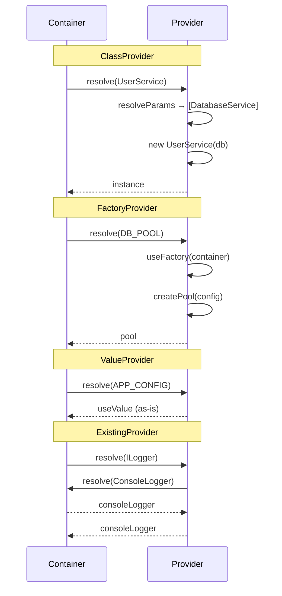
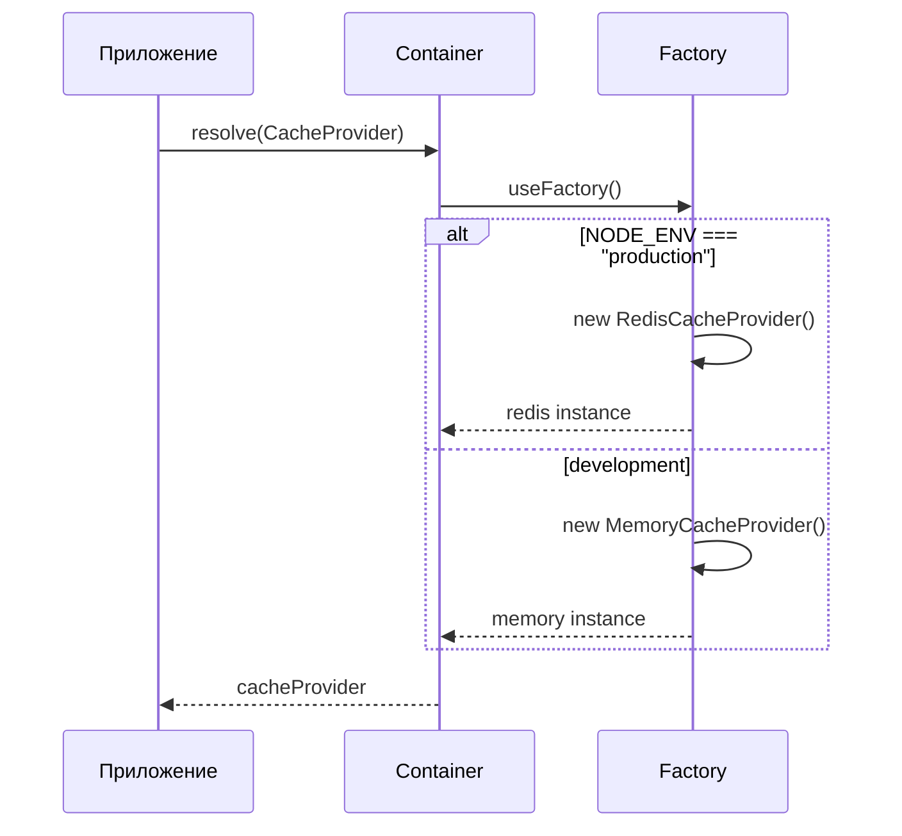

import { Callout } from 'fumadocs-ui/components/callout';
import { Tab, Tabs } from 'fumadocs-ui/components/tabs';

# Кастомные провайдеры

Продвинутые техники создания провайдеров для сложных сценариев.

## 4 типа провайдеров



### ClassProvider — создание через конструктор

```typescript
import { Container, Injectable, Scope } from "@ambrosia/core";

@Injectable({ scope: Scope.SINGLETON })
class CacheService {
  private store = new Map<string, { value: unknown; expires: number }>();

  set(key: string, value: unknown, ttl = 3600) {
    this.store.set(key, { value, expires: Date.now() + ttl * 1000 });
  }

  get<T>(key: string): T | null {
    const entry = this.store.get(key);
    if (!entry || entry.expires < Date.now()) {
      this.store.delete(key);
      return null;
    }
    return entry.value as T;
  }
}

// Авто-регистрация через @Injectable
const cache = container.resolve(CacheService);

// Или ручная регистрация
container.register({
  token: CacheService,
  useClass: CacheService,
  scope: Scope.SINGLETON,
});
```

### FactoryProvider — кастомная логика создания

```typescript
import { Container, InjectionToken, Scope } from "@ambrosia/core";

const DB_POOL = new InjectionToken<ConnectionPool>("DbPool");

container.register({
  token: DB_POOL,
  useFactory: (c) => {
    const config = c.resolve(ConfigService);
    return createPool({
      host: config.get("DB_HOST"),
      port: Number(config.get("DB_PORT")),
      max: Number(config.get("DB_POOL_SIZE") ?? "10"),
      ssl: config.get("DB_SSL") === "true",
    });
  },
  scope: Scope.SINGLETON,
});
```

### ValueProvider — готовое значение

```typescript
import { InjectionToken } from "@ambrosia/core";

interface AppConfig {
  apiUrl: string;
  timeout: number;
  debug: boolean;
}

const APP_CONFIG = new InjectionToken<AppConfig>("AppConfig");

container.register({
  token: APP_CONFIG,
  useValue: {
    apiUrl: process.env.API_URL ?? "https://api.example.com",
    timeout: Number(process.env.TIMEOUT ?? 5000),
    debug: process.env.DEBUG === "true",
  },
});
```

### ExistingProvider — алиас токена

```typescript
import { Injectable, Implements } from "@ambrosia/core";

abstract class Logger {
  abstract log(msg: string): void;
  abstract error(msg: string): void;
}

@Injectable()
@Implements(Logger)
class ConsoleLogger extends Logger {
  log(msg: string) { console.log(`[LOG] ${msg}`); }
  error(msg: string) { console.error(`[ERR] ${msg}`); }
}

// Алиас: resolve(Logger) → resolve(ConsoleLogger)
container.register({
  token: Logger,
  useExisting: ConsoleLogger,
});
```

## Conditional Provider

Создание разных экземпляров в зависимости от условий:

```typescript
import { Container, InjectionToken, Injectable } from "@ambrosia/core";

abstract class CacheProvider {
  abstract get(key: string): Promise<string | null>;
  abstract set(key: string, value: string, ttl?: number): Promise<void>;
}

@Injectable()
class RedisCacheProvider extends CacheProvider {
  async get(key: string) { /* Redis GET */ return null; }
  async set(key: string, value: string) { /* Redis SET */ }
}

@Injectable()
class MemoryCacheProvider extends CacheProvider {
  private store = new Map<string, string>();
  async get(key: string) { return this.store.get(key) ?? null; }
  async set(key: string, value: string) { this.store.set(key, value); }
}

// Conditional: Redis в prod, Memory в dev
container.register({
  token: CacheProvider,
  useFactory: () => {
    if (process.env.NODE_ENV === "production") {
      return new RedisCacheProvider();
    }
    return new MemoryCacheProvider();
  },
});
```



## Multi-Provider

Несколько реализаций под одним токеном (через массив):

```typescript
import { InjectionToken, Injectable } from "@ambrosia/core";

interface HealthCheck {
  name: string;
  check(): Promise<boolean>;
}

const HEALTH_CHECKS = new InjectionToken<HealthCheck[]>("HealthChecks");

@Injectable()
class DatabaseHealthCheck implements HealthCheck {
  name = "database";
  async check() { /* ping DB */ return true; }
}

@Injectable()
class RedisHealthCheck implements HealthCheck {
  name = "redis";
  async check() { /* ping Redis */ return true; }
}

@Injectable()
class ExternalApiHealthCheck implements HealthCheck {
  name = "external-api";
  async check() { /* ping API */ return true; }
}

// Регистрация как массив
container.register({
  token: HEALTH_CHECKS,
  useFactory: (c) => [
    c.resolve(DatabaseHealthCheck),
    c.resolve(RedisHealthCheck),
    c.resolve(ExternalApiHealthCheck),
  ],
});

// Использование
@Injectable()
class HealthService {
  constructor(@Inject(HEALTH_CHECKS) private checks: HealthCheck[]) {}

  async checkAll() {
    const results = await Promise.all(
      this.checks.map(async (check) => ({
        name: check.name,
        healthy: await check.check(),
      })),
    );
    return {
      status: results.every((r) => r.healthy) ? "healthy" : "unhealthy",
      checks: results,
    };
  }
}
```

## Lazy Provider

Отложенная инициализация тяжёлых ресурсов:

```typescript
import { Container, InjectionToken, Scope } from "@ambrosia/core";

interface S3Client {
  upload(key: string, data: Buffer): Promise<string>;
  download(key: string): Promise<Buffer>;
}

const S3_CLIENT = new InjectionToken<S3Client>("S3Client");

// Lazy: создаётся только при первом resolve
container.register({
  token: S3_CLIENT,
  useFactory: () => {
    console.log("Creating S3 client..."); // Только при первом вызове
    return new S3Client({
      region: process.env.AWS_REGION,
      credentials: {
        accessKeyId: process.env.AWS_ACCESS_KEY!,
        secretAccessKey: process.env.AWS_SECRET_KEY!,
      },
    });
  },
  scope: Scope.SINGLETON, // Создаётся один раз, при первом resolve
});

// S3 клиент НЕ создаётся при старте
// Создаётся только когда кто-то вызовет resolve(S3_CLIENT)
```

## Scoped Factory

Фабрика, создающая разные экземпляры в зависимости от scope:

```typescript
import { Injectable, Scope, InjectionToken } from "@ambrosia/core";

const TRACE_ID = new InjectionToken<string>("TraceId");

// Уникальный trace ID для каждого request
container.register({
  token: TRACE_ID,
  useFactory: () => crypto.randomUUID(),
  scope: Scope.REQUEST, // Новый ID для каждого request context
});

@Injectable()
class AuditService {
  constructor(@Inject(TRACE_ID) private traceId: string) {}

  log(action: string) {
    console.log(`[${this.traceId}] ${action}`);
  }
}

// В request context:
await container.requestStorage.runAsync(async () => {
  const audit = container.resolve(AuditService);
  audit.log("user.login"); // [550e8400-...] user.login
});
```

## Best Practices

1. **Используйте `InjectionToken<T>`** для type-safe токенов конфигурации
2. **Предпочитайте `ClassProvider`** для обычных сервисов — контейнер сам разрешит зависимости
3. **Используйте `FactoryProvider`** для сложной инициализации, условного создания или внешних SDK
4. **`ValueProvider`** идеален для конфигов и констант
5. **`ExistingProvider`** — для полиморфизма (abstract class → concrete implementation)

<Callout type="success">
**Принцип:** Самый простой провайдер — лучший. `@Injectable()` класс > FactoryProvider > ValueProvider. Используйте фабрики только когда автоматическое разрешение недостаточно.
</Callout>

## Следующие шаги

- [Ленивая загрузка](/docs/core/advanced/lazy-loading) — proxy-based lazy initialization
- [API: Container](/docs/core/api-reference/container) — методы регистрации
- [Базовое использование](/docs/core/guides/basic-usage) — паттерны регистрации
