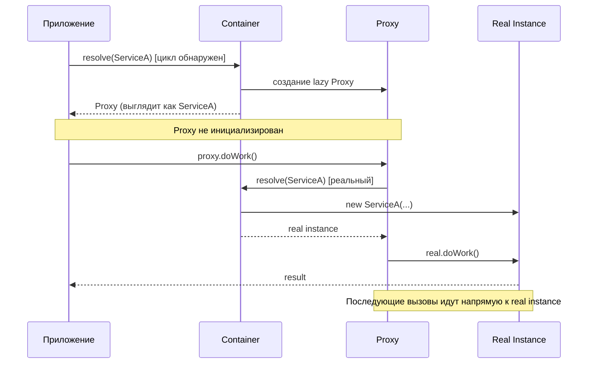
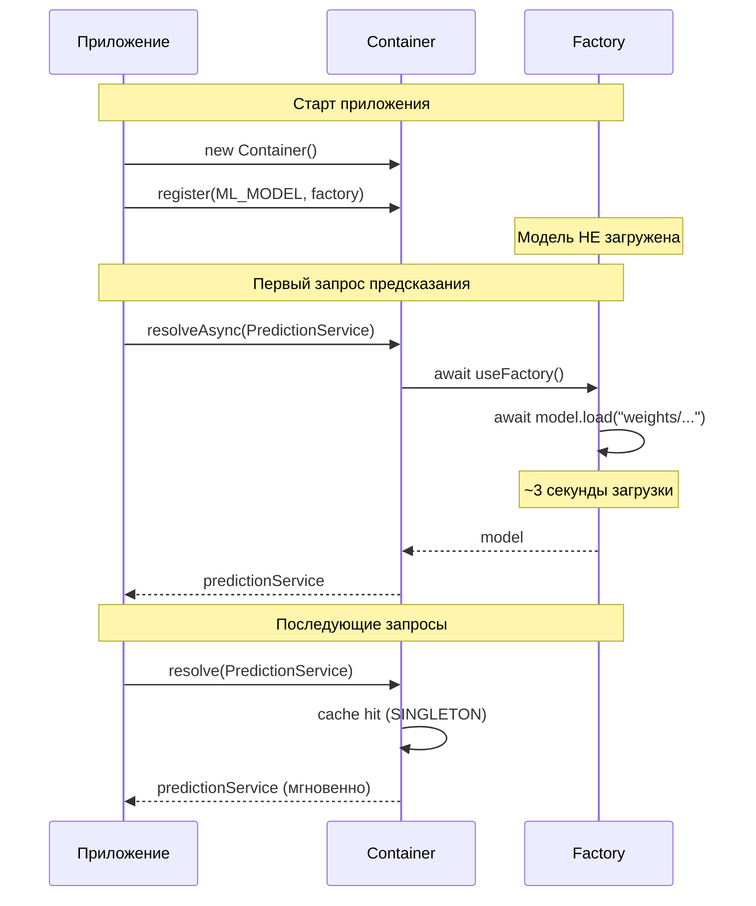
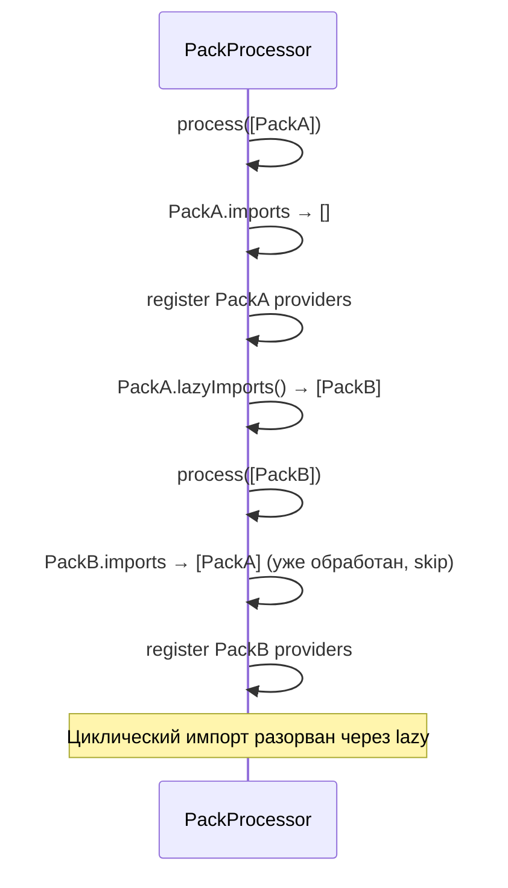

import { Callout } from 'fumadocs-ui/components/callout';
import { Tab, Tabs } from 'fumadocs-ui/components/tabs';

# Ленивая загрузка

Техники отложенной инициализации зависимостей для оптимизации времени запуска и потребления памяти.

## Lazy Proxy (autoResolveCircular)

Контейнер может создавать прозрачные proxy-объекты, которые разрешают реальный экземпляр при первом обращении к свойству или методу:



```typescript
import { Container, Injectable } from "@ambrosia-unce/core";

// Включаем auto-resolve для циклов
const container = new Container({ autoResolveCircular: true });

@Injectable()
class ServiceA {
  constructor(private b: ServiceB) {}

  doWork() {
    return this.b.help(); // Proxy разрешит ServiceB при вызове
  }
}

@Injectable()
class ServiceB {
  constructor(private a: ServiceA) {} // Цикл → lazy proxy

  help() { return "done"; }
}

// Работает без ошибок!
const a = container.resolve(ServiceA);
a.doWork(); // "done"
```

**Особенности lazy proxy:**
- Прозрачен для вызывающего кода
- Поддерживает `instanceof`, доступ к свойствам, вызов методов
- Разрешает реальный экземпляр при первом доступе
- Кэширует реальный экземпляр после первого разрешения

<Callout type="warn">
Не обращайтесь к lazy proxy **в конструкторе**. Конструктор вызывается до создания реального экземпляра. Используйте proxy только в методах.
</Callout>

```typescript
@Injectable()
class ServiceA {
  constructor(private b: ServiceB) {
    // ❌ Proxy ещё не разрешён в конструкторе!
    // this.b.help(); // Ошибка!
  }

  doWork() {
    // ✅ К моменту вызова метода proxy уже разрешён
    return this.b.help();
  }
}
```

## Lazy Singleton через Factory

Для тяжёлых ресурсов используйте `FactoryProvider` с `Scope.SINGLETON`:

```typescript
import { Container, InjectionToken, Scope, Injectable, Inject } from "@ambrosia-unce/core";

const ML_MODEL = new InjectionToken<MLModel>("MLModel");

container.register({
  token: ML_MODEL,
  useFactory: async () => {
    console.log("Loading ML model (heavy operation)...");
    const model = new MLModel();
    await model.load("./weights/model-v2.bin"); // Может занять секунды
    return model;
  },
  scope: Scope.SINGLETON,
});

@Injectable()
class PredictionService {
  constructor(@Inject(ML_MODEL) private model: MLModel) {}

  predict(input: number[]) {
    return this.model.predict(input);
  }
}

// Модель загрузится ТОЛЬКО при первом resolveAsync
// Если PredictionService никто не использует — модель не загрузится
const service = await container.resolveAsync(PredictionService);
```



## Lazy Module Import

Динамический `import()` для code splitting:

```typescript
import { Container, InjectionToken, Scope } from "@ambrosia-unce/core";

const SHARP = new InjectionToken<typeof import("sharp")>("Sharp");

// Sharp загрузится только при первом использовании
container.register({
  token: SHARP,
  useFactory: async () => {
    const { default: sharp } = await import("sharp");
    return sharp;
  },
  scope: Scope.SINGLETON,
});

@Injectable()
class ImageService {
  constructor(@Inject(SHARP) private sharp: typeof import("sharp")) {}

  async resize(buffer: Buffer, width: number) {
    return this.sharp(buffer).resize(width).toBuffer();
  }
}
```

## lazyImports для паков

Для разрыва циклических импортов между паками используйте `lazyImports`:

```typescript
import { definePack, type PackDefinition } from "@ambrosia-unce/core";

const PackA: PackDefinition = definePack({
  meta: { name: "pack-a" },
  providers: [ServiceA],
  lazyImports: () => [PackB], // Ленивый импорт — вычисляется при обработке
});

const PackB: PackDefinition = definePack({
  meta: { name: "pack-b" },
  providers: [ServiceB],
  imports: [PackA], // Обычный импорт
});
```



## Когда использовать ленивую загрузку

### Используйте для:
- Тяжёлых SDK (AWS, ML models, image processing)
- Редко используемых модулей (admin panel, reports)
- Разрыва циклических зависимостей между паками
- Development-only инструментов (profiling, debugging)

### НЕ используйте для:
- Критичных для старта сервисов (config, database)
- Часто используемых зависимостей (быстрее eager-load)
- Простых stateless сервисов (overhead не оправдан)

## Trade-offs

| Аспект | Eager (по умолчанию) | Lazy |
|--------|---------------------|------|
| Время старта | Медленнее | Быстрее |
| Первый вызов | Мгновенный | Медленнее (инициализация) |
| Обнаружение ошибок | При старте | При первом использовании |
| Сложность | Минимальная | Дополнительная |
| Память | Всё загружено | По требованию |

<Callout type="info">
**Рекомендация:** Используйте eager loading по умолчанию. Переходите на lazy только для конкретных тяжёлых зависимостей, где это измеримо улучшает время старта.
</Callout>

## Следующие шаги

- [Оптимизация производительности](/docs/core/advanced/performance) — production mode и кэширование
- [Циклические зависимости](/docs/core/guides/circular-dependencies) — autoResolveCircular
- [Система паков](/docs/core/guides/packs) — lazyImports
