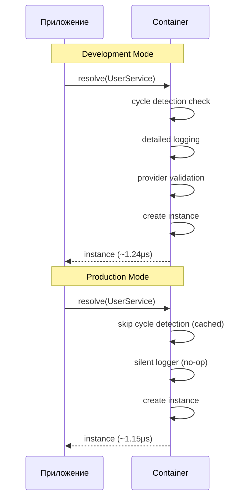
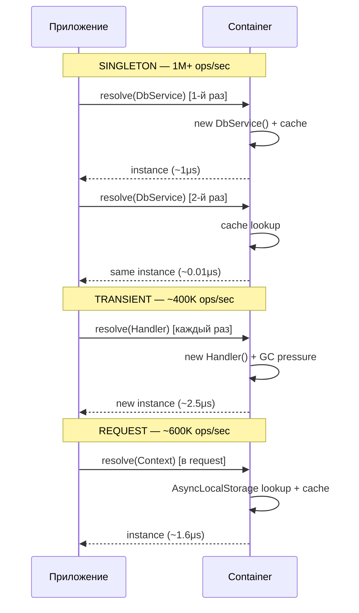

import { Callout } from 'fumadocs-ui/components/callout';
import { Tab, Tabs } from 'fumadocs-ui/components/tabs';

# Оптимизация производительности

Руководство по достижению максимальной производительности DI-контейнера.

## Результаты бенчмарков

| Операция | Ops/sec | Время |
|----------|---------|-------|
| Singleton (кэш) | 1,005,257 | 0.995μs |
| Simple (production) | 867,814 | 1.152μs |
| Complex (production) | 443,715 | 2.254μs |
| Simple (development) | 806,392 | 1.240μs |
| Complex (development) | 351,549 | 2.845μs |

## Production vs Development



```typescript
// Development: полная диагностика
const devContainer = new Container({
  mode: "development",        // Полная проверка циклов
  enableCycleDetection: true, // Явно (по умолчанию в dev)
});

// Production: максимальная скорость
const prodContainer = new Container({
  mode: "production",         // Skip cycle check для cached
  // enableCycleDetection: false (по умолчанию в prod)
});
```

**Прирост production mode:**
- Simple service: **+7.4%** (806K → 867K ops/sec)
- Complex service: **+22.8%** (351K → 443K ops/sec)

## Выбор правильного Scope



| Scope | Ops/sec | Overhead | Рекомендация |
|-------|---------|----------|--------------|
| SINGLETON | 1,000,000+ | Минимальный | По умолчанию для всего |
| REQUEST | ~600,000 | AsyncLocalStorage | Только для request-context |
| TRANSIENT | ~400,000 | Создание + GC | Только для stateful объектов |

<Callout type="success">
**Правило:** Используйте `SINGLETON` для всего, кроме случаев, когда вам нужна изоляция состояния (REQUEST/TRANSIENT).
</Callout>

## Оптимизации контейнера

### Flattened Provider Lookup

Контейнер предзаполняет провайдеры из Registry и родительского контейнера:

```typescript
// Без оптимизации: тройной поиск
resolve(token) {
  let provider = this.ownProviders.get(token);    // 1. Свои
  if (!provider) provider = this.parent?.get(token); // 2. Родитель
  if (!provider) provider = registry.get(token);     // 3. Registry
}

// С оптимизацией: единый кэш (flat map)
resolve(token) {
  return this.flatProviders.get(token); // Один lookup
}
```

**Прирост:** ~50% быстрее поиск провайдера.

### WeakMap Metadata Cache

Кэширование reflect-metadata в WeakMap:

```typescript
// Без кэширования: reflection при каждом resolve
const params = Reflect.getMetadata("design:paramtypes", target);

// С кэшированием: один раз
const cached = metadataCache.get(target);
if (cached) return cached;
const params = Reflect.getMetadata("design:paramtypes", target);
metadataCache.set(target, params);
```

**Прирост:** ~70% быстрее разрешение параметров.

### Silent Logger в Production

```typescript
import { setGlobalLogger, SilentLogger } from "@ambrosia/core";

// Production: нулевой overhead от логирования
setGlobalLogger(new SilentLogger());
// Все вызовы logger.info/debug/warn — no-op
```

**Прирост:** 100% (полное исключение overhead логирования).

## Memory Management

### Bun GC Hints

```typescript
// После bulk-операций (инициализация приложения)
if (typeof Bun !== "undefined") {
  Bun.gc(true); // Major GC после startup
}
```

### Очистка REQUEST scope

```typescript
// REQUEST scope автоматически очищается
await container.requestStorage.runAsync(async () => {
  // ... обработка запроса ...
}); // Кэш очищен автоматически здесь
```

### Размер бандла

**Minified:** 36.79 KB

| Компонент | Размер |
|-----------|--------|
| Container core | ~15 KB |
| Decorators & metadata | ~8 KB |
| Scope manager | ~5 KB |
| Plugins | ~4 KB |
| Utilities | ~4 KB |

## Анти-паттерны

### Resolve в цикле

```typescript
// ❌ Плохо: resolve на каждой итерации
for (const item of items) {
  const service = container.resolve(UserService); // Overhead на каждый вызов
  await service.process(item);
}

// ✅ Хорошо: resolve один раз
const service = container.resolve(UserService);
for (const item of items) {
  await service.process(item);
}
```

### Глубокие графы зависимостей

```typescript
// ❌ Плохо: 7+ уровней вложенности
// A → B → C → D → E → F → G → H
// Время: 5-10ms на первый resolve

// ✅ Хорошо: ≤ 3-4 уровня
// Controller → Service → Repository → Database
// Время: 1-2ms на первый resolve
```

### TRANSIENT без необходимости

```typescript
// ❌ Плохо: TRANSIENT для stateless сервиса
@Injectable({ scope: Scope.TRANSIENT })
class MathService {
  add(a: number, b: number) { return a + b; }
}

// ✅ Хорошо: SINGLETON (по умолчанию)
@Injectable()
class MathService {
  add(a: number, b: number) { return a + b; }
}
```

## Профилирование

### Встроенный ProfilingPlugin

```typescript
import { Container } from "@ambrosia/core";

// Используйте кастомный плагин для профилирования
const profiler = {
  name: "profiler",
  durations: new Map<string, number[]>(),

  onAfterResolve(token: Token, _: unknown, ctx: ResolutionContext) {
    const elapsed = performance.now() - ctx.startTime;
    const name = tokenToString(token);
    const list = this.durations.get(name) ?? [];
    list.push(elapsed);
    this.durations.set(name, list);
  },
};

container.use(profiler);

// ... после работы приложения ...

// Top-5 самых медленных
const sorted = [...profiler.durations.entries()]
  .map(([name, times]) => ({
    name,
    avg: times.reduce((a, b) => a + b) / times.length,
    max: Math.max(...times),
    count: times.length,
  }))
  .sort((a, b) => b.avg - a.avg)
  .slice(0, 5);

console.table(sorted);
```

## Чеклист для Production

- [ ] `mode: "production"` в ContainerOptions
- [ ] `SilentLogger` или без LoggingPlugin
- [ ] SINGLETON для всех stateless сервисов
- [ ] REQUEST scope только для HTTP-контекста
- [ ] TRANSIENT только для stateful объектов
- [ ] Resolve вне циклов (кэшируйте результат)
- [ ] Граф зависимостей ≤ 4 уровней
- [ ] `Bun.gc(true)` после инициализации (опционально)

## Следующие шаги

- [Бенчмарки](/docs/core/benchmarks/results) — детальные результаты
- [Области видимости](/docs/core/guides/scopes) — выбор scope
- [Разработка плагинов](/docs/core/advanced/plugin-development) — профилирование через плагины
