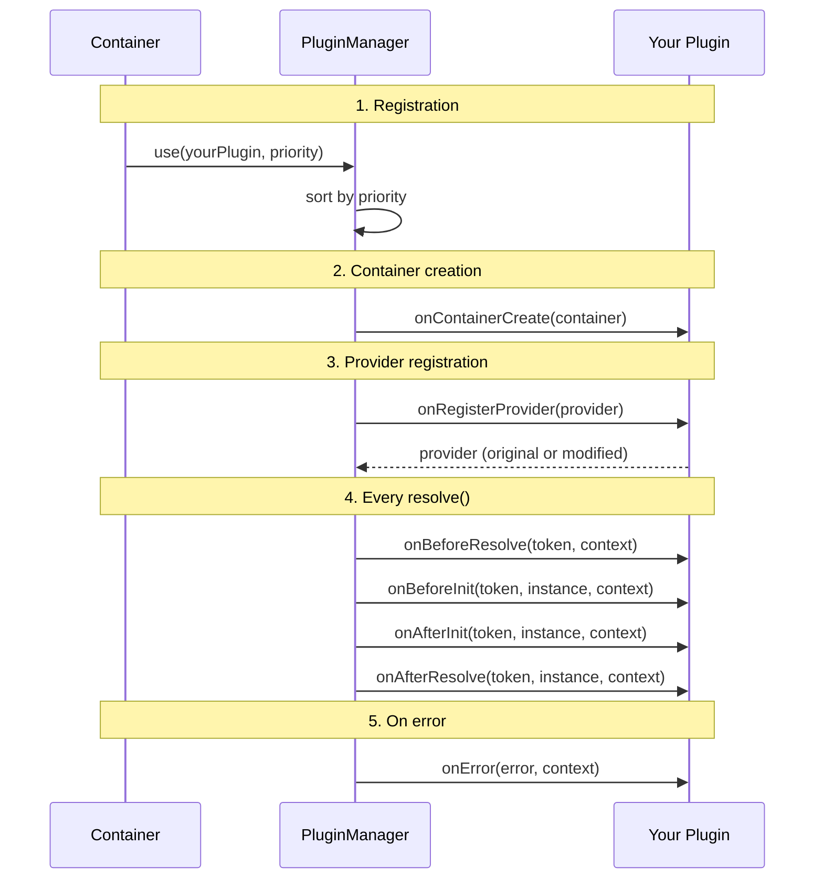

import { Callout } from 'fumadocs-ui/components/callout';
import { Tab, Tabs } from 'fumadocs-ui/components/tabs';

# Plugin Development

Step-by-step guide to creating plugins for @ambrosia/core.

## Plugin Lifecycle



## Step 1: Minimal Plugin

```typescript
import type { Plugin, Token, ResolutionContext } from "@ambrosia/core";
import { tokenToString } from "@ambrosia/core";

const myPlugin: Plugin = {
  name: "my-first-plugin",

  onAfterResolve(token: Token, instance: unknown, context: ResolutionContext) {
    const elapsed = performance.now() - context.startTime;
    console.log(`Resolved ${tokenToString(token)} in ${elapsed.toFixed(2)}ms`);
  },
};

container.use(myPlugin);
```

## Step 2: Stateful Class

```typescript
import type { Plugin, Token, ResolutionContext, Provider } from "@ambrosia/core";
import { tokenToString } from "@ambrosia/core";

interface MetricsPluginOptions {
  slowThresholdMs?: number;
  reportInterval?: number;
}

class MetricsPlugin implements Plugin {
  name = "metrics";
  version = "1.0.0";

  private resolutions = new Map<string, { count: number; totalMs: number; maxMs: number }>();
  private slowThreshold: number;

  constructor(private options: MetricsPluginOptions = {}) {
    this.slowThreshold = options.slowThresholdMs ?? 50;
  }

  onAfterResolve(token: Token, _instance: unknown, context: ResolutionContext) {
    const elapsed = performance.now() - context.startTime;
    const name = tokenToString(token);

    const stats = this.resolutions.get(name) ?? { count: 0, totalMs: 0, maxMs: 0 };
    stats.count++;
    stats.totalMs += elapsed;
    stats.maxMs = Math.max(stats.maxMs, elapsed);
    this.resolutions.set(name, stats);

    if (elapsed > this.slowThreshold) {
      console.warn(`[Metrics] SLOW: ${name} took ${elapsed.toFixed(1)}ms`);
    }
  }

  getStats() {
    const report: Record<string, { count: number; avgMs: number; maxMs: number }> = {};
    for (const [name, stats] of this.resolutions) {
      report[name] = {
        count: stats.count,
        avgMs: stats.totalMs / stats.count,
        maxMs: stats.maxMs,
      };
    }
    return report;
  }
}

const metrics = new MetricsPlugin({ slowThresholdMs: 10 });
container.use(metrics);
console.table(metrics.getStats());
```

## Step 3: Transforming Plugin

`onRegisterProvider` is the only hook that can modify data:

```typescript
import type { Plugin, Provider } from "@ambrosia/core";
import { tokenToString, Scope } from "@ambrosia/core";

class ScopeGuardPlugin implements Plugin {
  name = "scope-guard";

  constructor(private options: { forbidTransient?: boolean } = {}) {}

  onRegisterProvider(provider: Provider): Provider {
    const name = tokenToString(provider.token);

    if (this.options.forbidTransient && provider.scope === Scope.TRANSIENT) {
      console.warn(`[ScopeGuard] Converting ${name} from TRANSIENT to SINGLETON`);
      return { ...provider, scope: Scope.SINGLETON };
    }

    return provider; // Must return!
  }
}
```

<Callout type="warn">
Always return a `Provider` object from `onRegisterProvider`. Forgetting `return` will make the provider `undefined` and it won't be registered.
</Callout>

## Step 4: Async Plugin

For I/O-heavy operations (sending metrics, writing logs), use batching:

```typescript
import type { Plugin, Token, ResolutionContext } from "@ambrosia/core";
import { tokenToString } from "@ambrosia/core";

class RemoteTelemetryPlugin implements Plugin {
  name = "remote-telemetry";
  private buffer: Array<{ token: string; durationMs: number; timestamp: number }> = [];
  private flushTimer: Timer;

  constructor(private endpoint: string, private flushIntervalMs = 5000) {
    this.flushTimer = setInterval(() => this.flush(), flushIntervalMs);
  }

  onAfterResolve(token: Token, _instance: unknown, context: ResolutionContext) {
    this.buffer.push({
      token: tokenToString(token),
      durationMs: performance.now() - context.startTime,
      timestamp: Date.now(),
    });
    if (this.buffer.length >= 100) this.flush();
  }

  private async flush() {
    if (this.buffer.length === 0) return;
    const batch = this.buffer.splice(0);
    try {
      await fetch(this.endpoint, {
        method: "POST",
        headers: { "Content-Type": "application/json" },
        body: JSON.stringify({ events: batch }),
      });
    } catch (err) {
      console.error("[Telemetry] Flush failed:", (err as Error).message);
      this.buffer.unshift(...batch);
    }
  }

  async destroy() {
    clearInterval(this.flushTimer);
    await this.flush();
  }
}
```

## Step 5: Testing the Plugin

```typescript
import { describe, it, expect } from "bun:test";
import { Container, Injectable } from "@ambrosia/core";

describe("MetricsPlugin", () => {
  it("should track resolution count", () => {
    const container = new Container();
    const metrics = new MetricsPlugin();
    container.use(metrics);

    @Injectable()
    class TestService {}

    container.resolve(TestService);
    container.resolve(TestService);

    const stats = metrics.getStats();
    expect(stats["TestService"]).toBeDefined();
    expect(stats["TestService"].count).toBe(2);
  });
});
```

## Publishing as an npm Package

```
ambrosia-plugin-metrics/
+-- src/
|   +-- index.ts
|   +-- metrics-plugin.ts
+-- tests/
|   +-- metrics-plugin.test.ts
+-- build.ts
+-- package.json
+-- tsconfig.json
```

```json title="package.json"
{
  "name": "ambrosia-plugin-metrics",
  "version": "1.0.0",
  "type": "module",
  "main": "dist/index.js",
  "types": "dist/index.d.ts",
  "peerDependencies": {
    "@ambrosia/core": ">=1.0.0"
  }
}
```

## Best Practices

1. **Minimize overhead** - `onBeforeResolve` is called on every resolve
2. **Don't throw exceptions** - log errors, don't break the container
3. **Use batching** for I/O operations (network, files)
4. **Give a unique name** - use `container.hasPlugin(name)` to check
5. **Version it** - semver for backward compatibility
6. **Test it** - unit tests for each hook
7. **Use `tokenToString()`** - uniform token-to-string conversion

## Next Steps

- [Plugin System](/docs/core/guides/plugins) - Overview and usage
- [API: Plugin](/docs/core/api-reference/plugins) - Full reference
- [Optimization](/docs/core/advanced/performance) - Production-mode plugins
