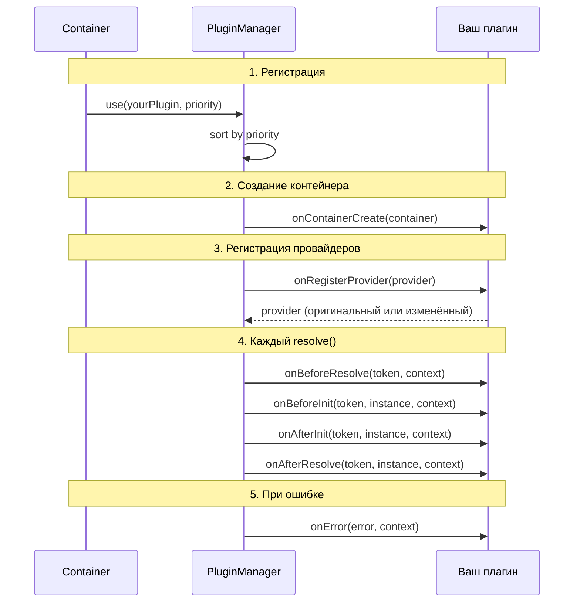

import { Callout } from 'fumadocs-ui/components/callout';
import { Tab, Tabs } from 'fumadocs-ui/components/tabs';

# Разработка плагинов

Пошаговое руководство по созданию плагинов для @ambrosia-unce/core.

## Жизненный цикл плагина



## Шаг 1: Минимальный плагин

```typescript
import type { Plugin, Token, ResolutionContext } from "@ambrosia-unce/core";
import { tokenToString } from "@ambrosia-unce/core";

const myPlugin: Plugin = {
  name: "my-first-plugin",

  onAfterResolve(token: Token, instance: unknown, context: ResolutionContext) {
    const elapsed = performance.now() - context.startTime;
    console.log(`Resolved ${tokenToString(token)} in ${elapsed.toFixed(2)}ms`);
  },
};

// Использование
container.use(myPlugin);
```

## Шаг 2: Класс с состоянием

```typescript
import type { Plugin, Token, ResolutionContext, Provider } from "@ambrosia-unce/core";
import { tokenToString } from "@ambrosia-unce/core";

interface MetricsPluginOptions {
  slowThresholdMs?: number;
  reportInterval?: number;
}

class MetricsPlugin implements Plugin {
  name = "metrics";
  version = "1.0.0";

  private resolutions = new Map<string, { count: number; totalMs: number; maxMs: number }>();
  private slowThreshold: number;
  private reportTimer?: Timer;

  constructor(private options: MetricsPluginOptions = {}) {
    this.slowThreshold = options.slowThresholdMs ?? 50;
  }

  onContainerCreate() {
    // Периодический отчёт
    if (this.options.reportInterval) {
      this.reportTimer = setInterval(() => {
        this.printReport();
      }, this.options.reportInterval);
    }
  }

  onBeforeResolve(token: Token, context: ResolutionContext) {
    // context.startTime уже установлен контейнером
  }

  onAfterResolve(token: Token, _instance: unknown, context: ResolutionContext) {
    const elapsed = performance.now() - context.startTime;
    const name = tokenToString(token);

    const stats = this.resolutions.get(name) ?? { count: 0, totalMs: 0, maxMs: 0 };
    stats.count++;
    stats.totalMs += elapsed;
    stats.maxMs = Math.max(stats.maxMs, elapsed);
    this.resolutions.set(name, stats);

    if (elapsed > this.slowThreshold) {
      console.warn(
        `[Metrics] SLOW: ${name} took ${elapsed.toFixed(1)}ms ` +
        `(threshold: ${this.slowThreshold}ms)`,
      );
    }
  }

  onError(error: Error, context: ResolutionContext) {
    console.error(
      `[Metrics] Error resolving ${tokenToString(context.token)}: ${error.message}`,
    );
  }

  // Публичный API плагина
  getStats() {
    const report: Record<string, { count: number; avgMs: number; maxMs: number }> = {};
    for (const [name, stats] of this.resolutions) {
      report[name] = {
        count: stats.count,
        avgMs: stats.totalMs / stats.count,
        maxMs: stats.maxMs,
      };
    }
    return report;
  }

  printReport() {
    console.log("\n--- DI Resolution Metrics ---");
    console.table(this.getStats());
  }

  // Cleanup
  destroy() {
    if (this.reportTimer) clearInterval(this.reportTimer);
  }
}

// Использование
const metrics = new MetricsPlugin({ slowThresholdMs: 10, reportInterval: 30_000 });
container.use(metrics);

// Позже: получить статистику
console.table(metrics.getStats());
```

## Шаг 3: Трансформирующий плагин

`onRegisterProvider` — единственный hook, который может изменять данные:

```typescript
import type { Plugin, Provider } from "@ambrosia-unce/core";
import { tokenToString, Scope } from "@ambrosia-unce/core";

class ScopeGuardPlugin implements Plugin {
  name = "scope-guard";

  private forbidden: Set<string>;

  constructor(private options: { forbidTransient?: boolean } = {}) {
    this.forbidden = new Set();
  }

  onRegisterProvider(provider: Provider): Provider {
    const name = tokenToString(provider.token);

    // Запрет TRANSIENT в production
    if (this.options.forbidTransient && provider.scope === Scope.TRANSIENT) {
      console.warn(
        `[ScopeGuard] Converting ${name} from TRANSIENT to SINGLETON`,
      );
      return { ...provider, scope: Scope.SINGLETON };
    }

    // Логирование всех REQUEST-scoped провайдеров
    if (provider.scope === Scope.REQUEST) {
      console.info(`[ScopeGuard] REQUEST-scoped: ${name}`);
    }

    return provider; // Обязательно вернуть!
  }
}

container.use(new ScopeGuardPlugin({
  forbidTransient: process.env.NODE_ENV === "production",
}));
```

<Callout type="warn">
Всегда возвращайте объект `Provider` из `onRegisterProvider`. Если забыть `return` — провайдер будет `undefined` и не зарегистрируется.
</Callout>

## Шаг 4: Async плагин

Для I/O-heavy операций (отправка метрик, запись логов) используйте батчинг:

```typescript
import type { Plugin, Token, ResolutionContext } from "@ambrosia-unce/core";
import { tokenToString } from "@ambrosia-unce/core";

class RemoteTelemetryPlugin implements Plugin {
  name = "remote-telemetry";

  private buffer: Array<{ token: string; durationMs: number; timestamp: number }> = [];
  private flushTimer: Timer;

  constructor(private endpoint: string, private flushIntervalMs = 5000) {
    // Периодический flush
    this.flushTimer = setInterval(() => this.flush(), flushIntervalMs);
  }

  onAfterResolve(token: Token, _instance: unknown, context: ResolutionContext) {
    this.buffer.push({
      token: tokenToString(token),
      durationMs: performance.now() - context.startTime,
      timestamp: Date.now(),
    });

    // Flush при достижении лимита
    if (this.buffer.length >= 100) {
      this.flush();
    }
  }

  onError(error: Error, context: ResolutionContext) {
    this.buffer.push({
      token: `ERROR:${tokenToString(context.token)}`,
      durationMs: -1,
      timestamp: Date.now(),
    });
  }

  private async flush() {
    if (this.buffer.length === 0) return;

    const batch = this.buffer.splice(0);
    try {
      await fetch(this.endpoint, {
        method: "POST",
        headers: { "Content-Type": "application/json" },
        body: JSON.stringify({ events: batch }),
      });
    } catch (err) {
      // Не падаем при ошибке отправки
      console.error("[Telemetry] Flush failed:", (err as Error).message);
      // Вернуть события обратно в буфер
      this.buffer.unshift(...batch);
    }
  }

  async destroy() {
    clearInterval(this.flushTimer);
    await this.flush(); // Финальный flush
  }
}
```

## Шаг 5: Тестирование плагина

```typescript
import { describe, it, expect } from "bun:test";
import { Container, Injectable } from "@ambrosia-unce/core";

describe("MetricsPlugin", () => {
  it("should track resolution count", () => {
    const container = new Container();
    const metrics = new MetricsPlugin();
    container.use(metrics);

    @Injectable()
    class TestService {}

    container.resolve(TestService);
    container.resolve(TestService); // Кэш hit (singleton)

    const stats = metrics.getStats();
    expect(stats["TestService"]).toBeDefined();
    expect(stats["TestService"].count).toBe(2);
  });

  it("should detect slow resolutions", () => {
    const warnings: string[] = [];
    const originalWarn = console.warn;
    console.warn = (msg: string) => warnings.push(msg);

    const container = new Container();
    container.use(new MetricsPlugin({ slowThresholdMs: 0 })); // Порог 0мс

    @Injectable()
    class SlowService {}

    container.resolve(SlowService);

    expect(warnings.some(w => w.includes("SLOW"))).toBe(true);
    console.warn = originalWarn;
  });

  it("should transform providers in ScopeGuard", () => {
    const container = new Container();
    container.use(new ScopeGuardPlugin({ forbidTransient: true }));

    @Injectable({ scope: Scope.TRANSIENT })
    class EphemeralService {}

    container.resolve(EphemeralService);

    // Должен быть конвертирован в SINGLETON
    const a = container.resolve(EphemeralService);
    const b = container.resolve(EphemeralService);
    expect(a === b).toBe(true); // Singleton теперь
  });
});
```

## Публикация как npm-пакет

```
ambrosia-plugin-metrics/
├── src/
│   ├── index.ts           # Экспорт плагина
│   └── metrics-plugin.ts  # Реализация
├── tests/
│   └── metrics-plugin.test.ts
├── build.ts               # Bun.build()
├── package.json
├── tsconfig.json
└── README.md
```

```json title="package.json"
{
  "name": "ambrosia-plugin-metrics",
  "version": "1.0.0",
  "type": "module",
  "main": "dist/index.js",
  "types": "dist/index.d.ts",
  "peerDependencies": {
    "@ambrosia-unce/core": ">=1.0.0"
  }
}
```

## Best Practices

1. **Минимизируйте overhead** — `onBeforeResolve` вызывается при каждом resolve
2. **Не бросайте исключения** — логируйте ошибки, не ломайте контейнер
3. **Используйте батчинг** для I/O операций (сеть, файлы)
4. **Давайте уникальное имя** — используйте `container.hasPlugin(name)` для проверки
5. **Версионируйте** — semver для обратной совместимости
6. **Тестируйте** — unit-тесты для каждого hook
7. **Используйте `tokenToString()`** — единообразное преобразование токена в строку

## Следующие шаги

- [Система плагинов](/docs/core/guides/plugins) — обзор и использование
- [API: Plugin](/docs/core/api-reference/plugins) — полный справочник
- [Оптимизация](/docs/core/advanced/performance) — production-mode плагины
