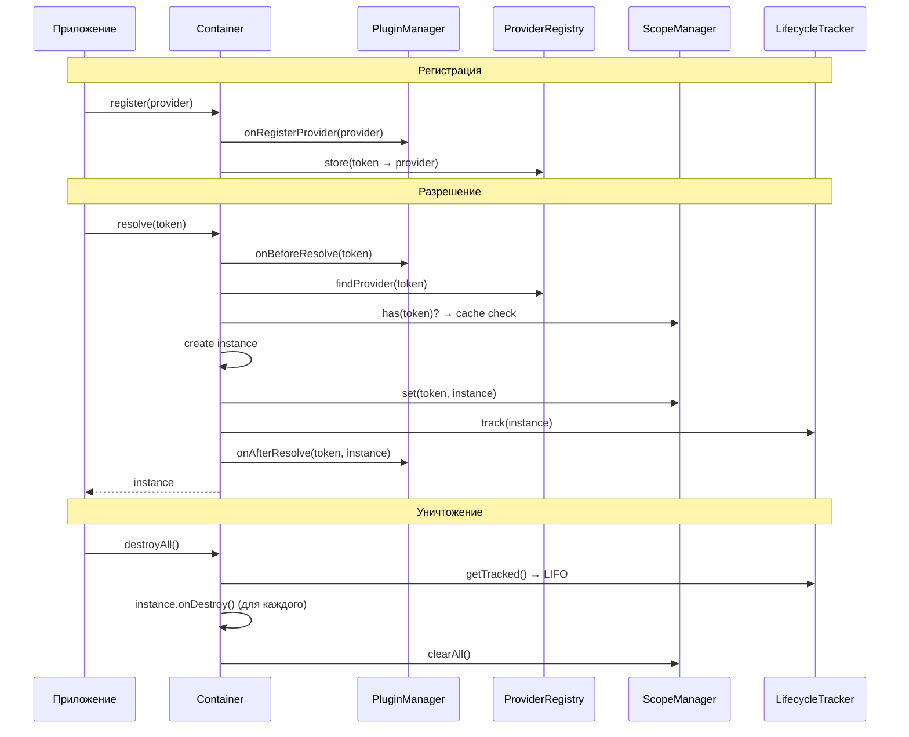

import { Callout } from 'fumadocs-ui/components/callout';
import { Tab, Tabs } from 'fumadocs-ui/components/tabs';

# Container API

`Container` — центральный класс DI-системы. Управляет регистрацией провайдеров, разрешением зависимостей, кэшированием экземпляров и жизненным циклом.



## Создание контейнера

```typescript
import { Container } from "@ambrosia/core";

// С настройками по умолчанию
const container = new Container();

// С опциями
const container = new Container({
  autoRegister: true,
  autoResolveCircular: false,
  mode: "development",
});

// Legacy: boolean для autoRegister
const container = new Container(false);
```

### ContainerOptions

```typescript
interface ContainerOptions {
  autoRegister?: boolean;          // default: true
  autoResolveCircular?: boolean;   // default: false
  enforceExports?: boolean;        // default: false
  mode?: "development" | "production"; // default: "development"
  enableCycleDetection?: boolean;  // default: true в dev, false в prod
}
```

| Опция | Тип | По умолчанию | Описание |
|---|---|---|---|
| `autoRegister` | `boolean` | `true` | Автоматически регистрирует `@Injectable()` классы из глобального Registry |
| `autoResolveCircular` | `boolean` | `false` | Использует lazy proxy для автоматического разрешения циклических зависимостей |
| `enforceExports` | `boolean` | `false` | Разрешает резолв только экспортированных паками токенов |
| `mode` | `string` | `"development"` | Режим: `development` — полная диагностика, `production` — оптимизированный |
| `enableCycleDetection` | `boolean` | зависит от mode | Явное управление обнаружением циклов (переопределяет mode) |

### Глобальный контейнер

Пакет экспортирует готовый singleton-контейнер:

```typescript
import { container } from "@ambrosia/core";

const service = container.resolve(MyService);
```

---

## Регистрация провайдеров

### register()

Регистрирует провайдер любого типа.

```typescript
register<T>(provider: Provider<T>): void
```

```typescript
import { Scope } from "@ambrosia/core";

// ClassProvider
container.register({
  token: UserService,
  useClass: UserService,
  scope: Scope.SINGLETON,
});

// ValueProvider
container.register({
  token: CONFIG_TOKEN,
  useValue: { apiUrl: "https://api.example.com" },
});

// FactoryProvider
container.register({
  token: Logger,
  useFactory: (c) => new Logger(c.resolve(CONFIG_TOKEN)),
  scope: Scope.SINGLETON,
});

// ExistingProvider (алиас)
container.register({
  token: ILogger,
  useExisting: ConsoleLogger,
});
```

<Callout type="info">
Плагины могут трансформировать провайдеры через хук `onRegisterProvider`. Трансформация происходит внутри `register()`.
</Callout>

### registerClass()

Сокращение для регистрации класса.

```typescript
registerClass<T>(token: Token<T>, useClass: Constructor<T>, scope?: Scope): void
```

```typescript
container.registerClass(UserService, UserService);
container.registerClass(ILogger, ConsoleLogger, Scope.TRANSIENT);
```

### registerValue()

Регистрирует константное значение.

```typescript
registerValue<T>(token: Token<T>, value: T): void
```

```typescript
const CONFIG = new InjectionToken<AppConfig>("AppConfig");
container.registerValue(CONFIG, { apiUrl: "https://api.example.com", port: 3000 });
```

### registerFactory()

Регистрирует фабричную функцию.

```typescript
registerFactory<T>(
  token: Token<T>,
  factory: Factory<T>,
  scope?: Scope,
  deps?: Token[]
): void
```

```typescript
container.registerFactory(
  DatabasePool,
  (c) => createPool(c.resolve(DB_CONFIG)),
  Scope.SINGLETON,
);

// С явными зависимостями
container.registerFactory(
  Logger,
  (c) => new Logger(c.resolve(CONFIG)),
  Scope.SINGLETON,
  [CONFIG], // deps для отслеживания
);
```

### registerExisting()

Создаёт алиас: один токен указывает на другой.

```typescript
registerExisting<T>(token: Token<T>, existingToken: Token<T>): void
```

```typescript
container.registerExisting(ILogger, ConsoleLogger);
// container.resolve(ILogger) вернёт тот же экземпляр, что и resolve(ConsoleLogger)
```

### registerInstance()

Регистрирует готовый экземпляр (обёртка над `registerValue`).

```typescript
registerInstance<T>(token: Token<T>, instance: T): void
```

```typescript
const logger = new ConsoleLogger("app");
container.registerInstance(Logger, logger);
```

---

## Разрешение зависимостей

### resolve()

Синхронно разрешает зависимость. Выбрасывает ошибку, если провайдер не найден.

```typescript
resolve<T = unknown>(token: Token<T>): T
```

```typescript
const userService = container.resolve(UserService);
const config = container.resolve(CONFIG_TOKEN);
```

<Callout type="warn">
Если `onInit()` класса возвращает `Promise`, `resolve()` выбросит ошибку. Используйте `resolveAsync()`.
</Callout>

### resolveOptional()

Разрешает зависимость или возвращает `undefined`, если провайдер не найден.

```typescript
resolveOptional<T = unknown>(token: Token<T>): T | undefined
```

```typescript
const cache = container.resolveOptional(CacheService);
if (cache) {
  cache.set("key", "value");
}
```

### resolveAsync()

Асинхронно разрешает зависимость. Поддерживает async-фабрики и async `onInit()`.

```typescript
resolveAsync<T = unknown>(token: Token<T>): Promise<T>
```

```typescript
const db = await container.resolveAsync(DatabaseService);
```

### resolveOptionalAsync()

Асинхронное опциональное разрешение.

```typescript
resolveOptionalAsync<T = unknown>(token: Token<T>): Promise<T | undefined>
```

---

## Управление скоупами

### requestStorage

Доступ к `RequestScopeStorage` для создания request-контекстов.

```typescript
get requestStorage: RequestScopeStorage
```

```typescript
container.requestStorage.run(() => {
  // Все resolve() внутри используют request-scope кэш
  const ctx = container.resolve(RequestContext);
});

// Или async
await container.requestStorage.runAsync(async () => {
  const ctx = container.resolve(RequestContext);
  await handleRequest(ctx);
});
```

### createChild()

Создаёт дочерний контейнер с отдельными кэшами, но наследованными провайдерами.

```typescript
createChild(): Container
```

```typescript
const parent = new Container();
parent.registerValue(CONFIG, { env: "prod" });

const child = parent.createChild();
child.registerValue(CONFIG, { env: "test" }); // Переопределение в дочернем

child.resolve(CONFIG); // { env: "test" }
parent.resolve(CONFIG); // { env: "prod" }
```

### clearScope()

Очищает все кэшированные экземпляры в указанном скоупе.

```typescript
clearScope(scope: Scope): void
```

```typescript
container.clearScope(Scope.SINGLETON);  // Сброс всех синглтонов
container.clearScope(Scope.REQUEST);    // Сброс request-кэша
```

### clearAll()

Очищает все кэши во всех скоупах.

```typescript
clearAll(): void
```

### destroyAll()

Вызывает `onDestroy()` на всех tracked-экземплярах в обратном порядке (LIFO), затем очищает кэши.

```typescript
destroyAll(): Promise<Error[]>
```

```typescript
const errors = await container.destroyAll();
if (errors.length > 0) {
  console.warn("Ошибки при уничтожении:", errors);
}
```

<Callout type="info">
Ошибки в `onDestroy()` логируются и собираются, но не прерывают процесс — все экземпляры будут уничтожены.
</Callout>

---

## Управление провайдерами

### has()

Проверяет, зарегистрирован ли провайдер для токена. Проверяет также родительский контейнер.

```typescript
has(token: Token): boolean
```

```typescript
if (container.has(CacheService)) {
  const cache = container.resolve(CacheService);
}
```

### getTokens()

Возвращает все зарегистрированные токены.

```typescript
getTokens(): Token[]
```

### remove()

Удаляет провайдер (не затрагивает кэшированные экземпляры).

```typescript
remove(token: Token): boolean
```

```typescript
container.remove(OldService); // true если был зарегистрирован
```

### size

Количество зарегистрированных провайдеров.

```typescript
get size: number
```

### snapshot()

Возвращает все провайдеры. Полезно для отладки и тестирования.

```typescript
snapshot(): Provider[]
```

---

## Система плагинов

### use()

Регистрирует плагин. Поддерживает chaining.

```typescript
use(plugin: Plugin, priority?: PluginPriority): this
```

```typescript
import { LoggingPlugin, PluginPriority } from "@ambrosia/core";

container
  .use(new LoggingPlugin({ logResolutionTiming: true }))
  .use(myCustomPlugin, PluginPriority.HIGH);
```

### getPlugins()

Возвращает массив всех зарегистрированных плагинов.

```typescript
getPlugins(): Plugin[]
```

### hasPlugin()

Проверяет наличие плагина по имени.

```typescript
hasPlugin(pluginName: string): boolean
```

---

## Интроспекция паков

### getLoadedPacks()

Возвращает информацию обо всех загруженных паках.

```typescript
getLoadedPacks(): LoadedPackInfo[]
```

```typescript
for (const info of container.getLoadedPacks()) {
  console.log(`${info.metadata.name}: ${info.providerCount} providers`);
}
```

### getPack()

Получает информацию о паке по имени.

```typescript
getPack(name: string): LoadedPackInfo | undefined
```

---

## Диагностика

### getDiagnostics()

Возвращает диагностическую информацию о контейнере.

```typescript
getDiagnostics(): {
  providerCount: number;
  singletonCacheSize: number;
  requestCacheSize: number;
  hasParent: boolean;
}
```

```typescript
const diag = container.getDiagnostics();
console.log(`Providers: ${diag.providerCount}`);
console.log(`Cached singletons: ${diag.singletonCacheSize}`);
console.log(`Request cache: ${diag.requestCacheSize}`);
console.log(`Has parent: ${diag.hasParent}`);
```

---

## Полный пример

```typescript
import {
  Container,
  Injectable,
  Inject,
  InjectionToken,
  Scope,
  type OnInit,
  type OnDestroy,
  LoggingPlugin,
} from "@ambrosia/core";

// Токены
const DB_URL = new InjectionToken<string>("DB_URL");

// Сервисы
@Injectable()
class DatabaseService implements OnInit, OnDestroy {
  private pool: ConnectionPool | null = null;

  constructor(@Inject(DB_URL) private url: string) {}

  async onInit() {
    this.pool = await ConnectionPool.create(this.url);
  }

  async onDestroy() {
    await this.pool?.close();
  }

  query(sql: string) {
    return this.pool!.query(sql);
  }
}

@Injectable()
class UserRepository {
  constructor(private db: DatabaseService) {}

  findById(id: string) {
    return this.db.query(`SELECT * FROM users WHERE id = '${id}'`);
  }
}

// Настройка контейнера
const container = new Container({ mode: "production" });
container.use(new LoggingPlugin());
container.registerValue(DB_URL, "postgres://localhost:5432/mydb");

// Использование
const repo = await container.resolveAsync(UserRepository);
const user = await repo.findById("123");

// Shutdown
await container.destroyAll();
```

## Следующие шаги

- [Декораторы](/docs/core/api-reference/decorators) — справочник по всем декораторам
- [Области видимости](/docs/core/api-reference/scopes) — управление жизненным циклом экземпляров
- [Система плагинов](/docs/core/api-reference/plugins) — расширение контейнера
