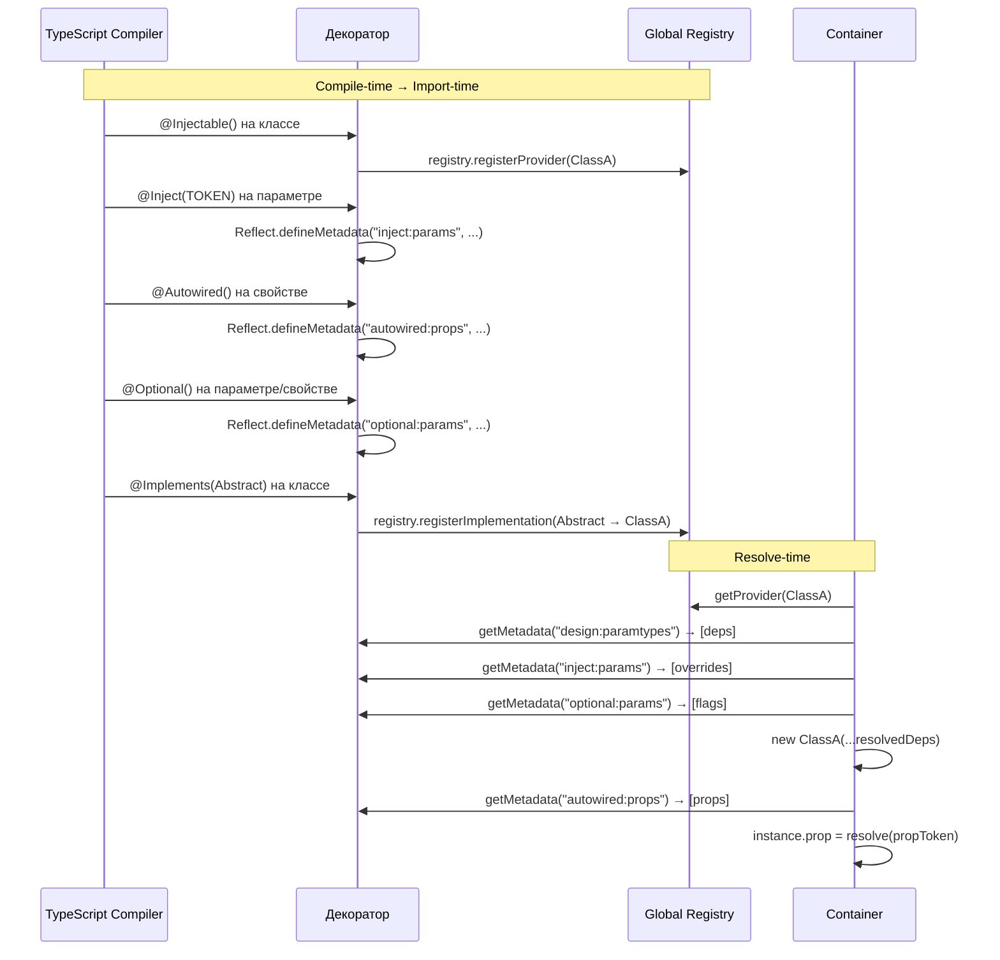

import { Callout } from 'fumadocs-ui/components/callout';
import { Tab, Tabs } from 'fumadocs-ui/components/tabs';

# Декораторы

Декораторы — основной способ конфигурирования DI в Ambrosia. Все декораторы работают через `reflect-metadata` и требуют `experimentalDecorators: true` + `emitDecoratorMetadata: true` в `tsconfig.json`.



## @Injectable()

Отмечает класс как доступный для инъекции. Автоматически регистрирует его в глобальном Registry.

```typescript
@Injectable(options?: InjectableOptions)
```

### Параметры

```typescript
interface InjectableOptions {
  scope?: Scope; // default: Scope.SINGLETON
}
```

### Использование

```typescript
import { Injectable, Scope } from "@ambrosia-unce/core";

// Singleton (по умолчанию)
@Injectable()
class UserService {
  getUsers() { return []; }
}

// С указанием скоупа
@Injectable({ scope: Scope.TRANSIENT })
class RequestLogger {
  log(msg: string) { console.log(msg); }
}

// Request scope
@Injectable({ scope: Scope.REQUEST })
class RequestContext {
  userId?: string;
}
```

### Поведение

- Автоматически добавляет класс в глобальный `Registry`
- При `autoRegister: true` (по умолчанию) контейнер подхватывает класс без ручной регистрации
- Зависимости конструктора определяются через `design:paramtypes` (TypeScript metadata)
- **Обязателен** для классов, которые резолвятся как `ClassProvider`

<Callout type="warn">
Без `@Injectable()` контейнер не сможет определить зависимости конструктора. Вызов `resolve()` на незарегистрированном классе выбросит `ProviderNotFoundError`.
</Callout>

---

## @Inject()

Явно указывает токен для инъекции в параметр конструктора. Необходим, когда TypeScript metadata недостаточно (интерфейсы, абстрактные классы, `InjectionToken`).

```typescript
@Inject(token: Token)
```

### Когда нужен @Inject

TypeScript `emitDecoratorMetadata` генерирует metadata только для конкретных классов. Для всех остальных случаев нужен `@Inject()`:

<Tabs items={['InjectionToken', 'Абстрактный класс', 'Интерфейс через токен']}>
<Tab value="InjectionToken">
```typescript
import { Injectable, Inject, InjectionToken } from "@ambrosia-unce/core";

const API_URL = new InjectionToken<string>("API_URL");
const MAX_RETRIES = new InjectionToken<number>("MAX_RETRIES");

@Injectable()
class ApiClient {
  constructor(
    @Inject(API_URL) private url: string,
    @Inject(MAX_RETRIES) private retries: number,
  ) {}
}
```
</Tab>
<Tab value="Абстрактный класс">
```typescript
import { Injectable, Inject } from "@ambrosia-unce/core";

abstract class Logger {
  abstract log(msg: string): void;
}

@Injectable()
class UserService {
  constructor(@Inject(Logger) private logger: Logger) {}
}
```
</Tab>
<Tab value="Интерфейс через токен">
```typescript
import { Injectable, Inject, InjectionToken } from "@ambrosia-unce/core";

interface CacheConfig {
  ttl: number;
  maxSize: number;
}

const CACHE_CONFIG = new InjectionToken<CacheConfig>("CacheConfig");

@Injectable()
class CacheService {
  constructor(@Inject(CACHE_CONFIG) private config: CacheConfig) {}
}
```
</Tab>
</Tabs>

### Когда @Inject не нужен

Если зависимость — конкретный класс с `@Injectable()`, TypeScript metadata достаточно:

```typescript
@Injectable()
class DatabaseService { /* ... */ }

@Injectable()
class UserRepository {
  // @Inject не нужен — DatabaseService определяется через design:paramtypes
  constructor(private db: DatabaseService) {}
}
```

---

## @Optional()

Делает зависимость необязательной. Если провайдер не найден, вместо ошибки возвращается `undefined`.

```typescript
@Optional()
```

### С параметрами конструктора

```typescript
import { Injectable, Inject, Optional, InjectionToken } from "@ambrosia-unce/core";

const METRICS = new InjectionToken<MetricsClient>("Metrics");

@Injectable()
class UserService {
  constructor(
    private db: DatabaseService,
    @Inject(METRICS) @Optional() private metrics?: MetricsClient,
  ) {}

  getUser(id: string) {
    this.metrics?.increment("user.get"); // Безопасно — может быть undefined
    return this.db.findUser(id);
  }
}
```

### С @Autowired (свойства)

```typescript
@Injectable()
class NotificationService {
  @Autowired(EmailService)
  @Optional()
  private email?: EmailService;

  notify(msg: string) {
    if (this.email) {
      this.email.send(msg);
    } else {
      console.log("Email service unavailable, logging:", msg);
    }
  }
}
```

### Типичные сценарии

- **Опциональные плагины** — сервис работает и без них
- **Feature flags** — зависимость регистрируется условно
- **Fallback логика** — использование альтернативы при отсутствии основного сервиса

---

## @Autowired()

Инъекция зависимости в свойство класса (property injection). Выполняется **после** конструктора.

```typescript
@Autowired(token?: Token)
```

### Параметры

| Параметр | Тип | Описание |
|---|---|---|
| `token` | `Token` (опционально) | Токен для разрешения. Если не указан, определяется через `design:type` metadata |

### Базовое использование

```typescript
import { Injectable, Autowired } from "@ambrosia-unce/core";

@Injectable()
class OrderService {
  // Токен определяется автоматически через TypeScript metadata
  @Autowired()
  private userService!: UserService;

  // Или с явным токеном
  @Autowired(Logger)
  private logger!: Logger;

  createOrder(userId: string) {
    const user = this.userService.getUser(userId);
    this.logger.log(`Order created for ${user.name}`);
  }
}
```

### Разрыв циклических зависимостей

Главное применение `@Autowired` — разрыв циклов в конструкторах:

```typescript
@Injectable()
class ServiceA {
  // Вместо конструктора — property injection
  @Autowired()
  private serviceB!: ServiceB;

  doSomething() {
    this.serviceB.help();
  }
}

@Injectable()
class ServiceB {
  constructor(private serviceA: ServiceA) {} // Обычная инъекция через конструктор

  help() { /* ... */ }
}
```

**Как это работает:**
1. Создаётся `ServiceB` → конструктор получает `ServiceA`
2. Для `ServiceA` создаётся экземпляр (конструктор без `ServiceB`)
3. `ServiceA` кэшируется в scope
4. `@Autowired` инъектирует `ServiceB` в свойство `ServiceA`
5. `ServiceB` уже в кэше → цикл разорван

<Callout type="info">
Property injection выполняется **после** кэширования экземпляра. Это ключевой механизм разрыва циклов — зависимость находит частично инициализированный экземпляр в кэше.
</Callout>

### Порядок инициализации

```
1. new Service(...params)       ← конструктор
2. scope cache                  ← экземпляр кэшируется
3. @Autowired инъекция          ← property injection
4. onInit()                     ← lifecycle hook
```

---

## @Implements()

Связывает конкретный класс с абстрактным. Позволяет резолвить абстрактные классы как токены.

```typescript
@Implements(abstractClass: Abstract)
```

### Использование

```typescript
import { Injectable, Implements, Inject } from "@ambrosia-unce/core";

// Абстрактный класс как "интерфейс"
abstract class Logger {
  abstract log(message: string): void;
  abstract error(message: string): void;
}

// Конкретная реализация
@Injectable()
@Implements(Logger)
class ConsoleLogger extends Logger {
  log(message: string) {
    console.log(`[LOG] ${message}`);
  }
  error(message: string) {
    console.error(`[ERR] ${message}`);
  }
}

// Инъекция через абстрактный класс
@Injectable()
class UserService {
  constructor(@Inject(Logger) private logger: Logger) {}
}

// resolve(Logger) вернёт ConsoleLogger
const service = container.resolve(UserService);
```

### Зачем нужен @Implements

TypeScript интерфейсы стираются при компиляции — их нельзя использовать как DI-токены. Абстрактные классы сохраняются в runtime и могут выступать токенами. `@Implements` автоматически регистрирует маппинг `AbstractClass → ConcreteClass` в глобальном Registry.

### Несколько реализаций

Для переключения реализаций — переопределяйте через контейнер:

```typescript
@Injectable()
@Implements(Logger)
class ConsoleLogger extends Logger { /* ... */ }

@Injectable()
class FileLogger extends Logger { /* ... */ }

// По умолчанию Logger → ConsoleLogger (через @Implements)
// Переопределение:
container.registerClass(Logger, FileLogger);
```

---

## Комбинирование декораторов

Декораторы можно свободно комбинировать:

| Комбинация | Описание | Пример |
|---|---|---|
| `@Inject() + @Optional()` | Опциональная зависимость по токену | `@Inject(CACHE) @Optional() cache?: CacheService` |
| `@Autowired() + @Optional()` | Опциональное свойство | `@Autowired(Logger) @Optional() logger?: Logger` |
| `@Injectable() + @Implements()` | Регистрация + маппинг абстрактного класса | `@Injectable() @Implements(Logger) class ConsoleLogger` |

### Полный пример

```typescript
import {
  Injectable,
  Inject,
  Optional,
  Autowired,
  Implements,
  InjectionToken,
  Scope,
  type OnInit,
} from "@ambrosia-unce/core";

const METRICS_TOKEN = new InjectionToken<MetricsClient>("Metrics");

abstract class Logger {
  abstract log(msg: string): void;
}

@Injectable()
@Implements(Logger)
class StructuredLogger extends Logger {
  log(msg: string) { console.log(JSON.stringify({ msg, ts: Date.now() })); }
}

@Injectable({ scope: Scope.REQUEST })
class RequestHandler implements OnInit {
  @Autowired()
  private logger!: Logger;

  constructor(
    private userService: UserService,
    @Inject(METRICS_TOKEN) @Optional() private metrics?: MetricsClient,
  ) {}

  onInit() {
    this.logger.log("RequestHandler initialized");
  }

  async handle(userId: string) {
    this.metrics?.increment("request.handle");
    return this.userService.getUser(userId);
  }
}
```

## Следующие шаги

- [Container API](/docs/core/api-reference/container) — методы контейнера
- [Области видимости](/docs/core/api-reference/scopes) — SINGLETON, TRANSIENT, REQUEST
- [Циклические зависимости](/docs/core/guides/circular-dependencies) — стратегии разрешения
