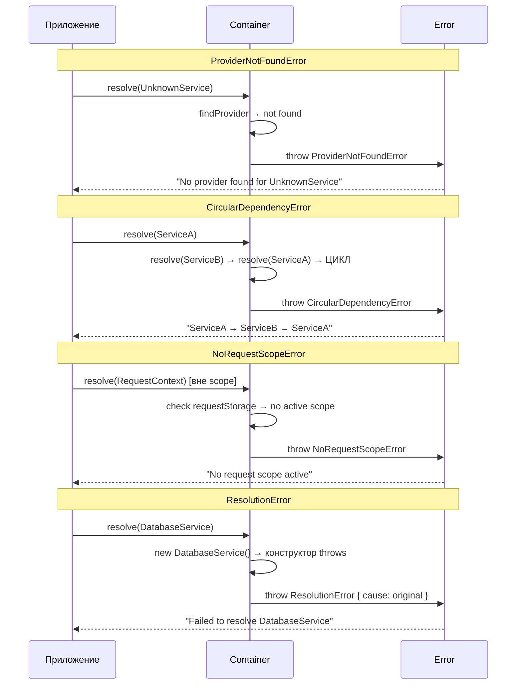

import { Callout } from 'fumadocs-ui/components/callout';
import { Tab, Tabs } from 'fumadocs-ui/components/tabs';

# Типы ошибок

Все DI-ошибки наследуются от `DIError`, который наследуется от стандартного `Error`. Каждый тип ошибки содержит actionable-сообщение с рекомендациями по исправлению.



## Иерархия ошибок

```
Error
└── DIError
    ├── CircularDependencyError
    ├── ProviderNotFoundError
    ├── InvalidProviderError
    ├── ResolutionError
    ├── NoRequestScopeError
    └── NotInjectableError
```

---

## DIError

Базовый класс для всех DI-ошибок.

```typescript
class DIError extends Error {
  constructor(message: string);
  name: "DIError";
}
```

Используйте `instanceof DIError` для перехвата всех DI-ошибок:

```typescript
import { DIError } from "@ambrosia-unce/core";

try {
  container.resolve(SomeService);
} catch (error) {
  if (error instanceof DIError) {
    console.error("DI error:", error.message);
  }
}
```

---

## CircularDependencyError

Выбрасывается при обнаружении циклической зависимости в графе.

```typescript
class CircularDependencyError extends DIError {
  readonly chain: Token[];
  name: "CircularDependencyError";
}
```

### Свойства

| Свойство | Тип | Описание |
|---|---|---|
| `chain` | `Token[]` | Полный путь цикла: `[A, B, C, A]` |
| `message` | `string` | Визуализация цикла и рекомендации |

### Пример сообщения

```
Circular dependency detected:
  ServiceA → ServiceB → ServiceC → ServiceA

Possible solutions:
  1. Use factory provider with lazy evaluation
  2. Use @Autowired for property injection (breaks the cycle)
  3. Refactor to remove the circular reference
```

### Обработка

```typescript
import { CircularDependencyError } from "@ambrosia-unce/core";

try {
  container.resolve(ServiceA);
} catch (error) {
  if (error instanceof CircularDependencyError) {
    console.error("Цикл:", error.chain.map(t =>
      typeof t === "function" ? t.name : String(t)
    ).join(" → "));
  }
}
```

### Как исправить

<Tabs items={['@Autowired', 'autoResolveCircular', 'Рефакторинг']}>
<Tab value="@Autowired">
```typescript
@Injectable()
class ServiceA {
  @Autowired()
  private serviceB!: ServiceB; // Property injection разрывает цикл
}

@Injectable()
class ServiceB {
  constructor(private serviceA: ServiceA) {}
}
```
</Tab>
<Tab value="autoResolveCircular">
```typescript
// Контейнер автоматически создаёт lazy proxy
const container = new Container({ autoResolveCircular: true });
```
</Tab>
<Tab value="Рефакторинг">
```typescript
// Извлеките общую логику в третий сервис
@Injectable()
class SharedLogic { /* ... */ }

@Injectable()
class ServiceA {
  constructor(private shared: SharedLogic) {}
}

@Injectable()
class ServiceB {
  constructor(private shared: SharedLogic) {}
}
```
</Tab>
</Tabs>

---

## ProviderNotFoundError

Выбрасывается, когда контейнер не может найти провайдер для запрошенного токена.

```typescript
class ProviderNotFoundError extends DIError {
  readonly token: Token;
  name: "ProviderNotFoundError";
}
```

### Свойства

| Свойство | Тип | Описание |
|---|---|---|
| `token` | `Token` | Токен, для которого не найден провайдер |

### Пример сообщения

```
No provider found for UserService

Possible solutions:
  1. Register the provider: container.register(...)
  2. Add @Injectable() decorator to the class
  3. Use @Optional() if the dependency is optional
  4. Check that the token matches the registered provider
```

### Типичные причины

1. **Забыт `@Injectable()`** на классе
2. **Не зарегистрирован** `InjectionToken` через `registerValue()`
3. **Неправильный импорт** — разные копии одного модуля (barrel re-export issues)
4. **Pack не экспортирует** токен при `enforceExports: true`

```typescript
import { ProviderNotFoundError } from "@ambrosia-unce/core";

try {
  container.resolve(UnknownService);
} catch (error) {
  if (error instanceof ProviderNotFoundError) {
    console.error(`Провайдер не найден: ${error.token}`);
  }
}
```

---

## InvalidProviderError

Выбрасывается при попытке зарегистрировать некорректный провайдер.

```typescript
class InvalidProviderError extends DIError {
  name: "InvalidProviderError";
}
```

### Типичные причины

```typescript
// Нет token
container.register({ useClass: MyService } as any);
// → "Invalid provider: Provider must have a token"

// Нет useClass/useValue/useFactory/useExisting
container.register({ token: MyService } as any);
// → "Invalid provider: Provider must have one of: useClass, useValue, useFactory, or useExisting"

// Несколько типов одновременно
container.register({ token: MyService, useClass: MyService, useValue: 42 } as any);
// → "Invalid provider: Provider can only have one of..."

// useClass не является конструктором
container.register({ token: MyService, useClass: "not-a-class" } as any);
// → "Invalid provider: ClassProvider.useClass must be a constructor function"
```

---

## ResolutionError

Обёртка над ошибкой, возникшей при разрешении зависимости. Содержит контекст (какой токен резолвился) и оригинальную ошибку.

```typescript
class ResolutionError extends DIError {
  readonly token: Token;
  cause: Error;
  name: "ResolutionError";
}
```

### Свойства

| Свойство | Тип | Описание |
|---|---|---|
| `token` | `Token` | Токен, при разрешении которого произошла ошибка |
| `cause` | `Error` | Оригинальная ошибка (из конструктора, фабрики и т.д.) |

### Пример сообщения

```
Failed to resolve DatabaseService
Cause: Connection refused

This usually means:
  1. A dependency's constructor threw an error
  2. A factory function failed
  3. A required constructor parameter is missing
```

### Типичные причины

1. **Конструктор класса** выбросил ошибку
2. **Factory функция** вернула ошибку
3. **Отсутствует зависимость** конструктора (нет metadata)

```typescript
import { ResolutionError } from "@ambrosia-unce/core";

try {
  container.resolve(DatabaseService);
} catch (error) {
  if (error instanceof ResolutionError) {
    console.error(`Ошибка резолва ${error.token}:`, error.cause.message);
  }
}
```

---

## NoRequestScopeError

Выбрасывается при попытке резолва `REQUEST`-scoped провайдера вне активного request-контекста.

```typescript
class NoRequestScopeError extends DIError {
  name: "NoRequestScopeError";
}
```

### Пример сообщения

```
No request scope active

Request-scoped providers can only be resolved within a request context.
Wrap your code with:
  container.requestStorage.run(() => {
    // Your code here
  })
```

### Как исправить

```typescript
import { NoRequestScopeError } from "@ambrosia-unce/core";

// ❌ Ошибка — нет request контекста
container.resolve(RequestContext); // throws NoRequestScopeError

// ✅ Обернуть в request scope
container.requestStorage.run(() => {
  container.resolve(RequestContext); // OK
});
```

---

## NotInjectableError

Выбрасывается, когда класс без `@Injectable()` используется как зависимость.

```typescript
class NotInjectableError extends DIError {
  readonly target: Function;
  name: "NotInjectableError";
}
```

### Свойства

| Свойство | Тип | Описание |
|---|---|---|
| `target` | `Function` | Класс, на котором отсутствует `@Injectable()` |

### Пример сообщения

```
Class UserService is not injectable

Add the @Injectable() decorator:
  @Injectable()
  class UserService { ... }
```

---

## Паттерны обработки ошибок

### Типизированный catch

```typescript
import {
  DIError,
  CircularDependencyError,
  ProviderNotFoundError,
  ResolutionError,
  NoRequestScopeError,
} from "@ambrosia-unce/core";

try {
  const service = container.resolve(MyService);
} catch (error) {
  if (error instanceof CircularDependencyError) {
    // Циклическая зависимость
    console.error("Cycle:", error.chain);
  } else if (error instanceof ProviderNotFoundError) {
    // Провайдер не зарегистрирован
    console.error("Missing:", error.token);
  } else if (error instanceof NoRequestScopeError) {
    // Нет request контекста
    console.error("Wrap in requestStorage.run()");
  } else if (error instanceof ResolutionError) {
    // Ошибка при создании экземпляра
    console.error("Resolution failed:", error.cause);
  } else if (error instanceof DIError) {
    // Любая другая DI-ошибка
    console.error("DI error:", error.message);
  }
}
```

### Глобальный перехват через плагин

```typescript
const errorPlugin: Plugin = {
  name: "global-error-handler",
  onError(error, context) {
    errorTracker.capture(error, {
      token: tokenToString(context.token),
      scope: context.scope,
      parent: context.parent ? tokenToString(context.parent) : undefined,
    });
  },
};

container.use(errorPlugin);
```

### Graceful degradation с @Optional

```typescript
@Injectable()
class AppService {
  constructor(
    @Inject(CACHE_SERVICE) @Optional() private cache?: CacheService,
    @Inject(METRICS) @Optional() private metrics?: MetricsClient,
  ) {}

  getData(key: string) {
    // Работает даже если cache/metrics не зарегистрированы
    const cached = this.cache?.get(key);
    if (cached) {
      this.metrics?.increment("cache.hit");
      return cached;
    }
    // ... fetch from DB
  }
}
```

## Следующие шаги

- [Container API](/docs/core/api-reference/container) — методы контейнера
- [Декораторы](/docs/core/api-reference/decorators) — @Optional и другие
- [Циклические зависимости](/docs/core/guides/circular-dependencies) — стратегии разрешения
