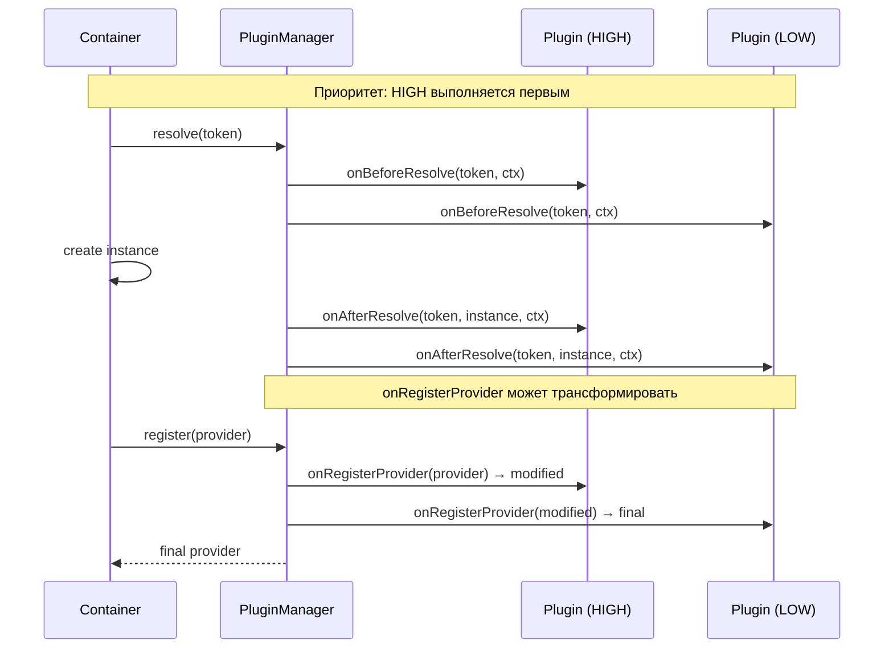

import { Callout } from 'fumadocs-ui/components/callout';
import { Tab, Tabs } from 'fumadocs-ui/components/tabs';

# Plugin API

Система плагинов позволяет расширять контейнер без изменения его ядра. Плагины подключаются к lifecycle-хукам для мониторинга, трансформации и валидации.



## Интерфейс Plugin

```typescript
interface Plugin {
  /** Уникальное имя плагина */
  name: string;

  /** Версия (опционально) */
  version?: string;

  // Lifecycle hooks
  onContainerCreate?(container: IContainer): void;
  onBeforeResolve?(token: Token, context: ResolutionContext): void;
  onAfterResolve?(token: Token, instance: unknown, context: ResolutionContext): void;
  onError?(error: Error, context: ResolutionContext): void;

  // Init hooks
  onBeforeInit?(token: Token, instance: unknown, context: ResolutionContext): void;
  onAfterInit?(token: Token, instance: unknown, context: ResolutionContext): void;

  // Provider hooks
  onRegisterProvider?(provider: Provider): Provider;

  // Custom scopes
  registerCustomScope?(name: string, handler: ScopeHandler): void;
}
```

---

## Lifecycle Hooks

### onContainerCreate

Вызывается при создании контейнера. Подходит для начальной конфигурации.

```typescript
onContainerCreate?(container: IContainer): void
```

```typescript
const plugin: Plugin = {
  name: "config-plugin",
  onContainerCreate(container) {
    container.registerValue(APP_VERSION, "1.0.0");
  },
};
```

### onBeforeResolve

Вызывается **перед** разрешением каждого токена (до cache lookup).

```typescript
onBeforeResolve?(token: Token, context: ResolutionContext): void
```

```typescript
const timingPlugin: Plugin = {
  name: "timing",
  onBeforeResolve(token, context) {
    // context.startTime уже установлен
    console.log(`Resolving: ${tokenToString(token)}`);
  },
};
```

### onAfterResolve

Вызывается **после** успешного разрешения (включая cache hits).

```typescript
onAfterResolve?(token: Token, instance: unknown, context: ResolutionContext): void
```

```typescript
const validationPlugin: Plugin = {
  name: "validation",
  onAfterResolve(token, instance, context) {
    const elapsed = performance.now() - context.startTime;
    if (elapsed > 100) {
      console.warn(`Slow resolution: ${tokenToString(token)} took ${elapsed.toFixed(1)}ms`);
    }
  },
};
```

### onBeforeInit / onAfterInit

Вызываются вокруг `onInit()` lifecycle-хука на экземплярах `ClassProvider`.

```typescript
onBeforeInit?(token: Token, instance: unknown, context: ResolutionContext): void
onAfterInit?(token: Token, instance: unknown, context: ResolutionContext): void
```

```typescript
const lifecyclePlugin: Plugin = {
  name: "lifecycle-tracker",
  onBeforeInit(token, instance, context) {
    console.log(`→ ${tokenToString(token)}.onInit() starting`);
  },
  onAfterInit(token, instance, context) {
    const elapsed = performance.now() - context.startTime;
    console.log(`✓ ${tokenToString(token)}.onInit() completed in ${elapsed.toFixed(1)}ms`);
  },
};
```

<Callout type="info">
`onBeforeInit` / `onAfterInit` вызываются **только** для экземпляров, реализующих интерфейс `OnInit`. Value, Factory и Existing провайдеры не триггерят эти хуки.
</Callout>

### onError

Вызывается при ошибке разрешения зависимости.

```typescript
onError?(error: Error, context: ResolutionContext): void
```

```typescript
const errorPlugin: Plugin = {
  name: "error-reporter",
  onError(error, context) {
    errorReporter.captureException(error, {
      token: tokenToString(context.token),
      scope: context.scope,
      depth: context.depth,
    });
  },
};
```

---

## Provider Hooks

### onRegisterProvider

Вызывается при регистрации провайдера. Может трансформировать провайдер перед сохранением.

```typescript
onRegisterProvider?(provider: Provider): Provider
```

```typescript
const scopeEnforcer: Plugin = {
  name: "scope-enforcer",
  onRegisterProvider(provider) {
    // Запретить transient scope в production
    if (provider.scope === Scope.TRANSIENT) {
      console.warn(`Transient scope used for ${tokenToString(provider.token)}`);
      return { ...provider, scope: Scope.SINGLETON };
    }
    return provider;
  },
};
```

---

## ResolutionContext

Контекст, передаваемый во все resolution-хуки.

```typescript
interface ResolutionContext {
  /** Токен, который резолвится */
  token: Token;

  /** Скоуп разрешения */
  scope: Scope;

  /** Глубина в графе зависимостей (0 = корневой resolve) */
  depth: number;

  /** Родительский токен (если это вложенная зависимость) */
  parent?: Token;

  /** Время начала разрешения (performance.now()) */
  startTime: number;

  /** Является ли разрешение опциональным */
  optional: boolean;
}
```

### Использование startTime для профилирования

```typescript
onAfterResolve(token, instance, context) {
  const elapsed = performance.now() - context.startTime;
  metrics.histogram("di.resolve.duration", elapsed, {
    token: tokenToString(token),
    scope: context.scope,
    cached: context.depth === 0,
  });
}
```

---

## PluginPriority

Управляет порядком выполнения хуков при наличии нескольких плагинов.

```typescript
enum PluginPriority {
  HIGHEST = 100,   // Выполняется первым
  HIGH    = 75,
  NORMAL  = 50,    // По умолчанию
  LOW     = 25,
  LOWEST  = 0,     // Выполняется последним
}
```

```typescript
container
  .use(securityPlugin, PluginPriority.HIGHEST)  // Проверки безопасности — первыми
  .use(loggingPlugin, PluginPriority.NORMAL)     // Логирование — стандартный приоритет
  .use(metricsPlugin, PluginPriority.LOW);       // Метрики — после всего
```

---

## PluginManager

Класс для управления плагинами. Доступен через контейнер.

### Методы регистрации

```typescript
// Через контейнер (рекомендуется)
container.use(plugin, priority?);
container.getPlugins();
container.hasPlugin("plugin-name");
```

### Внутренний API (для авторов плагинов)

```typescript
class PluginManager {
  register(plugin: Plugin, priority?: PluginPriority): void;
  unregister(pluginName: string): boolean;
  getPlugins(): Plugin[];
  hasPlugin(pluginName: string): boolean;
  clear(): void;
  get size(): number;
}
```

---

## ScopeHandler

Интерфейс для реализации пользовательских скоупов через плагины.

```typescript
interface ScopeHandler {
  get(token: Token): unknown | undefined;
  set(token: Token, instance: unknown): void;
  has(token: Token): boolean;
  clear(): void;
}
```

---

## Встроенные плагины

### LoggingPlugin

Логирование операций контейнера.

```typescript
import { LoggingPlugin } from "@ambrosia-unce/core";

container.use(new LoggingPlugin({
  logger: customLogger,              // default: ConsoleLogger
  logResolutionTiming: true,         // Логировать время resolve (default: false)
  logProviderRegistration: true,     // Логировать регистрацию провайдеров (default: false)
}));
```

#### LoggingPluginOptions

```typescript
interface LoggingPluginOptions {
  logger?: Logger;
  logResolutionTiming?: boolean;
  logProviderRegistration?: boolean;
}
```

#### Интерфейс Logger

```typescript
interface Logger {
  info(message: string, ...args: unknown[]): void;
  warn(message: string, ...args: unknown[]): void;
  error(message: string, ...args: unknown[]): void;
  debug(message: string, ...args: unknown[]): void;
}
```

#### Встроенные логгеры

```typescript
import { ConsoleLogger, SilentLogger, setGlobalLogger } from "@ambrosia-unce/core";

// ConsoleLogger — выводит в console с префиксами
const logger = new ConsoleLogger();

// SilentLogger — no-op, для production / тестов
const silent = new SilentLogger();

// Установить глобальный логгер для внутренних сообщений Ambrosia
setGlobalLogger(new SilentLogger());
```

---

## Полный пример плагина

```typescript
import type { Plugin, ResolutionContext, Token, Provider } from "@ambrosia-unce/core";
import { tokenToString } from "@ambrosia-unce/core";

class TelemetryPlugin implements Plugin {
  name = "telemetry";
  version = "1.0.0";

  private resolutions = new Map<string, number>();

  onContainerCreate() {
    console.log("[Telemetry] Container created");
  }

  onBeforeResolve(token: Token, context: ResolutionContext) {
    const name = tokenToString(token);
    this.resolutions.set(name, (this.resolutions.get(name) ?? 0) + 1);
  }

  onAfterResolve(token: Token, instance: unknown, context: ResolutionContext) {
    const elapsed = performance.now() - context.startTime;
    if (elapsed > 50) {
      console.warn(`[Telemetry] Slow: ${tokenToString(token)} ${elapsed.toFixed(1)}ms`);
    }
  }

  onBeforeInit(token: Token) {
    console.log(`[Telemetry] ${tokenToString(token)}.onInit() starting`);
  }

  onAfterInit(token: Token) {
    console.log(`[Telemetry] ${tokenToString(token)}.onInit() completed`);
  }

  onError(error: Error, context: ResolutionContext) {
    console.error(`[Telemetry] Error resolving ${tokenToString(context.token)}:`, error.message);
  }

  onRegisterProvider(provider: Provider) {
    console.log(`[Telemetry] Registered: ${tokenToString(provider.token)}`);
    return provider;
  }

  getStats() {
    return Object.fromEntries(this.resolutions);
  }
}
```

## Следующие шаги

- [Разработка плагинов](/docs/core/advanced/plugin-development) — пошаговое руководство
- [Container API](/docs/core/api-reference/container) — регистрация плагинов
- [Типы ошибок](/docs/core/api-reference/errors) — обработка ошибок в плагинах
