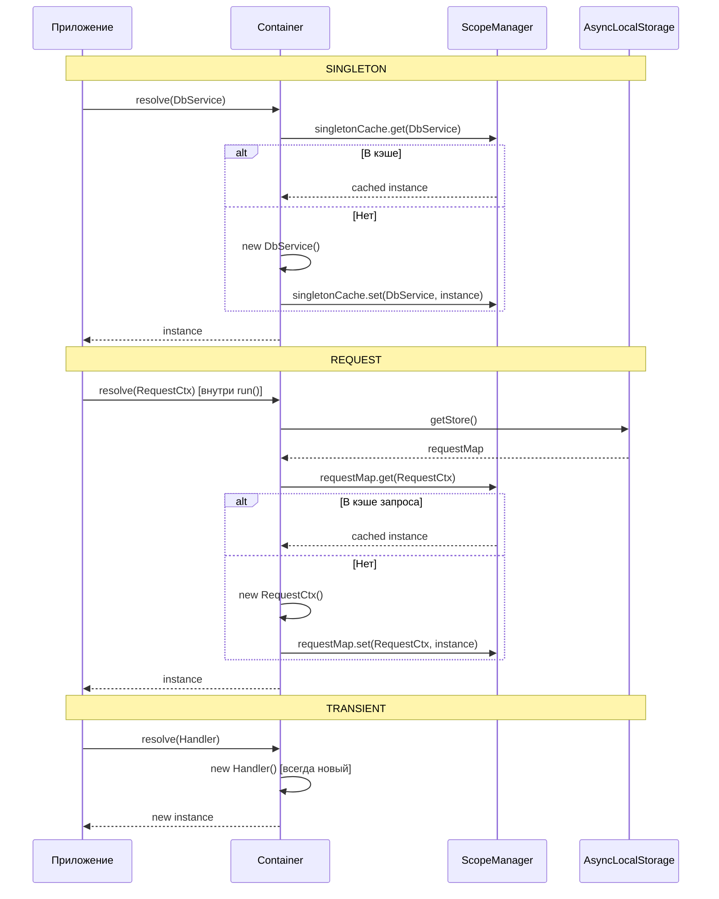

import { Callout } from 'fumadocs-ui/components/callout';
import { Tab, Tabs } from 'fumadocs-ui/components/tabs';

# Scope API

Скоупы определяют жизненный цикл экземпляров — как долго они живут и когда создаются заново.



## Enum Scope

```typescript
import { Scope } from "@ambrosia/core";

enum Scope {
  SINGLETON  = "singleton",
  TRANSIENT  = "transient",
  REQUEST    = "request",
}
```

### Scope.SINGLETON

Один экземпляр на весь контейнер. Создаётся при первом `resolve()` и кэшируется навсегда.

```typescript
@Injectable() // scope по умолчанию — SINGLETON
class DatabasePool {
  constructor() {
    console.log("Pool created"); // Выведется один раз
  }
}

const a = container.resolve(DatabasePool);
const b = container.resolve(DatabasePool);
console.log(a === b); // true
```

**Когда использовать:**
- Stateless сервисы (большинство сервисов)
- Ресурсы, которые дорого создавать (пулы соединений, кэши)
- Конфигурация

### Scope.TRANSIENT

Новый экземпляр при каждом вызове `resolve()`. Никогда не кэшируется.

```typescript
@Injectable({ scope: Scope.TRANSIENT })
class RequestLogger {
  private id = crypto.randomUUID();

  constructor() {
    console.log(`Logger ${this.id} created`); // Каждый раз новый
  }
}

const a = container.resolve(RequestLogger);
const b = container.resolve(RequestLogger);
console.log(a === b); // false
```

**Когда использовать:**
- Stateful объекты, которые не должны разделять состояние
- Объекты с коротким жизненным циклом
- Command/Strategy паттерны

<Callout type="warn">
`onDestroy()` **не вызывается** для transient-экземпляров, т.к. контейнер не хранит ссылок на них. Управляйте cleanup вручную.
</Callout>

### Scope.REQUEST

Один экземпляр на request-контекст. Использует `AsyncLocalStorage` для изоляции.

```typescript
@Injectable({ scope: Scope.REQUEST })
class RequestContext {
  userId?: string;
  startedAt = Date.now();
}

// Каждый request получает свой экземпляр
await container.requestStorage.runAsync(async () => {
  const ctx = container.resolve(RequestContext);
  ctx.userId = "user-123";

  // Все resolve() в этом контексте вернут тот же экземпляр
  const same = container.resolve(RequestContext);
  console.log(ctx === same); // true
});

// Другой request — другой экземпляр
await container.requestStorage.runAsync(async () => {
  const ctx = container.resolve(RequestContext);
  console.log(ctx.userId); // undefined (новый экземпляр)
});
```

**Когда использовать:**
- HTTP request context (userId, tracing, i18n)
- Транзакции базы данных
- Любые данные, привязанные к конкретному запросу

<Callout type="warn">
Резолв REQUEST-scoped провайдера вне контекста `requestStorage.run()` выбросит `NoRequestScopeError`.
</Callout>

---

## Сравнение скоупов

| Характеристика | SINGLETON | TRANSIENT | REQUEST |
|---|---|---|---|
| Кэширование | Навсегда | Нет | На время request |
| `a === b` (два resolve) | `true` | `false` | `true` (в одном request) |
| `onDestroy()` | Да | Нет | Да |
| Производительность | Лучшая | Худшая | Средняя |
| Требует контекста | Нет | Нет | Да (`requestStorage.run`) |

---

## DEFAULT_SCOPE

```typescript
import { DEFAULT_SCOPE } from "@ambrosia/core";

console.log(DEFAULT_SCOPE); // "singleton"
```

Используется, когда scope не указан явно в провайдере.

---

## RequestScopeStorage

Управляет request-scoped экземплярами через `AsyncLocalStorage`.

```typescript
import { Container } from "@ambrosia/core";

const container = new Container();
const storage = container.requestStorage;
```

### run()

Выполняет синхронный callback в новом request-контексте.

```typescript
run<T>(callback: () => T): T
```

```typescript
const result = container.requestStorage.run(() => {
  const ctx = container.resolve(RequestContext);
  ctx.userId = "123";
  return processRequest(ctx);
});
```

### runAsync()

Выполняет асинхронный callback в новом request-контексте.

```typescript
runAsync<T>(callback: () => Promise<T>): Promise<T>
```

```typescript
await container.requestStorage.runAsync(async () => {
  const ctx = container.resolve(RequestContext);
  await handleRequest(ctx);
});
```

### hasActiveScope()

Проверяет, есть ли активный request-контекст.

```typescript
hasActiveScope(): boolean
```

```typescript
if (container.requestStorage.hasActiveScope()) {
  const ctx = container.resolve(RequestContext);
} else {
  console.log("Нет активного request контекста");
}
```

### get() / set() / has()

Низкоуровневые методы для работы с кэшем текущего request-контекста.

```typescript
get(token: Token): unknown | undefined
set(token: Token, instance: unknown): void
has(token: Token): boolean
```

### clear()

Очищает все экземпляры в текущем request-контексте.

```typescript
clear(): void
```

### size()

Количество кэшированных экземпляров в текущем контексте.

```typescript
size(): number
```

---

## Пример: HTTP-сервер с request scope

```typescript
import { Injectable, Inject, InjectionToken, Scope, Container } from "@ambrosia/core";

const USER_ID = new InjectionToken<string>("UserId");

@Injectable({ scope: Scope.REQUEST })
class AuditLogger {
  constructor(@Inject(USER_ID) private userId: string) {}

  log(action: string) {
    console.log(`[${this.userId}] ${action}`);
  }
}

@Injectable()
class UserService {
  constructor(private audit: AuditLogger) {}

  deleteUser(targetId: string) {
    this.audit.log(`Deleted user ${targetId}`);
  }
}

const container = new Container();

// Для каждого HTTP-запроса:
async function handleRequest(req: Request) {
  return container.requestStorage.runAsync(async () => {
    // Регистрируем userId для этого запроса
    container.registerValue(USER_ID, req.headers.get("x-user-id")!);

    const userService = container.resolve(UserService);
    userService.deleteUser("target-456");
    // Лог: [user-123] Deleted user target-456
  });
}
```

## Следующие шаги

- [Container API](/docs/core/api-reference/container) — управление контейнером
- [Руководство по скоупам](/docs/core/guides/scopes) — углублённое использование
- [Типы ошибок](/docs/core/api-reference/errors) — NoRequestScopeError и другие
