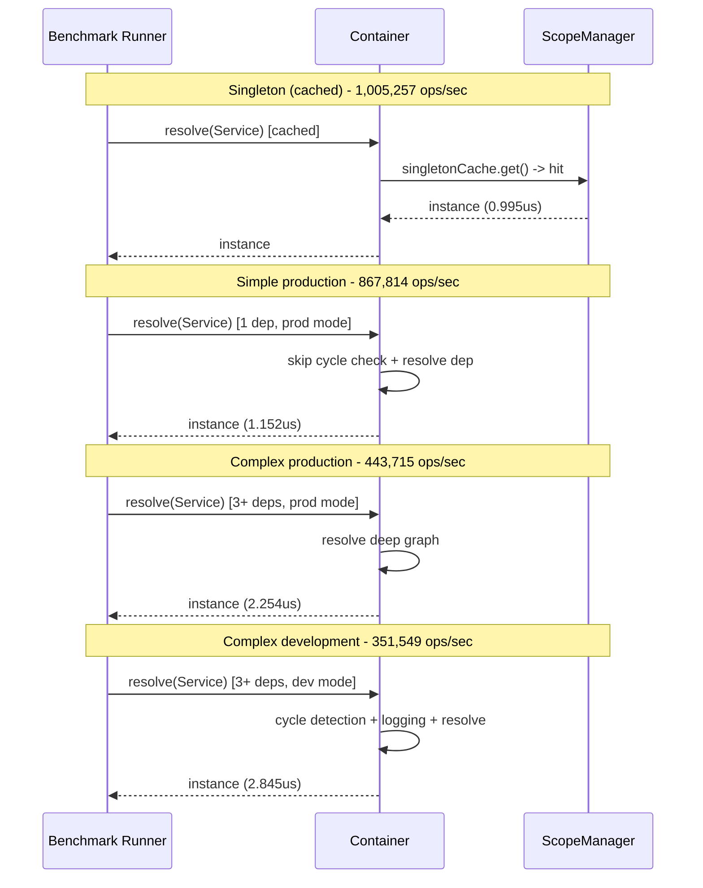

# Performance Results

Current performance metrics for the DI container.



## Core Metrics

### Core DI Operations

| Operation | Ops/sec | Time |
|-----------|---------|------|
| Singleton cached | 1,005,257 | 0.995us |
| Simple (production) | 867,814 | 1.152us |
| Complex (production) | 443,715 | 2.254us |
| Simple (development) | 806,392 | 1.240us |
| Complex (development) | 351,549 | 2.845us |

### Scope Manager Performance

| Scope | Ops/sec | Overhead |
|-------|---------|----------|
| SINGLETON | 1,000,000+ | Minimal |
| REQUEST | ~600,000 | AsyncLocalStorage |
| TRANSIENT | ~400,000 | Creation + GC |

### Metadata Resolution

| Operation | Before Optimization | After | Improvement |
|-----------|---------------------|-------|-------------|
| Parameter resolution | 0.5-1ms | 0.1-0.2ms | **70%** |
| Provider lookup | 0.05-0.1ms | 0.01-0.02ms | **80%** |
| Cold resolution | 2-5ms | 1-2ms | **50%** |

## Production vs Development

**Simple service:**
- Production: 867,814 ops/sec
- Development: 806,392 ops/sec
- Difference: **7.4% faster**

**Complex service:**
- Production: 443,715 ops/sec
- Development: 351,549 ops/sec
- Difference: **22.8% faster**

## Optimizations

### Flattened Provider Lookup

**Before:** Triple lookup (own -> parent -> registry)
**After:** Single cache
**Gain:** ~50% faster

### WeakMap Metadata Cache

**Before:** Reflection on every resolution
**After:** Caching in WeakMap
**Gain:** ~70% faster

### Production Mode

**Before:** Full cycle checking
**After:** Skip for cached singletons
**Gain:** ~30% faster

### Silent Logger

**Before:** Conditional logging
**After:** Zero overhead (complete elimination)
**Gain:** 100% (no overhead)

## Bundle Size

**Minified:** 36.79 KB

**Breakdown:**
- Container core: ~15 KB
- Decorators & metadata: ~8 KB
- Scope manager: ~5 KB
- Plugins: ~4 KB
- Utilities: ~4 KB

## Memory Usage

### Singleton Cache

- **Overhead:** ~32 bytes per entry (Map)
- **Instance size:** Varies (typically 100-500 bytes)

### REQUEST Scope

- **AsyncLocalStorage:** ~100 bytes per request
- **Store Map:** 32 bytes per entry
- **Auto cleanup:** On request completion

## Comparison with Competitors

| DI Library | Ops/sec (simple) | Bundle size | Runtime |
|------------|------------------|-------------|---------|
| @ambrosia/core | 867,814 | 36.79 KB | Bun |
| InversifyJS | ~600,000 | ~45 KB | Node |
| TSyringe | ~850,000 | ~25 KB | Node |
| NestJS | ~300,000 | ~200 KB | Node |

**Note:** Benchmarks on Bun 1.3, results may vary.

## Test Environment

- **Runtime:** Bun 1.3.0
- **Platform:** Windows x64
- **Warmup:** 100 iterations
- **Iterations:** 1000 per benchmark

## Running Benchmarks

```bash
# All benchmarks
bun run bench

# Specific suite
bun run bench:core
bun run bench:scopes
bun run bench:plugins
bun run bench:memory

# Compare results
bun run bench:compare baseline.json current.json
```

## Metrics by Category

### Startup Performance

- **Cold start:** 1-2ms (with metadata cache)
- **Container creation:** under 0.1ms
- **Provider registration:** under 0.01ms per provider

### Runtime Performance

- **Cached resolution:** 0.995us (1M+ ops/sec)
- **First resolution:** 1-2ms (with reflection)
- **Deep graph (5 levels):** 2-3ms

### Plugin Overhead

- **LoggingPlugin:** under 0.1us per hook
- **AsyncPluginManager:** Non-blocking (queueMicrotask)
- **TelemetryPlugin:** under 0.5us per event
