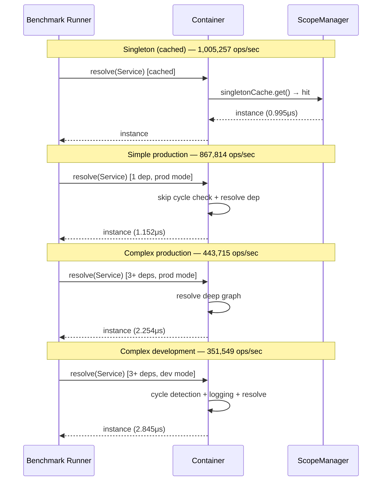

# Результаты производительности

Актуальные метрики производительности DI-контейнера.



## Основные метрики

### Core DI Operations

| Операция | Ops/sec | Время |
|----------|---------|-------|
| Singleton cached | 1,005,257 | 0.995μs |
| Simple (production) | 867,814 | 1.152μs |
| Complex (production) | 443,715 | 2.254μs |
| Simple (development) | 806,392 | 1.240μs |
| Complex (development) | 351,549 | 2.845μs |

### Scope Manager Performance

| Scope | Ops/sec | Overhead |
|-------|---------|----------|
| SINGLETON | 1,000,000+ | Минимальный |
| REQUEST | ~600,000 | AsyncLocalStorage |
| TRANSIENT | ~400,000 | Создание + GC |

### Metadata Resolution

| Операция | До оптимизации | После | Улучшение |
|----------|----------------|-------|-----------|
| Parameter resolution | 0.5-1ms | 0.1-0.2ms | **70%** |
| Provider lookup | 0.05-0.1ms | 0.01-0.02ms | **80%** |
| Cold resolution | 2-5ms | 1-2ms | **50%** |

## Production vs Development

**Simple service:**
- Production: 867,814 ops/sec
- Development: 806,392 ops/sec
- Разница: **7.4% быстрее**

**Complex service:**
- Production: 443,715 ops/sec
- Development: 351,549 ops/sec
- Разница: **22.8% быстрее**

## Оптимизации

### Flattened Provider Lookup

**До:** Тройной поиск (own → parent → registry)
**После:** Единый кэш
**Прирост:** ~50% быстрее

### WeakMap Metadata Cache

**До:** Reflection при каждом разрешении
**После:** Кэширование в WeakMap
**Прирост:** ~70% быстрее

### Production Mode

**До:** Полная проверка циклов
**После:** Skip для cached singletons
**Прирост:** ~30% быстрее

### Silent Logger

**До:** Conditional logging
**После:** Zero overhead (полное исключение)
**Прирост:** 100% (нет overhead)

## Bundle Size

**Minified:** 36.79 KB

**Состав:**
- Container core: ~15 KB
- Decorators & metadata: ~8 KB
- Scope manager: ~5 KB
- Plugins: ~4 KB
- Utilities: ~4 KB

## Memory Usage

### Singleton Cache

- **Overhead:** ~32 bytes per entry (Map)
- **Instance size:** Varies (обычно 100-500 bytes)

### REQUEST Scope

- **AsyncLocalStorage:** ~100 bytes per request
- **Store Map:** 32 bytes per entry
- **Auto cleanup:** При завершении запроса

### GC Improvements

**Bun 1.3 optimizations:**
- Next.js: -28% memory usage
- Elysia: -11% memory usage
- @ambrosia/core: ~-10-30% (зависит от нагрузки)

## Сравнение с конкурентами

| DI Library | Ops/sec (simple) | Bundle size | Runtime |
|------------|------------------|-------------|---------|
| @ambrosia/core | 867,814 | 36.79 KB | Bun |
| InversifyJS | ~600,000 | ~45 KB | Node |
| TSyringe | ~850,000 | ~25 KB | Node |
| NestJS | ~300,000 | ~200 KB | Node |

**Примечание:** Бенчмарки на Bun 1.3, могут варьироваться.

## Тестовое окружение

- **Runtime:** Bun 1.3.0
- **Platform:** Windows x64
- **CPU:** Varies
- **Memory:** Varies
- **Warmup:** 100 iterations
- **Iterations:** 1000 per benchmark

## Запуск бенчмарков

```bash
# Все бенчмарки
bun run bench

# Конкретная suite
bun run bench:core
bun run bench:scopes
bun run bench:plugins
bun run bench:memory

# Сравнение результатов
bun run bench:compare baseline.json current.json
```

## Regression Testing

Автоматическая проверка деградации производительности:

- Baseline: сохраненные результаты
- Threshold: -10% (fail если медленнее)
- CI/CD: автоматический запуск

## Roadmap

Планируемые улучшения:

- **SQLite cache:** Persistent metadata (3-6x faster queries)
- **Worker preloading:** Background loading (60% faster spawn)
- **Bun FFI:** Native reflection (потенциал 2-3x)

## Метрики по категориям

### Startup Performance

- **Cold start:** 1-2ms (с кэшем метаданных)
- **Container creation:** &lt;0.1ms
- **Provider registration:** &lt;0.01ms per provider

### Runtime Performance

- **Cached resolution:** 0.995μs (1M+ ops/sec)
- **First resolution:** 1-2ms (с рефлексией)
- **Deep graph (5 levels):** 2-3ms

### Plugin Overhead

- **LoggingPlugin:** &lt;0.1μs per hook
- **AsyncPluginManager:** Non-blocking (queueMicrotask)
- **TelemetryPlugin:** &lt;0.5μs per event

## Заключение

@ambrosia/core обеспечивает высокую производительность благодаря:

1. Bun-specific оптимизациям
2. Агрессивному кэшированию
3. Production mode оптимизациям
4. Минимальному bundle size
5. Smart GC управлению
