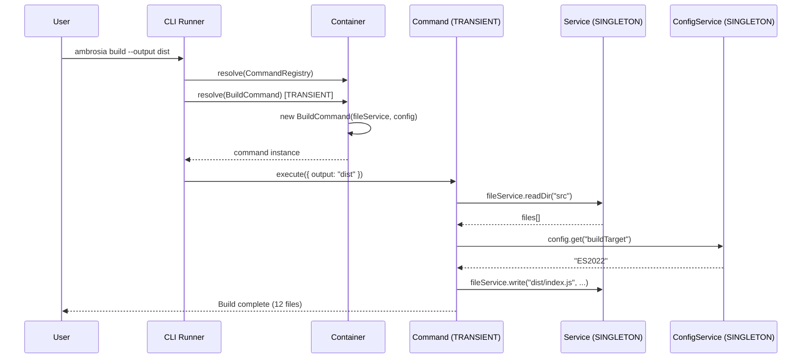

import { Callout } from 'fumadocs-ui/components/callout';

# CLI Application

An example console application with a DI container, the Command pattern, and TRANSIENT scope for commands.

## Architecture



## Project Structure

```
src/
+-- config/
|   +-- config.service.ts       # ConfigService (SINGLETON)
+-- services/
|   +-- file.service.ts          # FileService (SINGLETON)
|   +-- git.service.ts           # GitService (SINGLETON)
+-- commands/
|   +-- command.interface.ts     # Abstract Command class
|   +-- init.command.ts          # InitCommand (TRANSIENT)
|   +-- build.command.ts         # BuildCommand (TRANSIENT)
|   +-- deploy.command.ts        # DeployCommand (TRANSIENT)
+-- registry/
|   +-- command.registry.ts      # CommandRegistry
+-- index.ts                     # Entry point
```

## Implementation

### Abstract Command Class

```typescript title="src/commands/command.interface.ts"
export abstract class Command {
  abstract name: string;
  abstract description: string;

  abstract execute(args: Record<string, string>): Promise<void>;
}
```

### ConfigService

```typescript title="src/config/config.service.ts"
import { Injectable, type OnInit } from "@ambrosia/core";
import { readFileSync, existsSync } from "fs";

@Injectable()
export class ConfigService implements OnInit {
  private config: Record<string, string> = {};

  onInit() {
    const configPath = "./ambrosia.json";
    if (existsSync(configPath)) {
      this.config = JSON.parse(readFileSync(configPath, "utf-8"));
    }
  }

  get(key: string, fallback = ""): string {
    return this.config[key] ?? process.env[key] ?? fallback;
  }

  getAll(): Record<string, string> {
    return { ...this.config };
  }
}
```

### Commands (TRANSIENT scope)

```typescript title="src/commands/build.command.ts"
import { Injectable, Scope } from "@ambrosia/core";
import { Command } from "./command.interface";
import { FileService } from "../services/file.service";
import { ConfigService } from "../config/config.service";

@Injectable({ scope: Scope.TRANSIENT })
export class BuildCommand extends Command {
  name = "build";
  description = "Build the project";

  constructor(
    private files: FileService,
    private config: ConfigService,
  ) {
    super();
  }

  async execute(args: Record<string, string>) {
    const output = args.output ?? this.config.get("outputDir", "dist");
    const target = this.config.get("buildTarget", "ES2022");

    console.log(`Building to ${output} (target: ${target})...`);

    const sourceFiles = await this.files.readDir("src");
    const tsFiles = sourceFiles.filter((f: string) => f.endsWith(".ts"));

    console.log(`Found ${tsFiles.length} TypeScript files`);

    const result = await Bun.build({
      entrypoints: tsFiles.map((f: string) => `src/${f}`),
      outdir: output,
      target: "node",
    });

    console.log(`Build complete: ${result.outputs.length} files`);
  }
}
```

### CommandRegistry

```typescript title="src/registry/command.registry.ts"
import { Injectable, Container } from "@ambrosia/core";
import { Command } from "../commands/command.interface";
import { InitCommand } from "../commands/init.command";
import { BuildCommand } from "../commands/build.command";
import { DeployCommand } from "../commands/deploy.command";

@Injectable()
export class CommandRegistry {
  private commands = new Map<string, new (...args: any[]) => Command>();

  constructor(private container: Container) {
    this.register("init", InitCommand);
    this.register("build", BuildCommand);
    this.register("deploy", DeployCommand);
  }

  register(name: string, commandClass: new (...args: any[]) => Command) {
    this.commands.set(name, commandClass);
  }

  async run(name: string, args: Record<string, string>) {
    const CommandClass = this.commands.get(name);
    if (!CommandClass) {
      throw new Error(`Unknown command: ${name}. Available: ${[...this.commands.keys()].join(", ")}`);
    }

    // TRANSIENT: each run() creates a new instance
    const command = this.container.resolve(CommandClass) as Command;
    await command.execute(args);
  }

  getAvailableCommands(): string[] {
    return [...this.commands.keys()];
  }
}
```

### Entry Point

```typescript title="src/index.ts"
import { Container } from "@ambrosia/core";
import { CommandRegistry } from "./registry/command.registry";

const container = new Container({ mode: "production" });

const registry = container.resolve(CommandRegistry);

const [, , commandName, ...rawArgs] = process.argv;

if (!commandName || commandName === "help") {
  console.log("Available commands:");
  for (const cmd of registry.getAvailableCommands()) {
    console.log(`  ${cmd}`);
  }
  process.exit(0);
}

const args: Record<string, string> = {};
for (let i = 0; i < rawArgs.length; i += 2) {
  const key = rawArgs[i]?.replace(/^--/, "");
  const value = rawArgs[i + 1] ?? "true";
  if (key) args[key] = value;
}

try {
  await registry.run(commandName, args);
} catch (error) {
  console.error(`Error: ${(error as Error).message}`);
  process.exit(1);
} finally {
  await container.destroyAll();
}
```

## Why TRANSIENT for Commands

Commands use `Scope.TRANSIENT` because each execution is independent and can have its own state. Services (`FileService`, `ConfigService`) are `SINGLETON` because they are stateless and reusable.

## Next Steps

- [Microservices](/docs/core/examples/microservices) - DI in microservice architecture
- [Scopes](/docs/core/guides/scopes) - SINGLETON vs TRANSIENT vs REQUEST
- [Testing](/docs/core/examples/testing) - Testing CLI commands
