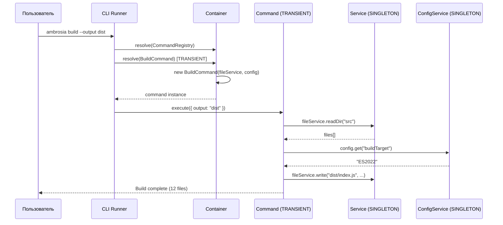
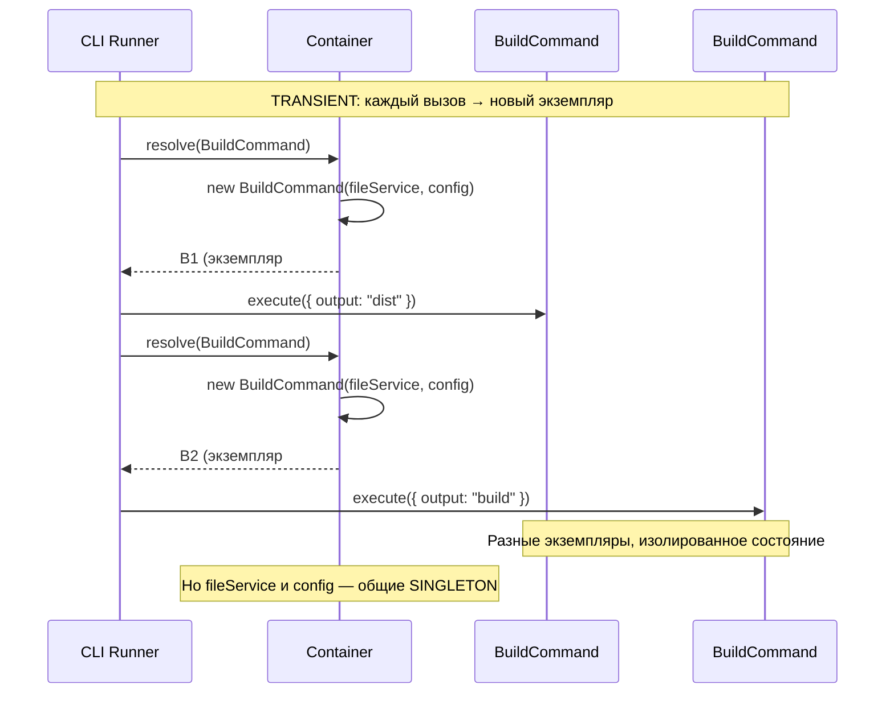

import { Callout } from 'fumadocs-ui/components/callout';

# CLI приложение

Пример консольного приложения с DI-контейнером, паттерном Command и TRANSIENT scope для команд.

## Архитектура



## Структура проекта

```
src/
├── config/
│   └── config.service.ts       # ConfigService (SINGLETON)
├── services/
│   ├── file.service.ts          # FileService (SINGLETON)
│   └── git.service.ts           # GitService (SINGLETON)
├── commands/
│   ├── command.interface.ts     # Абстрактный класс Command
│   ├── init.command.ts          # InitCommand (TRANSIENT)
│   ├── build.command.ts         # BuildCommand (TRANSIENT)
│   └── deploy.command.ts        # DeployCommand (TRANSIENT)
├── registry/
│   └── command.registry.ts      # CommandRegistry
└── index.ts                     # Точка входа
```

## Реализация

### Абстрактный класс Command

```typescript title="src/commands/command.interface.ts"
export abstract class Command {
  abstract name: string;
  abstract description: string;

  abstract execute(args: Record<string, string>): Promise<void>;
}
```

### ConfigService

```typescript title="src/config/config.service.ts"
import { Injectable, type OnInit } from "@ambrosia/core";
import { readFileSync, existsSync } from "fs";

@Injectable()
export class ConfigService implements OnInit {
  private config: Record<string, string> = {};

  onInit() {
    const configPath = "./ambrosia.json";
    if (existsSync(configPath)) {
      this.config = JSON.parse(readFileSync(configPath, "utf-8"));
    }
  }

  get(key: string, fallback = ""): string {
    return this.config[key] ?? process.env[key] ?? fallback;
  }

  getAll(): Record<string, string> {
    return { ...this.config };
  }
}
```

### FileService

```typescript title="src/services/file.service.ts"
import { Injectable } from "@ambrosia/core";
import { readdir, readFile, writeFile, mkdir } from "fs/promises";
import { join } from "path";

@Injectable()
export class FileService {
  async readDir(path: string): Promise<string[]> {
    return readdir(path, { recursive: true }) as Promise<string[]>;
  }

  async read(path: string): Promise<string> {
    return readFile(path, "utf-8");
  }

  async write(path: string, content: string): Promise<void> {
    await mkdir(join(path, ".."), { recursive: true });
    await writeFile(path, content);
  }
}
```

### GitService

```typescript title="src/services/git.service.ts"
import { Injectable } from "@ambrosia/core";

@Injectable()
export class GitService {
  async getCurrentBranch(): Promise<string> {
    const proc = Bun.spawn(["git", "rev-parse", "--abbrev-ref", "HEAD"]);
    const output = await new Response(proc.stdout).text();
    return output.trim();
  }

  async getLastCommit(): Promise<string> {
    const proc = Bun.spawn(["git", "log", "-1", "--format=%H"]);
    const output = await new Response(proc.stdout).text();
    return output.trim();
  }
}
```

### Команды (TRANSIENT scope)

```typescript title="src/commands/init.command.ts"
import { Injectable, Scope, Implements } from "@ambrosia/core";
import { Command } from "./command.interface";
import { FileService } from "../services/file.service";
import { ConfigService } from "../config/config.service";

@Injectable({ scope: Scope.TRANSIENT })
@Implements(Command)
export class InitCommand extends Command {
  name = "init";
  description = "Initialize a new project";

  constructor(
    private files: FileService,
    private config: ConfigService,
  ) {
    super();
  }

  async execute(args: Record<string, string>) {
    const projectName = args.name ?? "my-app";
    console.log(`Initializing project: ${projectName}`);

    await this.files.write(
      `${projectName}/ambrosia.json`,
      JSON.stringify({ name: projectName, version: "0.1.0" }, null, 2),
    );

    await this.files.write(
      `${projectName}/src/index.ts`,
      `console.log("Hello from ${projectName}!");`,
    );

    console.log(`Project ${projectName} initialized!`);
  }
}
```

```typescript title="src/commands/build.command.ts"
import { Injectable, Scope } from "@ambrosia/core";
import { Command } from "./command.interface";
import { FileService } from "../services/file.service";
import { ConfigService } from "../config/config.service";

@Injectable({ scope: Scope.TRANSIENT })
export class BuildCommand extends Command {
  name = "build";
  description = "Build the project";

  constructor(
    private files: FileService,
    private config: ConfigService,
  ) {
    super();
  }

  async execute(args: Record<string, string>) {
    const output = args.output ?? this.config.get("outputDir", "dist");
    const target = this.config.get("buildTarget", "ES2022");

    console.log(`Building to ${output} (target: ${target})...`);

    const sourceFiles = await this.files.readDir("src");
    const tsFiles = sourceFiles.filter((f: string) => f.endsWith(".ts"));

    console.log(`Found ${tsFiles.length} TypeScript files`);

    // Bun.build() вызов
    const result = await Bun.build({
      entrypoints: tsFiles.map((f: string) => `src/${f}`),
      outdir: output,
      target: "node",
    });

    console.log(`Build complete: ${result.outputs.length} files`);
  }
}
```

```typescript title="src/commands/deploy.command.ts"
import { Injectable, Scope } from "@ambrosia/core";
import { Command } from "./command.interface";
import { GitService } from "../services/git.service";
import { ConfigService } from "../config/config.service";

@Injectable({ scope: Scope.TRANSIENT })
export class DeployCommand extends Command {
  name = "deploy";
  description = "Deploy the project";

  constructor(
    private git: GitService,
    private config: ConfigService,
  ) {
    super();
  }

  async execute(args: Record<string, string>) {
    const branch = await this.git.getCurrentBranch();
    const commit = await this.git.getLastCommit();
    const target = args.target ?? this.config.get("deployTarget", "production");

    console.log(`Deploying ${branch}@${commit.slice(0, 7)} to ${target}...`);
    // ... deploy logic ...
    console.log("Deploy complete!");
  }
}
```

### CommandRegistry

```typescript title="src/registry/command.registry.ts"
import { Injectable, Container } from "@ambrosia/core";
import { Command } from "../commands/command.interface";

// Импортируем команды для авто-регистрации
import { InitCommand } from "../commands/init.command";
import { BuildCommand } from "../commands/build.command";
import { DeployCommand } from "../commands/deploy.command";

@Injectable()
export class CommandRegistry {
  private commands = new Map<string, new (...args: any[]) => Command>();

  constructor(private container: Container) {
    // Регистрируем доступные команды
    this.register("init", InitCommand);
    this.register("build", BuildCommand);
    this.register("deploy", DeployCommand);
  }

  register(name: string, commandClass: new (...args: any[]) => Command) {
    this.commands.set(name, commandClass);
  }

  async run(name: string, args: Record<string, string>) {
    const CommandClass = this.commands.get(name);
    if (!CommandClass) {
      throw new Error(`Unknown command: ${name}. Available: ${[...this.commands.keys()].join(", ")}`);
    }

    // TRANSIENT: каждый run() создаёт новый экземпляр
    const command = this.container.resolve(CommandClass) as Command;
    await command.execute(args);
  }

  getAvailableCommands(): string[] {
    return [...this.commands.keys()];
  }
}
```

### Точка входа

```typescript title="src/index.ts"
import { Container } from "@ambrosia/core";
import { CommandRegistry } from "./registry/command.registry";

const container = new Container({ mode: "production" });

const registry = container.resolve(CommandRegistry);

// Парсинг аргументов CLI
const [, , commandName, ...rawArgs] = process.argv;

if (!commandName || commandName === "help") {
  console.log("Available commands:");
  for (const cmd of registry.getAvailableCommands()) {
    console.log(`  ${cmd}`);
  }
  process.exit(0);
}

// Парсинг --key value аргументов
const args: Record<string, string> = {};
for (let i = 0; i < rawArgs.length; i += 2) {
  const key = rawArgs[i]?.replace(/^--/, "");
  const value = rawArgs[i + 1] ?? "true";
  if (key) args[key] = value;
}

try {
  await registry.run(commandName, args);
} catch (error) {
  console.error(`Error: ${(error as Error).message}`);
  process.exit(1);
} finally {
  await container.destroyAll();
}
```

## Почему TRANSIENT для команд



Команды используют `Scope.TRANSIENT`, потому что каждое выполнение независимо и может иметь своё состояние. Сервисы (`FileService`, `ConfigService`) — `SINGLETON`, потому что они stateless и переиспользуются.

## Следующие шаги

- [Микросервисы](/docs/core/examples/microservices) — DI в микросервисной архитектуре
- [Области видимости](/docs/core/guides/scopes) — SINGLETON vs TRANSIENT vs REQUEST
- [Тестирование](/docs/core/examples/testing) — тестирование CLI команд
