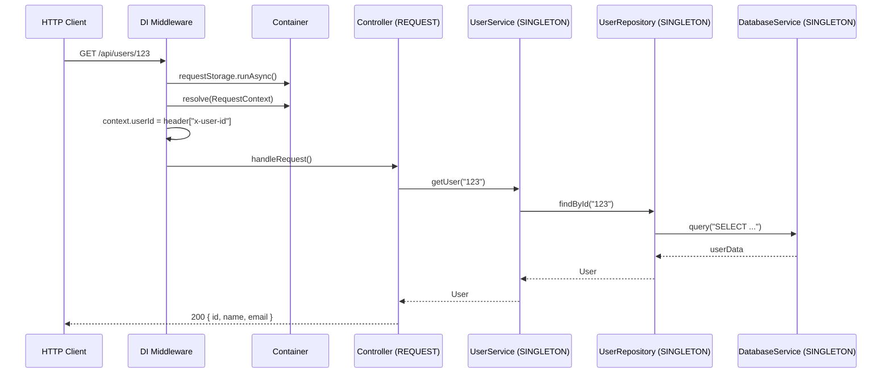

import { Callout } from 'fumadocs-ui/components/callout';
import { Tab, Tabs } from 'fumadocs-ui/components/tabs';

# HTTP Server

An example of a full-featured HTTP API using a DI container, REQUEST scope, and layered architecture.

## Architecture



## Project Structure

```
src/
+-- config/
|   +-- tokens.ts              # InjectionToken definitions
+-- database/
|   +-- database.service.ts    # DatabaseService (SINGLETON)
+-- repositories/
|   +-- user.repository.ts     # UserRepository (SINGLETON)
+-- services/
|   +-- user.service.ts        # UserService (SINGLETON)
+-- context/
|   +-- request-context.ts     # RequestContext (REQUEST)
+-- routes/
|   +-- users.ts               # HTTP handlers
+-- index.ts                   # Entry point
```

## Implementation

### Tokens and Configuration

```typescript title="src/config/tokens.ts"
import { InjectionToken } from "@ambrosia/core";

export interface DbConfig {
  host: string;
  port: number;
  database: string;
}

export const DB_CONFIG = new InjectionToken<DbConfig>("DbConfig");
```

### DatabaseService

```typescript title="src/database/database.service.ts"
import { Injectable, Inject, type OnInit, type OnDestroy } from "@ambrosia/core";
import { DB_CONFIG, type DbConfig } from "../config/tokens";

@Injectable()
export class DatabaseService implements OnInit, OnDestroy {
  private connected = false;

  constructor(@Inject(DB_CONFIG) private config: DbConfig) {}

  async onInit() {
    console.log(`Connecting to ${this.config.host}:${this.config.port}...`);
    this.connected = true;
    console.log("Database connected");
  }

  async onDestroy() {
    this.connected = false;
    console.log("Database disconnected");
  }

  async query<T>(sql: string, params: unknown[] = []): Promise<T[]> {
    if (!this.connected) throw new Error("Not connected");
    console.log(`SQL: ${sql}`);
    return [] as T[];
  }
}
```

### UserRepository

```typescript title="src/repositories/user.repository.ts"
import { Injectable } from "@ambrosia/core";
import { DatabaseService } from "../database/database.service";

export interface User {
  id: string;
  name: string;
  email: string;
}

@Injectable()
export class UserRepository {
  constructor(private db: DatabaseService) {}

  async findById(id: string): Promise<User | null> {
    const rows = await this.db.query<User>(
      "SELECT * FROM users WHERE id = $1",
      [id],
    );
    return rows[0] ?? null;
  }

  async findAll(): Promise<User[]> {
    return this.db.query<User>("SELECT * FROM users ORDER BY name");
  }

  async create(data: Omit<User, "id">): Promise<User> {
    const id = crypto.randomUUID();
    await this.db.query(
      "INSERT INTO users (id, name, email) VALUES ($1, $2, $3)",
      [id, data.name, data.email],
    );
    return { id, ...data };
  }
}
```

### UserService

```typescript title="src/services/user.service.ts"
import { Injectable } from "@ambrosia/core";
import { UserRepository, type User } from "../repositories/user.repository";

@Injectable()
export class UserService {
  constructor(private repo: UserRepository) {}

  async getUser(id: string): Promise<User> {
    const user = await this.repo.findById(id);
    if (!user) throw new Error(`User ${id} not found`);
    return user;
  }

  async getAllUsers(): Promise<User[]> {
    return this.repo.findAll();
  }

  async createUser(name: string, email: string): Promise<User> {
    if (!email.includes("@")) {
      throw new Error("Invalid email");
    }
    return this.repo.create({ name, email });
  }
}
```

### RequestContext (REQUEST scope)

```typescript title="src/context/request-context.ts"
import { Injectable, Scope } from "@ambrosia/core";

@Injectable({ scope: Scope.REQUEST })
export class RequestContext {
  userId?: string;
  requestId = crypto.randomUUID();
  startedAt = Date.now();

  getElapsed() {
    return Date.now() - this.startedAt;
  }
}
```

### HTTP Routes

<Tabs items={['Elysia (Bun)', 'Hono']}>
<Tab value="Elysia (Bun)">
```typescript title="src/index.ts"
import { Elysia } from "elysia";
import { Container, Scope } from "@ambrosia/core";
import { DB_CONFIG } from "./config/tokens";
import { UserService } from "./services/user.service";
import { RequestContext } from "./context/request-context";

const container = new Container({ mode: "production" });
container.registerValue(DB_CONFIG, {
  host: "localhost",
  port: 5432,
  database: "myapp",
});

const app = new Elysia()
  .derive(async ({ headers }) => {
    return new Promise((resolve) => {
      container.requestStorage.run(() => {
        const ctx = container.resolve(RequestContext);
        ctx.userId = headers["x-user-id"];
        resolve({ container, ctx });
      });
    });
  })
  .get("/api/users", async ({ container }) => {
    const userService = container.resolve(UserService);
    return userService.getAllUsers();
  })
  .get("/api/users/:id", async ({ container, params }) => {
    const userService = container.resolve(UserService);
    return userService.getUser(params.id);
  })
  .post("/api/users", async ({ container, body }) => {
    const userService = container.resolve(UserService);
    const { name, email } = body as { name: string; email: string };
    return userService.createUser(name, email);
  })
  .listen(3000);

console.log(`Server running at http://localhost:3000`);

process.on("SIGTERM", async () => {
  await container.destroyAll();
  process.exit(0);
});
```
</Tab>
<Tab value="Hono">
```typescript title="src/index.ts"
import { Hono } from "hono";
import { Container } from "@ambrosia/core";
import { DB_CONFIG } from "./config/tokens";
import { UserService } from "./services/user.service";
import { RequestContext } from "./context/request-context";

const container = new Container({ mode: "production" });
container.registerValue(DB_CONFIG, {
  host: "localhost",
  port: 5432,
  database: "myapp",
});

const app = new Hono();

app.use("*", async (c, next) => {
  await container.requestStorage.runAsync(async () => {
    const ctx = container.resolve(RequestContext);
    ctx.userId = c.req.header("x-user-id");
    c.set("container", container);
    await next();
  });
});

app.get("/api/users", async (c) => {
  const svc = (c.get("container") as Container).resolve(UserService);
  return c.json(await svc.getAllUsers());
});

app.get("/api/users/:id", async (c) => {
  const svc = (c.get("container") as Container).resolve(UserService);
  return c.json(await svc.getUser(c.req.param("id")));
});

app.post("/api/users", async (c) => {
  const svc = (c.get("container") as Container).resolve(UserService);
  const { name, email } = await c.req.json();
  return c.json(await svc.createUser(name, email), 201);
});

export default {
  port: 3000,
  fetch: app.fetch,
};
```
</Tab>
</Tabs>

## Testing

```typescript title="tests/user.service.test.ts"
import { describe, it, expect, beforeEach, afterEach } from "bun:test";
import { TestingPackFactory, definePack, type TestingPack } from "@ambrosia/core";
import { DB_CONFIG } from "../src/config/tokens";
import { UserService } from "../src/services/user.service";
import { UserRepository } from "../src/repositories/user.repository";
import { DatabaseService } from "../src/database/database.service";

const AppPack = definePack({
  providers: [
    { token: DB_CONFIG, useValue: { host: "test", port: 5432, database: "test" } },
    DatabaseService,
    UserRepository,
    UserService,
  ],
});

describe("UserService", () => {
  let testPack: TestingPack;

  beforeEach(async () => {
    testPack = await TestingPackFactory
      .create(AppPack)
      .overrideValue(DB_CONFIG, { host: "mock", port: 0, database: "mock" })
      .compile();
  });

  afterEach(async () => {
    await testPack.close();
  });

  it("should resolve UserService", () => {
    const service = testPack.get(UserService);
    expect(service).toBeDefined();
  });
});
```

## Next Steps

- [CLI Application](/docs/core/examples/cli-app) - DI without HTTP
- [Scopes](/docs/core/guides/scopes) - Deep dive into REQUEST scope
- [Testing](/docs/core/guides/testing) - TestingPackFactory
