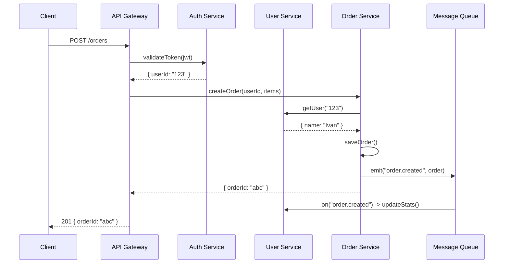

import { Callout } from 'fumadocs-ui/components/callout';
import { Tab, Tabs } from 'fumadocs-ui/components/tabs';

# Microservices

An example of organizing DI in a microservice architecture with isolated containers for each service and shared infrastructure.

## Architecture



## Monorepo Structure

```
packages/
+-- shared/                     # Shared infrastructure
|   +-- src/
|       +-- database/
|       +-- messaging/
|       +-- packs/
+-- auth-service/
+-- user-service/
+-- order-service/
```

## Shared Infrastructure

### EventBus (Inter-Service Communication)

```typescript title="packages/shared/src/messaging/event-bus.ts"
import { Injectable, type OnDestroy } from "@ambrosia/core";

type EventHandler = (data: unknown) => void | Promise<void>;

@Injectable()
export class EventBus implements OnDestroy {
  private handlers = new Map<string, Set<EventHandler>>();

  on(event: string, handler: EventHandler) {
    const set = this.handlers.get(event) ?? new Set();
    set.add(handler);
    this.handlers.set(event, set);
    return () => set.delete(handler); // unsubscribe
  }

  async emit(event: string, data: unknown) {
    const handlers = this.handlers.get(event);
    if (!handlers) return;

    const promises = [...handlers].map((handler) =>
      Promise.resolve(handler(data)).catch((err) =>
        console.error(`[EventBus] Error in handler for ${event}:`, err),
      ),
    );
    await Promise.all(promises);
  }

  onDestroy() {
    this.handlers.clear();
    console.log("[EventBus] Cleared all handlers");
  }
}
```

## Pattern: Container per Service

Each microservice creates its own isolated container:

```typescript
// Auth Service - own container, own DB
const authContainer = new Container({ mode: "production" });

// User Service - own container, own DB
const userContainer = new Container({ mode: "production" });

// Order Service - own container, own DB
const orderContainer = new Container({ mode: "production" });
```

**Benefits:**
- Full dependency isolation
- Independent DB configurations
- Independent lifecycle (startup/shutdown)
- Easy to test separately

<Callout type="info">
In production, EventBus is replaced with a real message broker (RabbitMQ, Kafka, Redis Pub/Sub). The interface remains the same - `on()` and `emit()`.
</Callout>

## Next Steps

- [HTTP Server](/docs/core/examples/http-server) - Single HTTP API with DI
- [Pack System](/docs/core/guides/packs) - Modular organization
- [Testing](/docs/core/examples/testing) - Testing microservices
