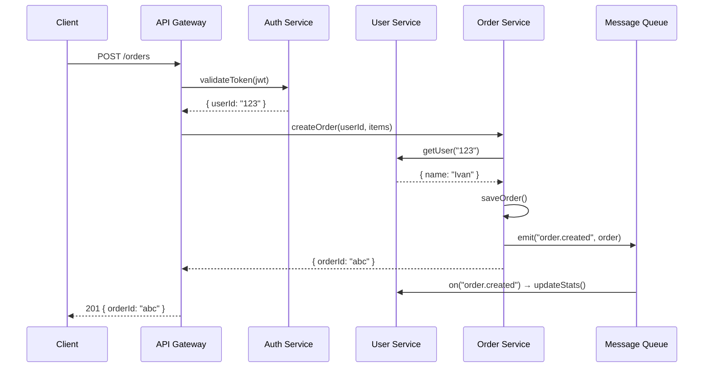
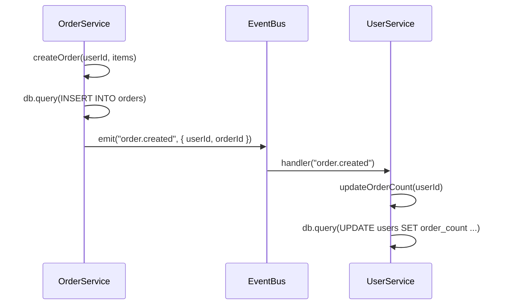

import { Callout } from 'fumadocs-ui/components/callout';
import { Tab, Tabs } from 'fumadocs-ui/components/tabs';

# Микросервисы

Пример организации DI в микросервисной архитектуре с изолированными контейнерами для каждого сервиса и общей инфраструктурой.

## Архитектура



## Структура монорепозитория

```
packages/
├── shared/                     # Общая инфраструктура
│   ├── src/
│   │   ├── database/
│   │   │   └── database.service.ts
│   │   ├── messaging/
│   │   │   └── event-bus.ts
│   │   ├── logging/
│   │   │   └── logger.service.ts
│   │   └── packs/
│   │       ├── database.pack.ts
│   │       ├── messaging.pack.ts
│   │       └── logging.pack.ts
├── auth-service/
│   ├── src/
│   │   ├── auth.service.ts
│   │   ├── auth.pack.ts
│   │   └── index.ts
├── user-service/
│   └── src/
│       ├── user.service.ts
│       ├── user.pack.ts
│       └── index.ts
└── order-service/
    └── src/
        ├── order.service.ts
        ├── order.pack.ts
        └── index.ts
```

## Shared инфраструктура

### DatabaseService

```typescript title="packages/shared/src/database/database.service.ts"
import { Injectable, Inject, type OnInit, type OnDestroy, InjectionToken } from "@ambrosia-unce/core";

export interface DbConfig {
  host: string;
  port: number;
  database: string;
}

export const DB_CONFIG = new InjectionToken<DbConfig>("DbConfig");

@Injectable()
export class DatabaseService implements OnInit, OnDestroy {
  private connected = false;

  constructor(@Inject(DB_CONFIG) private config: DbConfig) {}

  async onInit() {
    // await pool.connect(this.config)
    this.connected = true;
    console.log(`[DB] Connected to ${this.config.database}`);
  }

  async onDestroy() {
    this.connected = false;
    console.log(`[DB] Disconnected from ${this.config.database}`);
  }

  async query<T>(sql: string, params?: unknown[]): Promise<T[]> {
    if (!this.connected) throw new Error("Database not connected");
    return [] as T[];
  }
}
```

### EventBus (межсервисная коммуникация)

```typescript title="packages/shared/src/messaging/event-bus.ts"
import { Injectable, type OnDestroy } from "@ambrosia-unce/core";

type EventHandler = (data: unknown) => void | Promise<void>;

@Injectable()
export class EventBus implements OnDestroy {
  private handlers = new Map<string, Set<EventHandler>>();

  on(event: string, handler: EventHandler) {
    const set = this.handlers.get(event) ?? new Set();
    set.add(handler);
    this.handlers.set(event, set);
    return () => set.delete(handler); // unsubscribe
  }

  async emit(event: string, data: unknown) {
    const handlers = this.handlers.get(event);
    if (!handlers) return;

    const promises = [...handlers].map((handler) =>
      Promise.resolve(handler(data)).catch((err) =>
        console.error(`[EventBus] Error in handler for ${event}:`, err),
      ),
    );
    await Promise.all(promises);
  }

  onDestroy() {
    this.handlers.clear();
    console.log("[EventBus] Cleared all handlers");
  }
}
```

### Shared паки

```typescript title="packages/shared/src/packs/database.pack.ts"
import { type PackDefinition, createAsyncProvider } from "@ambrosia-unce/core";
import { DatabaseService, DB_CONFIG, type DbConfig } from "../database/database.service";

export class DatabasePack {
  static forRoot(config: DbConfig): PackDefinition {
    return {
      meta: { name: "database", version: "1.0.0" },
      providers: [
        { token: DB_CONFIG, useValue: config },
        DatabaseService,
      ],
      exports: [DatabaseService],
    };
  }
}
```

```typescript title="packages/shared/src/packs/messaging.pack.ts"
import type { PackDefinition } from "@ambrosia-unce/core";
import { EventBus } from "../messaging/event-bus";

export const MessagingPack: PackDefinition = {
  meta: { name: "messaging", version: "1.0.0" },
  providers: [EventBus],
  exports: [EventBus],
};
```

## Микросервисы

### Auth Service

```typescript title="packages/auth-service/src/auth.service.ts"
import { Injectable } from "@ambrosia-unce/core";
import { DatabaseService } from "@shared/database/database.service";

interface TokenPayload {
  userId: string;
  email: string;
}

@Injectable()
export class AuthService {
  constructor(private db: DatabaseService) {}

  async validateToken(token: string): Promise<TokenPayload | null> {
    // JWT validation logic
    const decoded = this.decodeJwt(token);
    if (!decoded) return null;

    const [user] = await this.db.query<{ id: string; email: string }>(
      "SELECT id, email FROM users WHERE id = $1",
      [decoded.userId],
    );

    return user ? { userId: user.id, email: user.email } : null;
  }

  private decodeJwt(token: string): TokenPayload | null {
    // JWT decode logic
    return null;
  }
}
```

```typescript title="packages/auth-service/src/index.ts"
import { Container } from "@ambrosia-unce/core";
import { PackProcessor } from "@ambrosia-unce/core";
import { DatabasePack } from "@shared/packs/database.pack";
import { AuthService } from "./auth.service";
import type { PackDefinition } from "@ambrosia-unce/core";

const AuthPack: PackDefinition = {
  meta: { name: "auth-service" },
  imports: [
    DatabasePack.forRoot({
      host: process.env.DB_HOST ?? "localhost",
      port: Number(process.env.DB_PORT ?? 5432),
      database: "auth_db",
    }),
  ],
  providers: [AuthService],
  exports: [AuthService],
};

// Каждый микросервис — свой контейнер
const container = new Container({ mode: "production" });
const processor = new PackProcessor();
const result = processor.process([AuthPack]);
PackProcessor.registerInContainer(container, result.providers);
await processor.getLifecycleManager().executeInit(container);

console.log("[Auth Service] Started on port 3001");

// Graceful shutdown
process.on("SIGTERM", async () => {
  await processor.getLifecycleManager().executeDestroy();
  await container.destroyAll();
  process.exit(0);
});
```

### User Service

```typescript title="packages/user-service/src/user.service.ts"
import { Injectable, type OnInit } from "@ambrosia-unce/core";
import { DatabaseService } from "@shared/database/database.service";
import { EventBus } from "@shared/messaging/event-bus";

@Injectable()
export class UserService implements OnInit {
  constructor(
    private db: DatabaseService,
    private events: EventBus,
  ) {}

  onInit() {
    // Подписка на события от других сервисов
    this.events.on("order.created", async (data: any) => {
      await this.updateOrderCount(data.userId);
    });
  }

  async getUser(id: string) {
    const [user] = await this.db.query(
      "SELECT * FROM users WHERE id = $1",
      [id],
    );
    return user ?? null;
  }

  async createUser(name: string, email: string) {
    const id = crypto.randomUUID();
    await this.db.query(
      "INSERT INTO users (id, name, email) VALUES ($1, $2, $3)",
      [id, name, email],
    );
    await this.events.emit("user.created", { id, name, email });
    return { id, name, email };
  }

  private async updateOrderCount(userId: string) {
    await this.db.query(
      "UPDATE users SET order_count = order_count + 1 WHERE id = $1",
      [userId],
    );
  }
}
```

### Order Service

```typescript title="packages/order-service/src/order.service.ts"
import { Injectable } from "@ambrosia-unce/core";
import { DatabaseService } from "@shared/database/database.service";
import { EventBus } from "@shared/messaging/event-bus";

interface OrderItem {
  productId: string;
  quantity: number;
  price: number;
}

@Injectable()
export class OrderService {
  constructor(
    private db: DatabaseService,
    private events: EventBus,
  ) {}

  async createOrder(userId: string, items: OrderItem[]) {
    const orderId = crypto.randomUUID();
    const total = items.reduce((sum, i) => sum + i.price * i.quantity, 0);

    await this.db.query(
      "INSERT INTO orders (id, user_id, total, status) VALUES ($1, $2, $3, $4)",
      [orderId, userId, total, "pending"],
    );

    // Уведомляем другие сервисы
    await this.events.emit("order.created", {
      orderId,
      userId,
      total,
      items,
    });

    return { orderId, total, status: "pending" };
  }

  async getOrder(id: string) {
    const [order] = await this.db.query("SELECT * FROM orders WHERE id = $1", [id]);
    return order ?? null;
  }
}
```

## Коммуникация между сервисами



<Callout type="info">
В production EventBus заменяется на реальный message broker (RabbitMQ, Kafka, Redis Pub/Sub). Интерфейс остаётся тем же — `on()` и `emit()`.
</Callout>

## Паттерн: Container per Service

Каждый микросервис создаёт свой изолированный контейнер:

```typescript
// Auth Service — свой контейнер, своя БД
const authContainer = new Container({ mode: "production" });
// ... регистрация AuthService, auth_db

// User Service — свой контейнер, своя БД
const userContainer = new Container({ mode: "production" });
// ... регистрация UserService, users_db

// Order Service — свой контейнер, своя БД
const orderContainer = new Container({ mode: "production" });
// ... регистрация OrderService, orders_db
```

**Преимущества:**
- Полная изоляция зависимостей
- Независимые конфигурации БД
- Независимый lifecycle (startup/shutdown)
- Легко тестировать отдельно

## Следующие шаги

- [HTTP сервер](/docs/core/examples/http-server) — единый HTTP API с DI
- [Система паков](/docs/core/guides/packs) — модульная организация
- [Тестирование](/docs/core/examples/testing) — тестирование микросервисов
