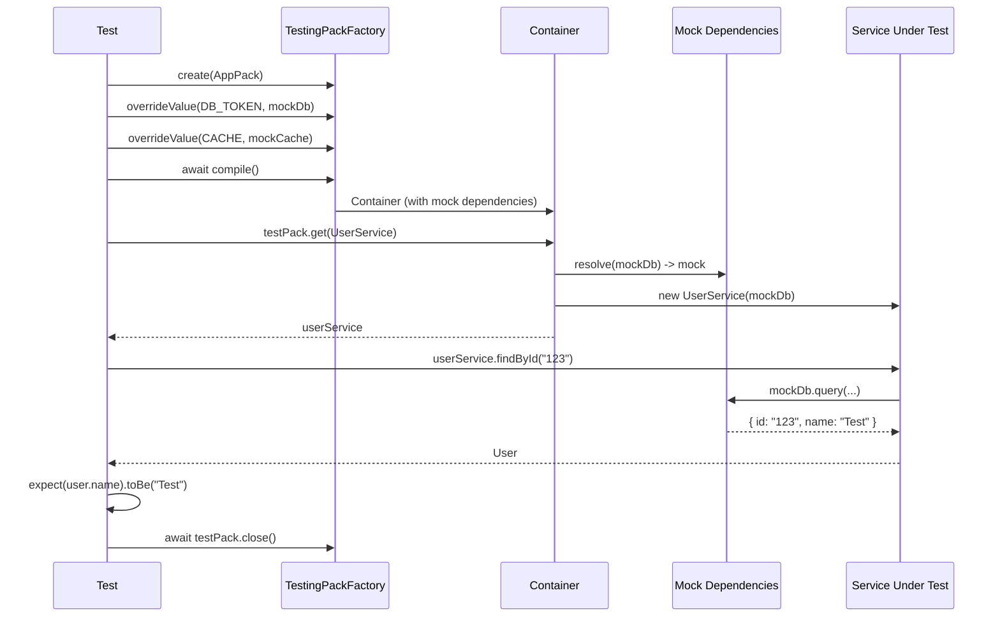

import { Callout } from 'fumadocs-ui/components/callout';
import { Tab, Tabs } from 'fumadocs-ui/components/tabs';

# Testing

Strategies and examples for testing code with a DI container, from unit tests to integration tests.

## Testing Approach with DI



## Unit Tests

### Testing a Service with Mock Dependencies

```typescript title="tests/user.service.test.ts"
import { describe, it, expect, beforeEach, afterEach } from "bun:test";
import {
  TestingPackFactory,
  definePack,
  Injectable,
  InjectionToken,
  type TestingPack,
} from "@ambrosia/core";

const DB = new InjectionToken<Database>("Database");

interface Database {
  query<T>(sql: string, params?: unknown[]): Promise<T[]>;
}

@Injectable()
class UserService {
  constructor(@Inject(DB) private db: Database) {}

  async findById(id: string) {
    const [user] = await this.db.query("SELECT * FROM users WHERE id = $1", [id]);
    if (!user) throw new Error(`User ${id} not found`);
    return user;
  }

  async findAll() {
    return this.db.query("SELECT * FROM users");
  }
}

const UserPack = definePack({
  providers: [UserService],
});

describe("UserService", () => {
  let testPack: TestingPack;

  const mockDb: Database = {
    query: async <T>(sql: string, params?: unknown[]): Promise<T[]> => {
      if (sql.includes("WHERE id")) {
        return [{ id: params?.[0], name: "Test User", email: "test@test.com" }] as T[];
      }
      return [
        { id: "1", name: "Alice", email: "alice@test.com" },
        { id: "2", name: "Bob", email: "bob@test.com" },
      ] as T[];
    },
  };

  beforeEach(async () => {
    testPack = await TestingPackFactory
      .create(UserPack)
      .overrideValue(DB, mockDb)
      .compile();
  });

  afterEach(async () => {
    await testPack.close();
  });

  it("should find user by id", async () => {
    const service = testPack.get(UserService);
    const user = await service.findById("123");
    expect(user).toEqual({
      id: "123",
      name: "Test User",
      email: "test@test.com",
    });
  });

  it("should return all users", async () => {
    const service = testPack.get(UserService);
    const users = await service.findAll();
    expect(users).toHaveLength(2);
  });
});
```

### Replacing an Entire Class

```typescript title="tests/notification.test.ts"
@Injectable()
class MockEmailService {
  sent: Array<{ to: string; body: string }> = [];

  async send(to: string, body: string) {
    this.sent.push({ to, body });
  }
}

const testPack = await TestingPackFactory
  .create(NotificationPack)
  .override(EmailService, MockEmailService)
  .compile();

const notifications = testPack.get(NotificationService);
await notifications.notifyUser("user-1", "Hello!");

const emailMock = testPack.get(EmailService) as unknown as MockEmailService;
expect(emailMock.sent).toHaveLength(1);
```

## Testing Lifecycle Hooks

```typescript title="tests/lifecycle.test.ts"
@Injectable()
class TrackedService implements OnInit, OnDestroy {
  initialized = false;
  destroyed = false;

  onInit() { this.initialized = true; }
  onDestroy() { this.destroyed = true; }
}

const testPack = await TestingPackFactory.create(
  definePack({ providers: [TrackedService] })
).compile();

const service = testPack.get(TrackedService);
expect(service.initialized).toBe(true);

await testPack.close();
expect(service.destroyed).toBe(true);
```

## REQUEST Scope in Tests

```typescript title="tests/request-scope.test.ts"
import { Container, Injectable, Scope } from "@ambrosia/core";

@Injectable({ scope: Scope.REQUEST })
class RequestContext {
  userId?: string;
  requestId = crypto.randomUUID();
}

describe("REQUEST scope", () => {
  it("should isolate request contexts", async () => {
    const container = new Container();
    const results: (string | undefined)[] = [];

    await container.requestStorage.runAsync(async () => {
      const ctx = container.resolve(RequestContext);
      ctx.userId = "user-A";
      const svc = container.resolve(UserService);
      results.push(svc.getCurrentUserId());
    });

    await container.requestStorage.runAsync(async () => {
      const ctx = container.resolve(RequestContext);
      ctx.userId = "user-B";
      const svc = container.resolve(UserService);
      results.push(svc.getCurrentUserId());
    });

    expect(results).toEqual(["user-A", "user-B"]);
  });
});
```

## Pattern: Test Helper

```typescript title="tests/helpers/create-test-app.ts"
import { TestingPackFactory, type Packable, type TestingPack } from "@ambrosia/core";

export async function createTestApp(...extraPacks: Packable[]): Promise<TestingPack> {
  return TestingPackFactory
    .create(CorePack.forRoot({ env: "test" }), ...extraPacks)
    .overrideValue(DATABASE_TOKEN, mockDb)
    .overrideValue(CACHE_TOKEN, mockCache)
    .compile();
}

// In tests:
const testPack = await createTestApp(UserPack);
```

## Best Practices

1. **Always call `close()`** - ensures `onDestroy` hooks and resource cleanup
2. **Use `overrideValue`** for external dependencies (DB, HTTP, files)
3. **Use `override`** for replacing entire classes (email, payments)
4. **Create helper functions** for repeated configurations
5. **Test lifecycle** - verify `onInit`/`onDestroy` behavior
6. **Isolate tests** - each test creates its own `TestingPack`

<Callout type="success">
**DI advantage for tests:** Replacing a dependency is a single `.overrideValue()` call instead of monkey-patching or complex mock frameworks.
</Callout>

## Next Steps

- [Testing (Guide)](/docs/core/guides/testing) - TestingPackFactory API
- [HTTP Server](/docs/core/examples/http-server) - Testing HTTP routes
- [Pack System](/docs/core/guides/packs) - Organizing test packs
