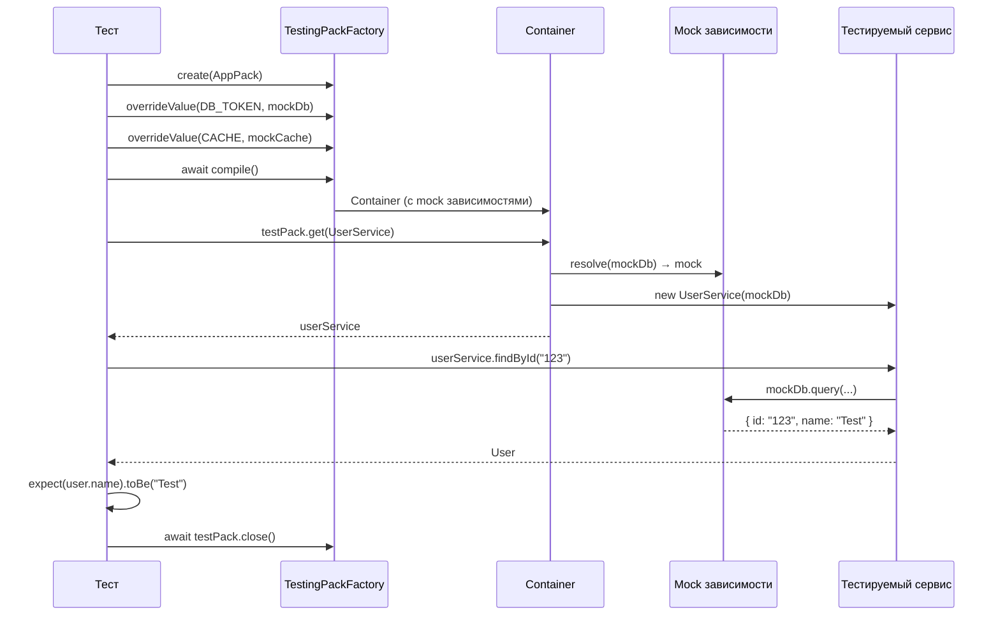

import { Callout } from 'fumadocs-ui/components/callout';
import { Tab, Tabs } from 'fumadocs-ui/components/tabs';

# Тестирование

Стратегии и примеры тестирования кода с DI-контейнером, от unit-тестов до integration.

## Подход к тестированию с DI



## Unit тесты

### Тестирование сервиса с mock зависимостями

```typescript title="tests/user.service.test.ts"
import { describe, it, expect, beforeEach, afterEach } from "bun:test";
import {
  TestingPackFactory,
  definePack,
  Injectable,
  InjectionToken,
  type TestingPack,
} from "@ambrosia/core";

// --- Продакшен-код ---
const DB = new InjectionToken<Database>("Database");

interface Database {
  query<T>(sql: string, params?: unknown[]): Promise<T[]>;
}

@Injectable()
class UserService {
  constructor(@Inject(DB) private db: Database) {}

  async findById(id: string) {
    const [user] = await this.db.query("SELECT * FROM users WHERE id = $1", [id]);
    if (!user) throw new Error(`User ${id} not found`);
    return user;
  }

  async findAll() {
    return this.db.query("SELECT * FROM users");
  }
}

const UserPack = definePack({
  providers: [UserService],
});

// --- Тесты ---
describe("UserService", () => {
  let testPack: TestingPack;

  // Mock база данных
  const mockDb: Database = {
    query: async <T>(sql: string, params?: unknown[]): Promise<T[]> => {
      if (sql.includes("WHERE id")) {
        return [{ id: params?.[0], name: "Test User", email: "test@test.com" }] as T[];
      }
      return [
        { id: "1", name: "Alice", email: "alice@test.com" },
        { id: "2", name: "Bob", email: "bob@test.com" },
      ] as T[];
    },
  };

  beforeEach(async () => {
    testPack = await TestingPackFactory
      .create(UserPack)
      .overrideValue(DB, mockDb)
      .compile();
  });

  afterEach(async () => {
    await testPack.close();
  });

  it("should find user by id", async () => {
    const service = testPack.get(UserService);
    const user = await service.findById("123");
    expect(user).toEqual({
      id: "123",
      name: "Test User",
      email: "test@test.com",
    });
  });

  it("should return all users", async () => {
    const service = testPack.get(UserService);
    const users = await service.findAll();
    expect(users).toHaveLength(2);
  });

  it("should throw on missing user", async () => {
    const emptyDb: Database = {
      query: async () => [],
    };

    const tp = await TestingPackFactory
      .create(UserPack)
      .overrideValue(DB, emptyDb)
      .compile();

    const service = tp.get(UserService);
    expect(service.findById("999")).rejects.toThrow("User 999 not found");

    await tp.close();
  });
});
```

### Подмена класса целиком

```typescript title="tests/notification.test.ts"
import { describe, it, expect, beforeEach, afterEach } from "bun:test";
import { TestingPackFactory, Injectable, definePack, type TestingPack } from "@ambrosia/core";

@Injectable()
class EmailService {
  async send(to: string, body: string) {
    // Реальная отправка email
    await fetch("https://email-api.com/send", {
      method: "POST",
      body: JSON.stringify({ to, body }),
    });
  }
}

@Injectable()
class NotificationService {
  constructor(private email: EmailService) {}

  async notifyUser(userId: string, message: string) {
    await this.email.send(`${userId}@example.com`, message);
  }
}

// Mock класс
@Injectable()
class MockEmailService {
  sent: Array<{ to: string; body: string }> = [];

  async send(to: string, body: string) {
    this.sent.push({ to, body });
  }
}

const NotificationPack = definePack({
  providers: [EmailService, NotificationService],
});

describe("NotificationService", () => {
  let testPack: TestingPack;

  beforeEach(async () => {
    testPack = await TestingPackFactory
      .create(NotificationPack)
      .override(EmailService, MockEmailService) // Подмена класса
      .compile();
  });

  afterEach(async () => {
    await testPack.close();
  });

  it("should send email notification", async () => {
    const notifications = testPack.get(NotificationService);
    await notifications.notifyUser("user-1", "Hello!");

    // Проверяем mock
    const emailMock = testPack.get(EmailService) as unknown as MockEmailService;
    expect(emailMock.sent).toHaveLength(1);
    expect(emailMock.sent[0]).toEqual({
      to: "user-1@example.com",
      body: "Hello!",
    });
  });
});
```

## Integration тесты

### Тестирование нескольких паков вместе

```typescript title="tests/integration/auth-flow.test.ts"
import { describe, it, expect, beforeEach, afterEach } from "bun:test";
import { TestingPackFactory, type TestingPack } from "@ambrosia/core";
import { DatabasePack, DB_CONFIG } from "../src/packs/database.pack";
import { AuthPack } from "../src/packs/auth.pack";
import { UserPack } from "../src/packs/user.pack";
import { AuthService } from "../src/services/auth.service";
import { UserService } from "../src/services/user.service";

describe("Auth Flow Integration", () => {
  let testPack: TestingPack;

  const mockDb = {
    query: async (sql: string, params?: unknown[]) => {
      if (sql.includes("users")) {
        return [{ id: "1", name: "Test", email: "test@test.com", password_hash: "..." }];
      }
      return [];
    },
  };

  beforeEach(async () => {
    testPack = await TestingPackFactory
      .create(
        DatabasePack.forRoot({ host: "test", port: 0, database: "test" }),
        AuthPack.forRoot({ secret: "test-secret", expiresIn: "1h" }),
        UserPack,
      )
      .overrideValue(DB_CONFIG, mockDb)
      .compile();
  });

  afterEach(async () => {
    await testPack.close();
  });

  it("should authenticate user and get profile", async () => {
    const auth = testPack.get(AuthService);
    const users = testPack.get(UserService);

    // Шаг 1: Login
    const token = await auth.login("test@test.com", "password");
    expect(token).toBeDefined();

    // Шаг 2: Validate token
    const payload = await auth.validateToken(token);
    expect(payload?.userId).toBe("1");

    // Шаг 3: Get user profile
    const user = await users.getUser("1");
    expect(user?.email).toBe("test@test.com");
  });
});
```

### Тестирование lifecycle hooks

```typescript title="tests/lifecycle.test.ts"
import { describe, it, expect } from "bun:test";
import {
  TestingPackFactory,
  Injectable,
  definePack,
  type OnInit,
  type OnDestroy,
} from "@ambrosia/core";

@Injectable()
class TrackedService implements OnInit, OnDestroy {
  initialized = false;
  destroyed = false;

  onInit() {
    this.initialized = true;
  }

  onDestroy() {
    this.destroyed = true;
  }
}

const TrackedPack = definePack({
  providers: [TrackedService],
});

describe("Lifecycle Hooks", () => {
  it("should call onInit during compile", async () => {
    const testPack = await TestingPackFactory.create(TrackedPack).compile();

    const service = testPack.get(TrackedService);
    expect(service.initialized).toBe(true);
    expect(service.destroyed).toBe(false);

    await testPack.close();
  });

  it("should call onDestroy during close", async () => {
    const testPack = await TestingPackFactory.create(TrackedPack).compile();
    const service = testPack.get(TrackedService);

    await testPack.close();

    expect(service.destroyed).toBe(true);
  });
});
```

## REQUEST scope в тестах

```typescript title="tests/request-scope.test.ts"
import { describe, it, expect } from "bun:test";
import { Container, Injectable, Scope } from "@ambrosia/core";

@Injectable({ scope: Scope.REQUEST })
class RequestContext {
  userId?: string;
  requestId = crypto.randomUUID();
}

@Injectable()
class UserService {
  constructor(private ctx: RequestContext) {}

  getCurrentUserId() {
    return this.ctx.userId;
  }
}

describe("REQUEST scope", () => {
  it("should isolate request contexts", async () => {
    const container = new Container();
    const results: (string | undefined)[] = [];

    // Запрос 1
    await container.requestStorage.runAsync(async () => {
      const ctx = container.resolve(RequestContext);
      ctx.userId = "user-A";
      const svc = container.resolve(UserService);
      results.push(svc.getCurrentUserId()); // "user-A"
    });

    // Запрос 2
    await container.requestStorage.runAsync(async () => {
      const ctx = container.resolve(RequestContext);
      ctx.userId = "user-B";
      const svc = container.resolve(UserService);
      results.push(svc.getCurrentUserId()); // "user-B"
    });

    expect(results).toEqual(["user-A", "user-B"]);
  });
});
```

## Паттерн: Helper для тестов

Создайте helper-функцию для повторяющихся тестовых конфигураций:

```typescript title="tests/helpers/create-test-app.ts"
import { TestingPackFactory, type Packable, type TestingPack } from "@ambrosia/core";
import { CorePack } from "../../src/packs/core.pack";
import { DB_CONFIG } from "../../src/config/tokens";

const mockDb = {
  query: async () => [],
  close: async () => {},
};

const mockCache = {
  get: async () => null,
  set: async () => {},
  del: async () => {},
};

export async function createTestApp(...extraPacks: Packable[]): Promise<TestingPack> {
  return TestingPackFactory
    .create(
      CorePack.forRoot({ env: "test" }),
      ...extraPacks,
    )
    .overrideValue(DB_CONFIG, mockDb)
    .overrideValue(CACHE_TOKEN, mockCache)
    .compile();
}
```

```typescript title="tests/user.service.test.ts"
import { createTestApp } from "./helpers/create-test-app";
import { UserPack } from "../src/packs/user.pack";

describe("UserService", () => {
  it("should work with test app", async () => {
    const testPack = await createTestApp(UserPack);
    const service = testPack.get(UserService);
    expect(service).toBeDefined();
    await testPack.close();
  });
});
```

## Best Practices

1. **Всегда вызывайте `close()`** — гарантирует вызов `onDestroy` и очистку ресурсов
2. **Используйте `overrideValue`** для внешних зависимостей (БД, HTTP, файлы)
3. **Используйте `override`** для подмены целых классов (email, платежи)
4. **Создавайте helper-функции** для повторяющихся конфигураций
5. **Тестируйте lifecycle** — проверяйте `onInit`/`onDestroy` поведение
6. **Изолируйте тесты** — каждый тест создаёт свой `TestingPack`

<Callout type="success">
**Преимущество DI для тестов:** Подмена зависимости — одна строчка `.overrideValue()` вместо monkey-patching или сложных mock-фреймворков.
</Callout>

## Следующие шаги

- [Тестирование (руководство)](/docs/core/guides/testing) — TestingPackFactory API
- [HTTP сервер](/docs/core/examples/http-server) — тестирование HTTP routes
- [Система паков](/docs/core/guides/packs) — организация тестовых паков
