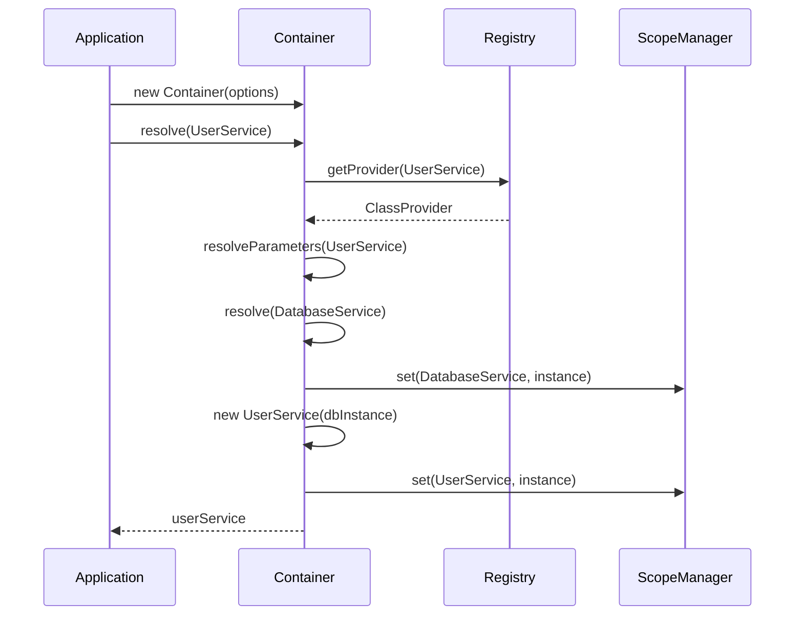
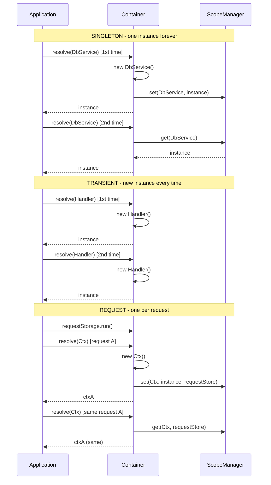
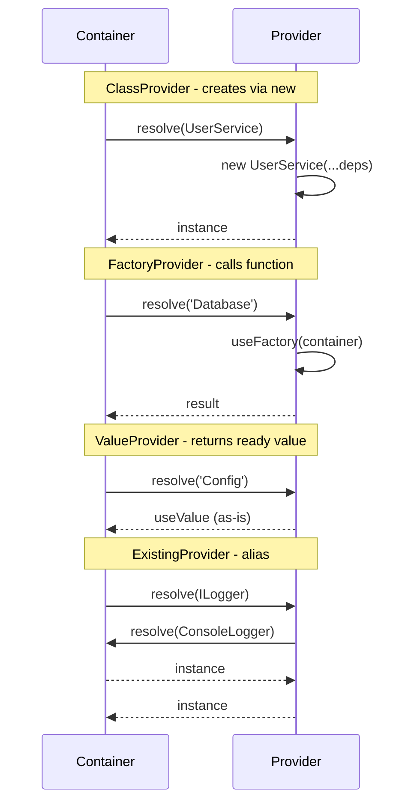

import { Callout } from 'fumadocs-ui/components/callout';

# Core Concepts

Learn the fundamental concepts of dependency injection and how @ambrosia-unce/core implements them.

## What is Dependency Injection?

**Dependency Injection (DI)** is a design pattern where objects receive their dependencies from external sources rather than creating them internally.

### Without DI (Tight Coupling)

```typescript
class UserService {
  private db: DatabaseService;

  constructor() {
    // UserService creates its own dependencies
    this.db = new DatabaseService();
  }
}
```

**Problems:**
- Hard to test (can't mock DatabaseService)
- Tight coupling between classes
- Configuration scattered across code
- Hard to reuse components

### With DI (Loose Coupling)

```typescript
@Injectable()
class UserService {
  // Dependencies are injected
  constructor(private db: DatabaseService) {}
}
```

**Benefits:**
- Easy to test (inject mocks)
- Loose coupling between classes
- Centralized configuration
- Reusable components

## DI Container

The **Container** is the heart of @ambrosia-unce/core. It manages:

1. **Registration** - which classes are available
2. **Resolution** - creating instances with dependencies
3. **Lifecycle** - managing instance lifetimes (singleton, transient, etc.)



```typescript
import { Container } from '@ambrosia-unce/core';

const container = new Container({
  mode: 'production',
  autoRegister: true,
});
```

## Decorators

Decorators are used to mark classes and provide metadata for the DI container.

### @Injectable()

Marks a class as available for dependency injection:

```typescript
import { Injectable } from '@ambrosia-unce/core';

@Injectable()
class MyService {
  doSomething() {
    return 'Hello';
  }
}
```

<Callout type="info">
  Without `@Injectable()`, the container won't be able to resolve the class.
</Callout>

### @Inject()

Explicitly specifies which dependency to inject (useful for interfaces or abstract classes):

```typescript
import { Injectable, Inject } from '@ambrosia-unce/core';

abstract class Logger {
  abstract log(message: string): void;
}

@Injectable()
class ConsoleLogger extends Logger {
  log(message: string) {
    console.log(message);
  }
}

@Injectable()
class UserService {
  // Inject a specific implementation
  constructor(@Inject('Logger') private logger: Logger) {}
}

// Register the implementation
container.register({
  token: 'Logger',
  useClass: ConsoleLogger,
});
```

### @Autowired()

Property injection (alternative to constructor injection):

```typescript
import { Injectable, Autowired } from '@ambrosia-unce/core';

@Injectable()
class UserService {
  @Autowired()
  private logger!: LoggerService;

  doSomething() {
    this.logger.log('Doing something');
  }
}
```

<Callout type="warn">
  Constructor injection is preferred over property injection for better testability and explicit dependencies.
</Callout>

### @Optional()

Marks a dependency as optional:

```typescript
import { Injectable, Optional, Inject } from '@ambrosia-unce/core';

@Injectable()
class UserService {
  constructor(
    private db: DatabaseService,
    @Optional() @Inject('Logger') private logger?: Logger
  ) {
    // logger may be undefined
  }

  log(message: string) {
    this.logger?.log(message);
  }
}
```

## Scopes

Scopes control the lifetime of instances.



### SINGLETON (Default)

One instance for the entire application:

```typescript
import { Injectable, Scope } from '@ambrosia-unce/core';

@Injectable({ scope: Scope.SINGLETON }) // Default
class DatabaseService {
  private connections = 0;

  connect() {
    this.connections++;
    console.log(`Total connections: ${this.connections}`);
  }
}

const db1 = container.resolve(DatabaseService);
const db2 = container.resolve(DatabaseService);

console.log(db1 === db2); // true (same instance)
```

**Use for:** database connections, configuration, logging, caches.

### TRANSIENT

New instance every time:

```typescript
@Injectable({ scope: Scope.TRANSIENT })
class RequestHandler {
  private id = Math.random();
  getId() { return this.id; }
}

const handler1 = container.resolve(RequestHandler);
const handler2 = container.resolve(RequestHandler);

console.log(handler1 === handler2); // false (different instances)
```

**Use for:** request handlers, command objects, stateful services.

### REQUEST

One instance per request scope (via `AsyncLocalStorage`):

```typescript
@Injectable({ scope: Scope.REQUEST })
class RequestContext {
  userId?: string;
  requestId?: string;
}

// In HTTP middleware
container.createRequestScope(async () => {
  const context = container.resolve(RequestContext);
  context.requestId = crypto.randomUUID();
  context.userId = '123';

  // All services resolved in this scope share the same RequestContext
  await handleRequest();
});
```

**Use for:** HTTP request context, session data, transactions.

## Providers

Providers define how the container creates instances. @ambrosia-unce/core has **4 types** of providers:



### Class Provider (Default)

Creates an instance via the constructor with automatic dependency resolution:

```typescript
container.register({
  token: UserService,
  useClass: UserService,
});

// Shorthand with @Injectable()
@Injectable()
class UserService {}
```

### Factory Provider

Factory function with container access:

```typescript
container.register({
  token: 'Database',
  useFactory: (container) => {
    const config = container.resolve(ConfigService);
    return new DatabaseService({
      host: config.get('DB_HOST'),
      port: config.get('DB_PORT'),
    });
  },
});
```

### Value Provider

A ready-made value (always singleton):

```typescript
container.register({
  token: 'Config',
  useValue: {
    apiUrl: 'https://api.example.com',
    timeout: 5000,
  },
});
```

### Existing Provider (Alias)

Reference to another token - useful for polymorphism:

```typescript
container.register({
  token: ConsoleLogger,
  useClass: ConsoleLogger,
});

container.register({
  token: 'ILogger',
  useExisting: ConsoleLogger, // resolve('ILogger') -> resolve(ConsoleLogger)
});
```

## Tokens

Tokens uniquely identify dependencies. @ambrosia-unce/core supports **4 types** of tokens:

### Class Tokens (Recommended)

The best choice - type safety + IDE autocompletion:

```typescript
@Injectable()
class UserService {}

// The token is the class itself
const service = container.resolve(UserService); // TypeScript knows the type
```

### String Tokens

For configuration values and primitives:

```typescript
container.register({
  token: 'API_URL',
  useValue: 'https://api.example.com',
});

const url = container.resolve<string>('API_URL');
```

### Symbol Tokens

Guaranteed unique, no name collisions:

```typescript
const DB_TOKEN = Symbol('Database');

container.register({
  token: DB_TOKEN,
  useClass: DatabaseService,
});

const db = container.resolve(DB_TOKEN);
```

### InjectionToken

Typed token with a description - the best choice for libraries:

```typescript
import { InjectionToken } from '@ambrosia-unce/core';

const CACHE_CONFIG = new InjectionToken<CacheConfig>('CacheConfig');

container.register({
  token: CACHE_CONFIG,
  useValue: { ttl: 3600, maxSize: 1000 },
});

const config = container.resolve(CACHE_CONFIG); // type is CacheConfig
```

<Callout type="success">
  **Best practice**: Use class tokens for services and `InjectionToken` for configuration and interfaces. Avoid string tokens in production.
</Callout>

## Next Steps

Now that you understand the core concepts:

1. [Basic Usage](/docs/core/guides/basic-usage) - Common patterns and best practices
2. [Scopes Guide](/docs/core/guides/scopes) - Deep dive into scope management
3. [API Reference](/docs/core/api-reference/container) - Complete API documentation
4. [Examples](/docs/core/examples/http-server) - Real-world examples
