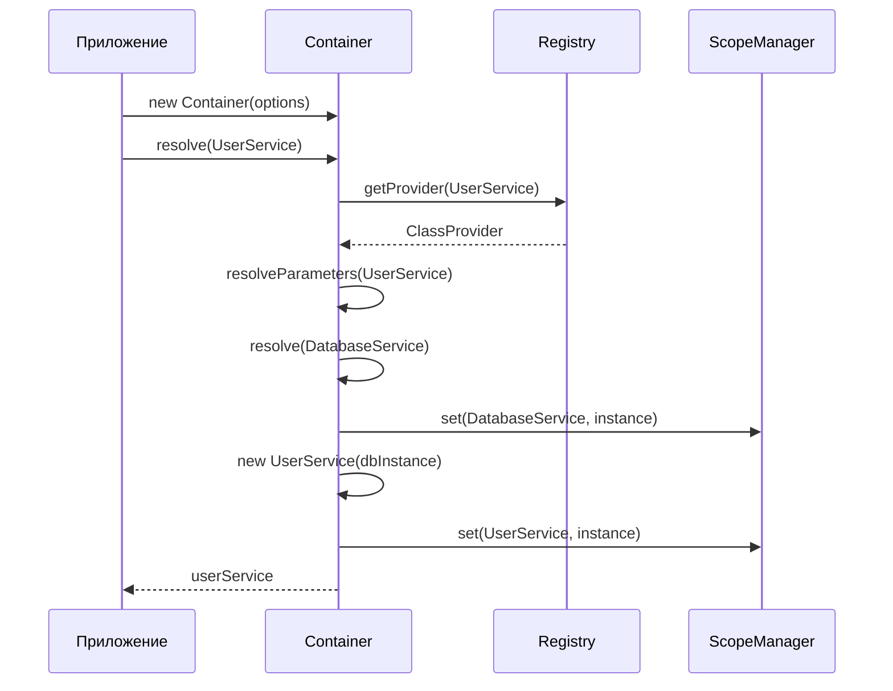
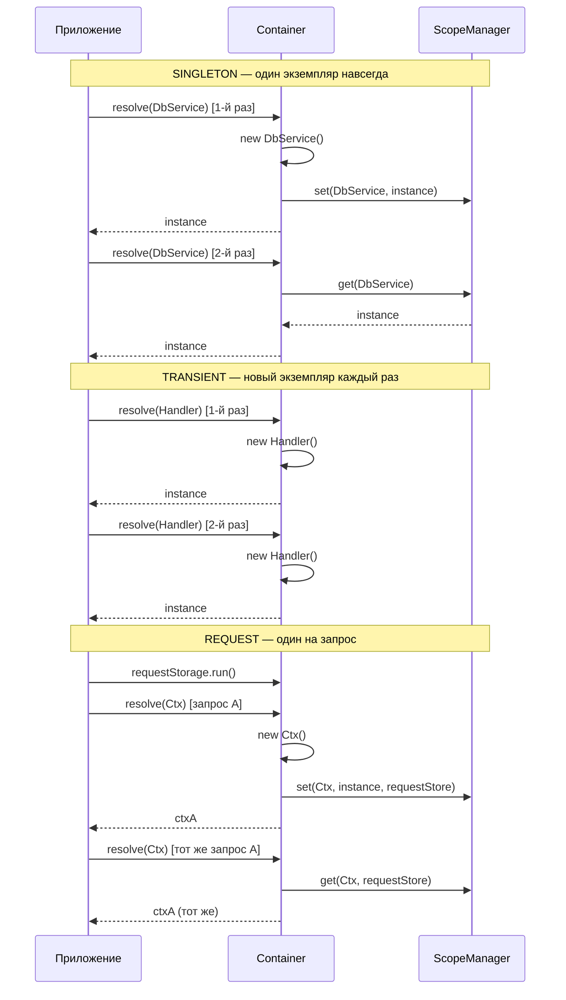
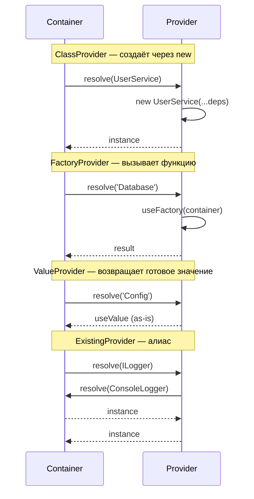

import { Callout } from 'fumadocs-ui/components/callout';

# Основные концепции

Изучите фундаментальные концепции dependency injection и как @ambrosia-unce/core их реализует.

## Что такое Dependency Injection?

**Dependency Injection (DI)** — это паттерн проектирования, при котором объекты получают свои зависимости из внешних источников, а не создают их внутри себя.

### Без DI (Тесная связь)

```typescript
class UserService {
  private db: DatabaseService;

  constructor() {
    // ❌ UserService создаёт свои собственные зависимости
    this.db = new DatabaseService();
  }
}
```

**Проблемы:**
- Сложно тестировать (нельзя сделать mock DatabaseService)
- Тесная связь между классами
- Конфигурация разбросана по коду
- Сложно повторно использовать компоненты

### С DI (Слабая связь)

```typescript
@Injectable()
class UserService {
  // ✅ Зависимости инъектируются
  constructor(private db: DatabaseService) {}
}
```

**Преимущества:**
- Легко тестировать (инъектируем mock)
- Слабая связь между классами
- Централизованная конфигурация
- Переиспользуемые компоненты

## DI Контейнер

**Container** — это сердце @ambrosia-unce/core. Он управляет:

1. **Регистрацией** — какие классы доступны
2. **Разрешением** — создание экземпляров с зависимостями
3. **Lifecycle** — управление временем жизни экземпляров (singleton, transient и т.д.)



```typescript
import { Container } from '@ambrosia-unce/core';

const container = new Container({
  mode: 'production',
  autoRegister: true,
});
```

## Декораторы

Декораторы используются для пометки классов и предоставления метаданных для DI-контейнера.

### @Injectable()

Помечает класс как доступный для dependency injection:

```typescript
import { Injectable } from '@ambrosia-unce/core';

@Injectable()
class MyService {
  doSomething() {
    return 'Привет';
  }
}
```

<Callout type="info">
  Без `@Injectable()` контейнер не сможет разрешить класс.
</Callout>

### @Inject()

Явно указывает, какую зависимость инъектировать (полезно для интерфейсов или абстрактных классов):

```typescript
import { Injectable, Inject } from '@ambrosia-unce/core';

abstract class Logger {
  abstract log(message: string): void;
}

@Injectable()
class ConsoleLogger extends Logger {
  log(message: string) {
    console.log(message);
  }
}

@Injectable()
class UserService {
  // Инъектируем конкретную реализацию
  constructor(@Inject('Logger') private logger: Logger) {}
}

// Регистрируем реализацию
container.register({
  token: 'Logger',
  useClass: ConsoleLogger,
});
```

### @Autowired()

Инъекция через свойства (альтернатива инъекции через конструктор):

```typescript
import { Injectable, Autowired } from '@ambrosia-unce/core';

@Injectable()
class UserService {
  @Autowired()
  private logger!: LoggerService;

  doSomething() {
    this.logger.log('Что-то делаем');
  }
}
```

<Callout type="warn">
  Инъекция через конструктор предпочтительнее инъекции через свойства для лучшей тестируемости и явных зависимостей.
</Callout>

### @Optional()

Помечает зависимость как опциональную:

```typescript
import { Injectable, Optional, Inject } from '@ambrosia-unce/core';

@Injectable()
class UserService {
  constructor(
    private db: DatabaseService,
    @Optional() @Inject('Logger') private logger?: Logger
  ) {
    // logger может быть undefined
  }

  log(message: string) {
    this.logger?.log(message);
  }
}
```

## Области видимости

Области видимости контролируют время жизни экземпляров.



### SINGLETON (по умолчанию)

Один экземпляр для всего приложения:

```typescript
import { Injectable, Scope } from '@ambrosia-unce/core';

@Injectable({ scope: Scope.SINGLETON }) // По умолчанию
class DatabaseService {
  private connections = 0;

  connect() {
    this.connections++;
    console.log(`Всего подключений: ${this.connections}`);
  }
}

const db1 = container.resolve(DatabaseService);
const db2 = container.resolve(DatabaseService);

console.log(db1 === db2); // true (тот же экземпляр)
```

**Использование:** подключения к БД, конфигурация, логирование, кэши.

### TRANSIENT

Новый экземпляр каждый раз:

```typescript
@Injectable({ scope: Scope.TRANSIENT })
class RequestHandler {
  private id = Math.random();
  getId() { return this.id; }
}

const handler1 = container.resolve(RequestHandler);
const handler2 = container.resolve(RequestHandler);

console.log(handler1 === handler2); // false (разные экземпляры)
```

**Использование:** обработчики запросов, command-объекты, stateful-сервисы.

### REQUEST

Один экземпляр на область видимости запроса (через `AsyncLocalStorage`):

```typescript
@Injectable({ scope: Scope.REQUEST })
class RequestContext {
  userId?: string;
  requestId?: string;
}

// В HTTP middleware
container.createRequestScope(async () => {
  const context = container.resolve(RequestContext);
  context.requestId = crypto.randomUUID();
  context.userId = '123';

  // Все сервисы, разрешённые в этой области, используют тот же RequestContext
  await handleRequest();
});
```

**Использование:** контекст HTTP-запроса, данные сессии, транзакции.

## Провайдеры

Провайдеры определяют, как контейнер создаёт экземпляры. В @ambrosia-unce/core есть **4 типа** провайдеров:



### Class Provider (по умолчанию)

Создаёт экземпляр через конструктор с автоматическим разрешением зависимостей:

```typescript
container.register({
  token: UserService,
  useClass: UserService,
});

// Сокращённая запись с @Injectable()
@Injectable()
class UserService {}
```

### Factory Provider

Фабричная функция с доступом к контейнеру:

```typescript
container.register({
  token: 'Database',
  useFactory: (container) => {
    const config = container.resolve(ConfigService);
    return new DatabaseService({
      host: config.get('DB_HOST'),
      port: config.get('DB_PORT'),
    });
  },
});
```

### Value Provider

Готовое значение (всегда singleton):

```typescript
container.register({
  token: 'Config',
  useValue: {
    apiUrl: 'https://api.example.com',
    timeout: 5000,
  },
});
```

### Existing Provider (алиас)

Ссылка на другой токен — полезно для полиморфизма:

```typescript
container.register({
  token: ConsoleLogger,
  useClass: ConsoleLogger,
});

container.register({
  token: 'ILogger',
  useExisting: ConsoleLogger, // resolve('ILogger') → resolve(ConsoleLogger)
});
```

## Токены

Токены однозначно идентифицируют зависимости. В @ambrosia-unce/core есть **4 вида** токенов:

### Class Tokens (рекомендуется)

Лучший выбор — типобезопасность + автозаполнение в IDE:

```typescript
@Injectable()
class UserService {}

// Токен — это сам класс
const service = container.resolve(UserService); // TypeScript знает тип
```

### String Tokens

Для конфигурационных значений и примитивов:

```typescript
container.register({
  token: 'API_URL',
  useValue: 'https://api.example.com',
});

const url = container.resolve<string>('API_URL');
```

### Symbol Tokens

Гарантированно уникальны, нет коллизий имён:

```typescript
const DB_TOKEN = Symbol('Database');

container.register({
  token: DB_TOKEN,
  useClass: DatabaseService,
});

const db = container.resolve(DB_TOKEN);
```

### InjectionToken

Типизированный токен с описанием — лучший выбор для библиотек:

```typescript
import { InjectionToken } from '@ambrosia-unce/core';

const CACHE_CONFIG = new InjectionToken<CacheConfig>('CacheConfig');

container.register({
  token: CACHE_CONFIG,
  useValue: { ttl: 3600, maxSize: 1000 },
});

const config = container.resolve(CACHE_CONFIG); // тип CacheConfig
```

<Callout type="success">
  **Лучшая практика**: Используйте class-токены для сервисов, `InjectionToken` — для конфигураций и интерфейсов. Избегайте строковых токенов в продакшене.
</Callout>

## Следующие шаги

Теперь, когда вы понимаете основные концепции:

1. [Базовое использование](/docs/core/guides/basic-usage) - Общие паттерны и лучшие практики
2. [Руководство по областям видимости](/docs/core/guides/scopes) - Глубокое погружение в управление областями видимости
3. [API Справочник](/docs/core/api-reference/container) - Полная документация API
4. [Примеры](/docs/core/examples/http-server) - Реальные примеры
