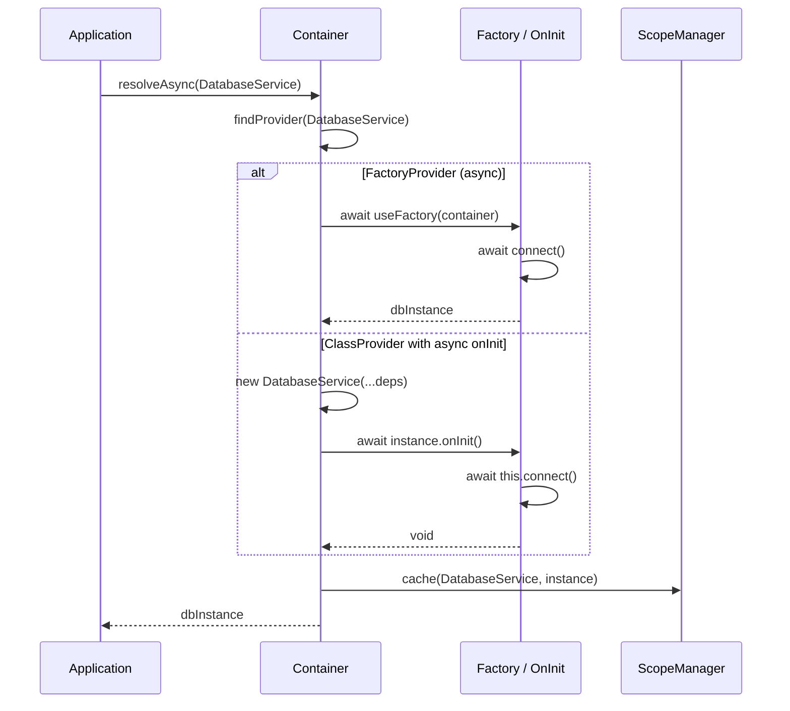
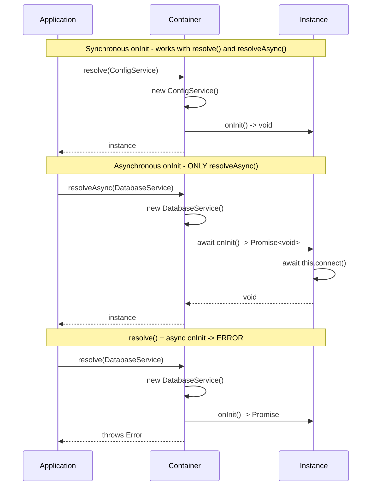

import { Callout } from 'fumadocs-ui/components/callout';
import { Tab, Tabs } from 'fumadocs-ui/components/tabs';

# Async Operations

@ambrosia/core supports async operations for cases where instance creation requires asynchronous initialization - connecting to a database, loading configuration, verifying external services.

## Async Flow Overview



## Async Factories

Register providers with async factories for cases where initialization requires `await`:

```typescript
import { Container, Scope, InjectionToken } from "@ambrosia/core";

const DB_CONNECTION = new InjectionToken<DatabaseConnection>("DbConnection");

const container = new Container();

container.register({
  token: DB_CONNECTION,
  useFactory: async () => {
    const connection = new DatabaseConnection({
      host: process.env.DB_HOST ?? "localhost",
      port: Number(process.env.DB_PORT ?? 5432),
    });
    await connection.connect();
    await connection.runMigrations();
    return connection;
  },
  scope: Scope.SINGLETON,
});
```

### Resolving Async Providers

```typescript
// Correct - via resolveAsync
const db = await container.resolveAsync(DB_CONNECTION);

// Error - resolve() cannot handle a Promise
const db = container.resolve(DB_CONNECTION);
// -> TypeError: Factory returned a Promise. Use resolveAsync().
```

<Callout type="warn">
Regular `resolve()` will throw an error if the factory returns a `Promise`. Always use `resolveAsync()` for async providers.
</Callout>

### Async Factory with Dependencies

The factory receives the container and can resolve dependencies:

```typescript
import { Injectable, InjectionToken } from "@ambrosia/core";

@Injectable()
class ConfigService {
  get(key: string): string {
    return process.env[key] ?? "";
  }
}

const REDIS_CLIENT = new InjectionToken<RedisClient>("Redis");

container.register({
  token: REDIS_CLIENT,
  useFactory: async (c) => {
    const config = c.resolve(ConfigService);
    const client = new RedisClient({
      url: config.get("REDIS_URL"),
    });
    await client.connect();
    return client;
  },
  scope: Scope.SINGLETON,
});
```

## Async onInit

Classes implementing `OnInit` can have an async `onInit()`:

```typescript
import { Injectable, Inject, type OnInit, type OnDestroy } from "@ambrosia/core";

@Injectable()
class DatabaseService implements OnInit, OnDestroy {
  private pool: ConnectionPool | null = null;

  constructor(@Inject(DB_CONFIG) private config: DbConfig) {}

  async onInit(): Promise<void> {
    this.pool = await ConnectionPool.create({
      host: this.config.host,
      port: this.config.port,
      maxConnections: 10,
    });
    console.log(`Connected to ${this.config.host}:${this.config.port}`);
  }

  async onDestroy(): Promise<void> {
    await this.pool?.drain();
    await this.pool?.clear();
  }

  query(sql: string) {
    return this.pool!.query(sql);
  }
}
```

### Sync vs Async onInit



<Tabs items={['Synchronous onInit', 'Asynchronous onInit']}>
<Tab value="Synchronous onInit">
```typescript
@Injectable()
class ConfigService implements OnInit {
  private loaded = false;

  onInit(): void {
    this.loaded = true;
  }
}

// Both variants work
const config = container.resolve(ConfigService);
const config2 = await container.resolveAsync(ConfigService);
```
</Tab>
<Tab value="Asynchronous onInit">
```typescript
@Injectable()
class DatabaseService implements OnInit {
  async onInit(): Promise<void> {
    await this.connect();
  }
}

// Only resolveAsync!
const db = await container.resolveAsync(DatabaseService);

// resolve() will throw an error:
// "DatabaseService.onInit() returned a Promise.
//  Use container.resolveAsync() for async lifecycle hooks."
```
</Tab>
</Tabs>

## Mixing Sync/Async Dependencies

When the root service has async dependencies, use `resolveAsync()` for the entire tree:

```typescript
@Injectable()
class UserRepository {
  constructor(private db: DatabaseService) {} // db has async onInit

  findById(id: string) {
    return this.db.query(`SELECT * FROM users WHERE id = '${id}'`);
  }
}

@Injectable()
class UserService {
  constructor(private repo: UserRepository) {}

  getUser(id: string) {
    return this.repo.findById(id);
  }
}

// resolveAsync resolves the entire tree, including async DatabaseService
const userService = await container.resolveAsync(UserService);
```

## AsyncPluginManager

A specialized manager for non-blocking plugin event processing:

```typescript
import { Container, AsyncPluginManager, LoggingPlugin } from "@ambrosia/core";

const asyncManager = new AsyncPluginManager({
  batchSize: 50,       // Max events per batch (default 50)
  flushInterval: 100,  // Auto-flush interval in ms
});

const container = new Container();
container.use(asyncManager);
```

### Manual Flush

```typescript
// Before application shutdown - flush all remaining events
await asyncManager.flush();

// In tests - ensure all events are processed
await asyncManager.flush();
expect(telemetryPlugin.getStats().totalResolutions).toBe(5);
```

## AsyncLogger

A non-blocking logger optimized for Bun:

```typescript
import { getAsyncLogger } from "@ambrosia/core";

const logger = getAsyncLogger({
  bufferSize: 100,      // Flush when reaching 100 entries
  flushInterval: 100,   // Or every 100ms
  pretty: false,        // JSON format (faster)
});

logger.info("Server started");
logger.debug("Request received", { path: "/api/users" });
logger.error("Database connection failed", { host: "localhost" });

// Force flush (before shutdown)
await logger.forceFlush();

// Graceful shutdown
await logger.destroy();
```

**Benefits:**
- `Bun.write()` for non-blocking writing
- `queueMicrotask()` for instant scheduling
- JSON format for machine processing
- Automatic flush on buffer overflow
- Graceful shutdown via `process.beforeExit`

## Full Example: Async Application Initialization

```typescript
import {
  Container,
  Injectable,
  Inject,
  InjectionToken,
  Scope,
  type OnInit,
  type OnDestroy,
  definePack,
  createAsyncProvider,
} from "@ambrosia/core";

// Tokens
const DB_CONFIG = new InjectionToken<DbConfig>("DbConfig");
const REDIS_CLIENT = new InjectionToken<RedisClient>("Redis");

// Services with async onInit
@Injectable()
class DatabaseService implements OnInit, OnDestroy {
  private pool: ConnectionPool | null = null;

  constructor(@Inject(DB_CONFIG) private config: DbConfig) {}

  async onInit() {
    this.pool = await ConnectionPool.create(this.config);
    console.log("DB connected");
  }

  async onDestroy() {
    await this.pool?.close();
    console.log("DB disconnected");
  }

  query(sql: string) {
    return this.pool!.query(sql);
  }
}

// Pack with async configuration
const DatabasePack = definePack({
  meta: { name: "database" },
  providers: [
    createAsyncProvider(DB_CONFIG, {
      useFactory: async () => {
        // Load configuration from an external source
        const response = await fetch("https://config.example.com/db");
        return response.json();
      },
    }),
    DatabaseService,
  ],
  exports: [DatabaseService],
  async onInit(container) {
    // Ensure DB is connected
    const db = await container.resolveAsync(DatabaseService);
    console.log("Database pack initialized");
  },
});

// Start the application
const container = new Container({ mode: "production" });

// ... process packs via PackProcessor or HttpApplication ...

// Shutdown
process.on("SIGTERM", async () => {
  await container.destroyAll();
  process.exit(0);
});
```

## Best Practices

1. **Use async only when necessary** - synchronous resolution is faster
2. **Cache async initializations** - use `Scope.SINGLETON` for expensive connections
3. **Graceful shutdown** - call `destroyAll()` or `flush()` before termination
4. **Error handling** - always use `try-catch` with `resolveAsync()`
5. **Don't mix** sync `resolve()` and async `onInit()` - this is always an error

```typescript
// Correct shutdown
process.on("SIGTERM", async () => {
  const errors = await container.destroyAll();
  if (errors.length > 0) {
    console.error("Shutdown errors:", errors);
  }
  process.exit(0);
});
```

## Next Steps

- [Plugins](/docs/core/guides/plugins) - LoggingPlugin and the extension system
- [Lifecycle](/docs/core/guides/lifecycle) - OnInit and OnDestroy
- [API: Container](/docs/core/api-reference/container) - resolveAsync() and other methods
