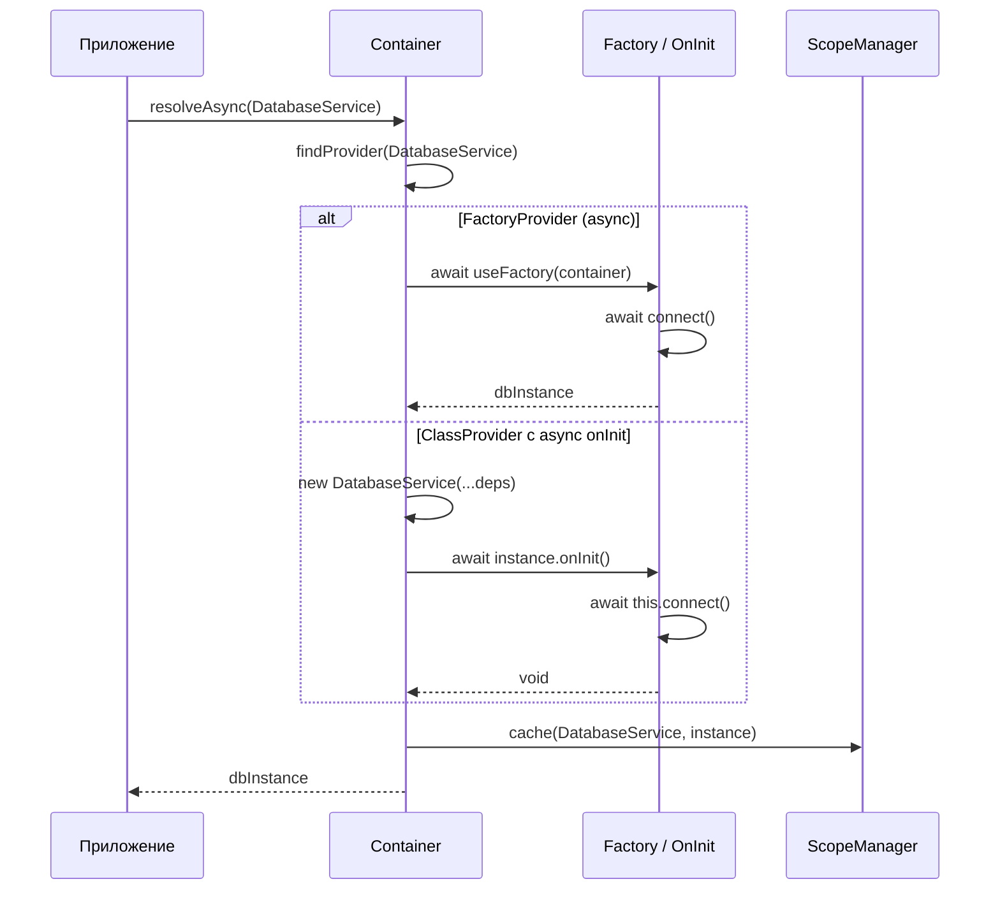
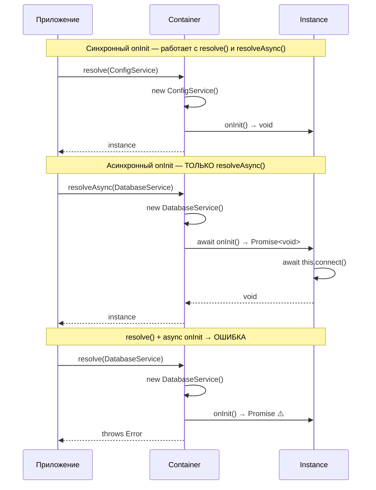
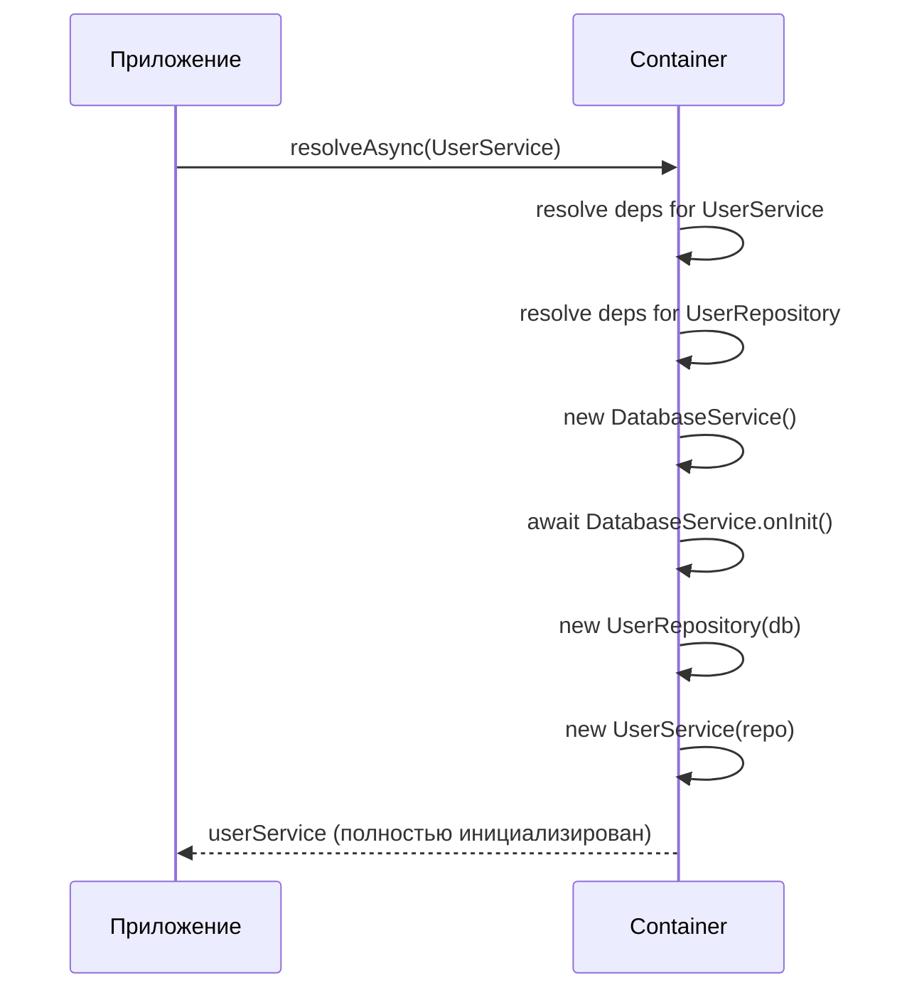
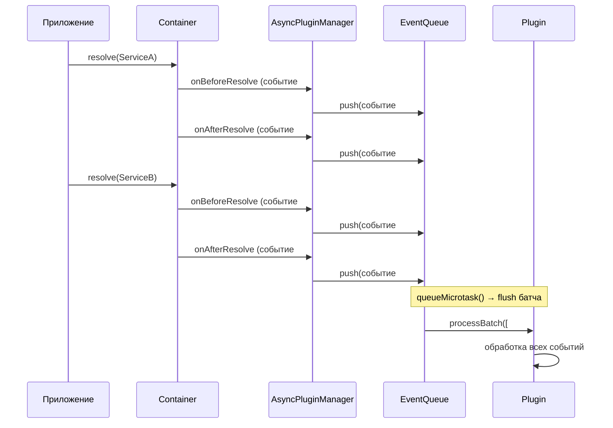
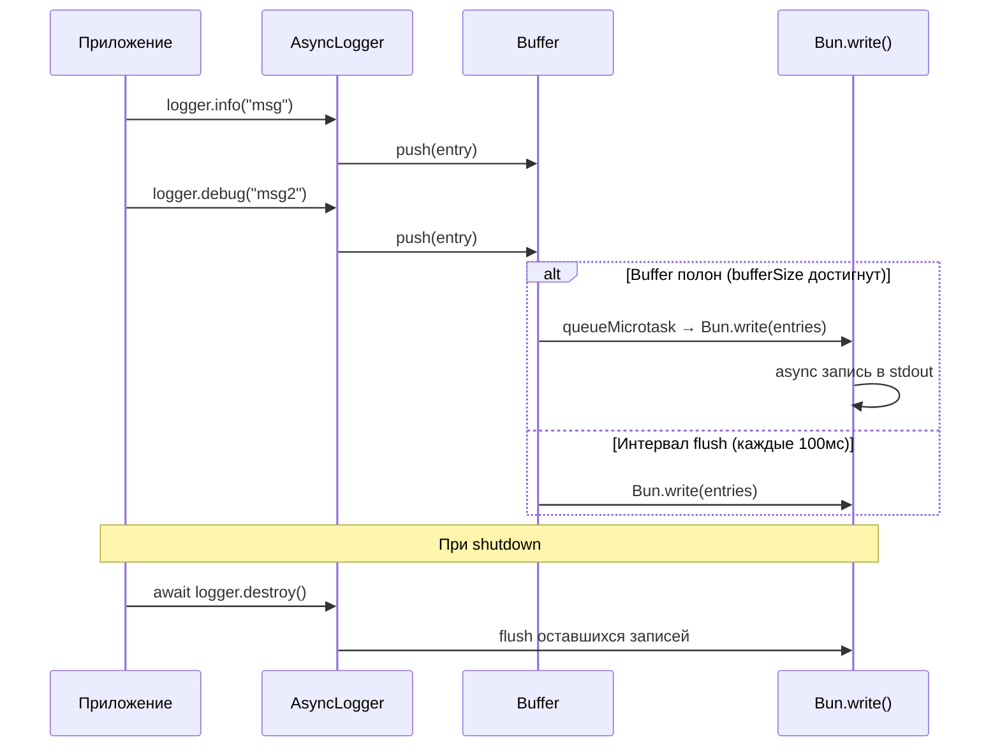

import { Callout } from 'fumadocs-ui/components/callout';
import { Tab, Tabs } from 'fumadocs-ui/components/tabs';

# Асинхронные операции

@ambrosia-unce/core поддерживает асинхронные операции для случаев, когда создание экземпляра требует асинхронной инициализации — подключение к БД, загрузка конфигурации, проверка внешних сервисов.

## Обзор async-потока



## Асинхронные фабрики

Регистрируйте провайдеры с async-фабриками для случаев, когда инициализация требует `await`:

```typescript
import { Container, Scope, InjectionToken } from "@ambrosia-unce/core";

const DB_CONNECTION = new InjectionToken<DatabaseConnection>("DbConnection");

const container = new Container();

container.register({
  token: DB_CONNECTION,
  useFactory: async () => {
    const connection = new DatabaseConnection({
      host: process.env.DB_HOST ?? "localhost",
      port: Number(process.env.DB_PORT ?? 5432),
    });
    await connection.connect();
    await connection.runMigrations();
    return connection;
  },
  scope: Scope.SINGLETON,
});
```

### Разрешение async-провайдеров

```typescript
// ✅ Правильно — через resolveAsync
const db = await container.resolveAsync(DB_CONNECTION);

// ❌ Ошибка — resolve() не может обработать Promise
const db = container.resolve(DB_CONNECTION);
// → TypeError: Factory returned a Promise. Use resolveAsync().
```

<Callout type="warn">
Обычный `resolve()` выбросит ошибку, если фабрика возвращает `Promise`. Всегда используйте `resolveAsync()` для асинхронных провайдеров.
</Callout>

### Async-фабрика с зависимостями

Фабрика получает контейнер и может разрешать зависимости:

```typescript
import { Injectable, InjectionToken } from "@ambrosia-unce/core";

@Injectable()
class ConfigService {
  get(key: string): string {
    return process.env[key] ?? "";
  }
}

const REDIS_CLIENT = new InjectionToken<RedisClient>("Redis");

container.register({
  token: REDIS_CLIENT,
  useFactory: async (c) => {
    const config = c.resolve(ConfigService);
    const client = new RedisClient({
      url: config.get("REDIS_URL"),
    });
    await client.connect();
    return client;
  },
  scope: Scope.SINGLETON,
});
```

## Async onInit

Классы, реализующие `OnInit`, могут иметь асинхронный `onInit()`:

```typescript
import { Injectable, Inject, type OnInit, type OnDestroy } from "@ambrosia-unce/core";

@Injectable()
class DatabaseService implements OnInit, OnDestroy {
  private pool: ConnectionPool | null = null;

  constructor(@Inject(DB_CONFIG) private config: DbConfig) {}

  async onInit(): Promise<void> {
    this.pool = await ConnectionPool.create({
      host: this.config.host,
      port: this.config.port,
      maxConnections: 10,
    });
    console.log(`Connected to ${this.config.host}:${this.config.port}`);
  }

  async onDestroy(): Promise<void> {
    await this.pool?.drain();
    await this.pool?.clear();
  }

  query(sql: string) {
    return this.pool!.query(sql);
  }
}
```

### Sync vs Async onInit



<Tabs items={['Синхронный onInit', 'Асинхронный onInit']}>
<Tab value="Синхронный onInit">
```typescript
@Injectable()
class ConfigService implements OnInit {
  private loaded = false;

  onInit(): void {
    this.loaded = true;
  }
}

// Оба варианта работают
const config = container.resolve(ConfigService);
const config2 = await container.resolveAsync(ConfigService);
```
</Tab>
<Tab value="Асинхронный onInit">
```typescript
@Injectable()
class DatabaseService implements OnInit {
  async onInit(): Promise<void> {
    await this.connect();
  }
}

// Только resolveAsync!
const db = await container.resolveAsync(DatabaseService);

// resolve() выбросит ошибку:
// "DatabaseService.onInit() returned a Promise.
//  Use container.resolveAsync() for async lifecycle hooks."
```
</Tab>
</Tabs>

## Смешивание sync/async зависимостей

Когда корневой сервис имеет async-зависимости, используйте `resolveAsync()` для всего дерева:

```typescript
@Injectable()
class UserRepository {
  constructor(private db: DatabaseService) {} // db имеет async onInit

  findById(id: string) {
    return this.db.query(`SELECT * FROM users WHERE id = '${id}'`);
  }
}

@Injectable()
class UserService {
  constructor(private repo: UserRepository) {}

  getUser(id: string) {
    return this.repo.findById(id);
  }
}

// resolveAsync разрешает всё дерево, включая async DatabaseService
const userService = await container.resolveAsync(UserService);
```



## AsyncPluginManager

Специализированный менеджер для неблокирующей обработки событий плагинов:

```typescript
import { Container, AsyncPluginManager, LoggingPlugin } from "@ambrosia-unce/core";

const asyncManager = new AsyncPluginManager({
  batchSize: 50,       // Макс. событий в одном батче (по умолчанию 50)
  flushInterval: 100,  // Интервал автоматического flush в мс
});

const container = new Container();
container.use(asyncManager);
```

### Как работает батчинг



**Синхронные хуки** (обрабатываются немедленно):
- `onContainerCreate`
- `onRegisterProvider`

**Асинхронные хуки** (батчинг через `queueMicrotask`):
- `onBeforeResolve`
- `onAfterResolve`
- `onError`

### Ручной flush

```typescript
// Перед завершением приложения — flush все оставшиеся события
await asyncManager.flush();

// В тестах — убедиться, что все события обработаны
await asyncManager.flush();
expect(telemetryPlugin.getStats().totalResolutions).toBe(5);
```

## AsyncLogger

Неблокирующий логгер, оптимизированный для Bun:

```typescript
import { getAsyncLogger } from "@ambrosia-unce/core";

const logger = getAsyncLogger({
  bufferSize: 100,      // Flush при достижении 100 записей
  flushInterval: 100,   // Или каждые 100мс
  pretty: false,        // JSON формат (быстрее)
});

logger.info("Server started");
logger.debug("Request received", { path: "/api/users" });
logger.error("Database connection failed", { host: "localhost" });

// Принудительный flush (перед shutdown)
await logger.forceFlush();

// Graceful shutdown
await logger.destroy();
```

**Как работает AsyncLogger:**



**Преимущества:**
- `Bun.write()` для неблокирующей записи
- `queueMicrotask()` для моментального планирования
- JSON формат для машинной обработки
- Автоматический flush при переполнении буфера
- Graceful shutdown через `process.beforeExit`

## Полный пример: async-инициализация приложения

```typescript
import {
  Container,
  Injectable,
  Inject,
  InjectionToken,
  Scope,
  type OnInit,
  type OnDestroy,
  definePack,
  createAsyncProvider,
} from "@ambrosia-unce/core";

// Токены
const DB_CONFIG = new InjectionToken<DbConfig>("DbConfig");
const REDIS_CLIENT = new InjectionToken<RedisClient>("Redis");

// Сервисы с async onInit
@Injectable()
class DatabaseService implements OnInit, OnDestroy {
  private pool: ConnectionPool | null = null;

  constructor(@Inject(DB_CONFIG) private config: DbConfig) {}

  async onInit() {
    this.pool = await ConnectionPool.create(this.config);
    console.log("DB connected");
  }

  async onDestroy() {
    await this.pool?.close();
    console.log("DB disconnected");
  }

  query(sql: string) {
    return this.pool!.query(sql);
  }
}

// Пак с async-конфигурацией
const DatabasePack = definePack({
  meta: { name: "database" },
  providers: [
    createAsyncProvider(DB_CONFIG, {
      useFactory: async () => {
        // Загрузка конфигурации из внешнего источника
        const response = await fetch("https://config.example.com/db");
        return response.json();
      },
    }),
    DatabaseService,
  ],
  exports: [DatabaseService],
  async onInit(container) {
    // Убедиться, что DB подключена
    const db = await container.resolveAsync(DatabaseService);
    console.log("Database pack initialized");
  },
});

// Запуск приложения
const container = new Container({ mode: "production" });

// ... обработка паков через PackProcessor или HttpApplication ...

// Shutdown
process.on("SIGTERM", async () => {
  await container.destroyAll();
  process.exit(0);
});
```

## Best Practices

1. **Используйте async только когда необходимо** — синхронное разрешение быстрее
2. **Кэшируйте async-инициализации** — используйте `Scope.SINGLETON` для дорогих подключений
3. **Graceful shutdown** — вызывайте `destroyAll()` или `flush()` перед завершением
4. **Обработка ошибок** — всегда используйте `try-catch` с `resolveAsync()`
5. **Не смешивайте** sync `resolve()` и async `onInit()` — это всегда ошибка

```typescript
// ✅ Правильный shutdown
process.on("SIGTERM", async () => {
  const errors = await container.destroyAll();
  if (errors.length > 0) {
    console.error("Shutdown errors:", errors);
  }
  process.exit(0);
});
```

## Следующие шаги

- [Плагины](/docs/core/guides/plugins) — LoggingPlugin и система расширений
- [Жизненный цикл](/docs/core/guides/lifecycle) — OnInit и OnDestroy
- [API: Container](/docs/core/api-reference/container) — resolveAsync() и другие методы
