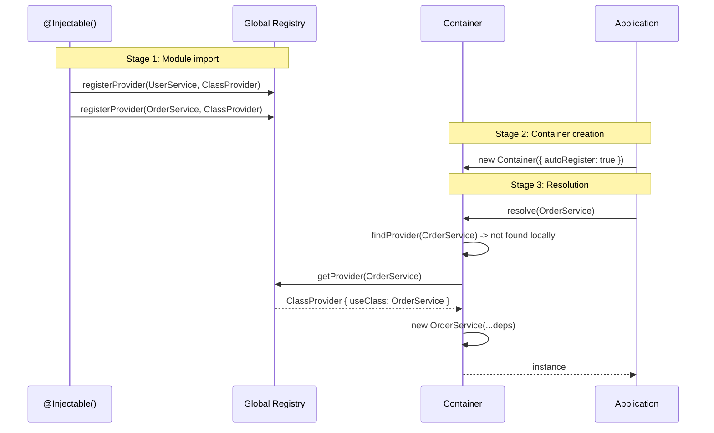

import { Callout } from 'fumadocs-ui/components/callout';
import { Tab, Tabs } from 'fumadocs-ui/components/tabs';

# Auto-Registration

Auto-registration allows the container to pick up classes marked with `@Injectable()` without manual `register()` calls.

## How It Works



1. `@Injectable()` registers the class in the global `Registry` when the module is imported
2. A container with `autoRegister: true` checks the Registry on `resolve()`
3. If a provider is found, it's used as if it were registered manually

```typescript
import { Injectable, Container } from "@ambrosia-unce/core";

@Injectable()
class UserService {
  getUsers() { return []; }
}

@Injectable()
class OrderService {
  constructor(private users: UserService) {}

  getOrdersForUser(id: string) {
    return this.users.getUsers().filter(u => u.id === id);
  }
}

// No manual registration needed!
const container = new Container(); // autoRegister: true by default
const orderService = container.resolve(OrderService); // Works
```

<Callout type="info">
Auto-registration is enabled by default (`autoRegister: true`). Classes are registered the moment they are imported (when the TypeScript/JavaScript engine executes the decorator).
</Callout>

## Enabling and Disabling

```typescript
// Enabled by default
const container = new Container();
const container = new Container({ autoRegister: true });

// Disabled - manual registration only
const container = new Container({ autoRegister: false });
```

With `autoRegister: false`, you need to register every provider manually:

```typescript
const container = new Container({ autoRegister: false });

container.registerClass(UserService, UserService);
container.registerClass(OrderService, OrderService);

const service = container.resolve(OrderService); // OK
```

---

## Global Registry

`Registry` is a singleton store of providers populated by the `@Injectable()` decorator.

```typescript
import { getRegistry } from "@ambrosia-unce/core";

const registry = getRegistry();

// Check if a class is registered
console.log(registry.hasProvider(UserService)); // true

// Get all registered tokens
console.log(registry.getAllTokens());

// Provider count
console.log(registry.size);
```

### How the Container Uses the Registry

On `resolve()`, the container checks providers in this order:

```
1. Local container providers (register/registerClass/etc)
2. Parent container providers (createChild)
3. Global Registry (autoRegister: true)
```

Local registration **always** takes priority over the Registry.

---

## Scope with Auto-Registration

By default, `@Injectable()` registers the class as `SINGLETON`. Override via parameter:

```typescript
import { Injectable, Scope } from "@ambrosia-unce/core";

// Singleton (default)
@Injectable()
class ConfigService {}

// Transient - new instance on every resolve
@Injectable({ scope: Scope.TRANSIENT })
class RequestLogger {}

// Request - one instance per request context
@Injectable({ scope: Scope.REQUEST })
class RequestContext {}
```

---

## Auto vs Manual Registration

<Tabs items={['Automatic', 'Manual']}>
<Tab value="Automatic">
```typescript
// Just add @Injectable()
@Injectable()
class UserService {
  constructor(private db: DatabaseService) {}
}

@Injectable()
class DatabaseService {
  connect() { /* ... */ }
}

// Everything works automatically
const container = new Container();
const service = container.resolve(UserService);
```

**Advantages:**
- Minimal boilerplate
- Dependencies determined from TypeScript metadata
- Adding a new service requires only `@Injectable()`

**Limitations:**
- Only `ClassProvider` (does not support Value, Factory, Existing)
- Requires importing the file with the class (the decorator must execute)
</Tab>
<Tab value="Manual">
```typescript
class UserService {
  constructor(private db: DatabaseService) {}
}

const container = new Container({ autoRegister: false });

// Explicit registration of each provider
container.registerClass(DatabaseService, DatabaseService);
container.registerClass(UserService, UserService);

// Can use all provider types
container.registerValue(API_URL, "https://api.example.com");
container.registerFactory(Logger, (c) => new Logger(c.resolve(CONFIG)));
container.registerExisting(ILogger, ConsoleLogger);
```

**Advantages:**
- Full control over registration
- Support for all provider types
- Explicit configuration - no "magic"

**Limitations:**
- More code
- Must remember to register each class
</Tab>
</Tabs>

---

## Combining Both Approaches

In practice, **both** approaches are used together:

```typescript
import { Injectable, Container, InjectionToken, Scope } from "@ambrosia-unce/core";

// Auto-registration for regular services
@Injectable()
class UserRepository {
  findAll() { return []; }
}

@Injectable()
class UserService {
  constructor(private repo: UserRepository) {}
}

// Manual registration for values, factories, configuration
const DB_URL = new InjectionToken<string>("DB_URL");

const container = new Container(); // autoRegister: true

// InjectionToken cannot be auto-registered - only manually
container.registerValue(DB_URL, process.env.DATABASE_URL!);

// Factory with dependencies
container.registerFactory(
  DatabasePool,
  (c) => createPool(c.resolve(DB_URL)),
  Scope.SINGLETON,
);

const service = container.resolve(UserService); // UserService + UserRepository - auto
```

<Callout type="success">
**Recommendation:** Use `@Injectable()` for classes and manual registration for `InjectionToken`, factories, and values. This gives minimal boilerplate with full control.
</Callout>

---

## Usage with Packs

In pack-based architecture, auto-registration is often **disabled** because packs explicitly declare their providers:

```typescript
import { definePack } from "@ambrosia-unce/core";

const UserPack = definePack({
  meta: { name: "users" },
  providers: [
    UserService,          // Shorthand for { token: UserService, useClass: UserService }
    UserRepository,
    {
      token: DB_URL,
      useValue: "postgres://localhost/users",
    },
  ],
  exports: [UserService], // Only UserService is accessible externally
});
```

When processing packs via `PackProcessor`, providers are registered in the container automatically. `@Injectable()` is still needed for metadata (determining constructor dependencies), but the Registry is not used directly.

---

## Important Details

### Import Order

`@Injectable()` executes on file import. If the file is not imported, the class won't be in the Registry:

```typescript
// UserService not imported - not in Registry
const container = new Container();
container.resolve(UserService); // ProviderNotFoundError!

// Import the file (directly or transitively)
import "./services/user.service";
const container = new Container();
container.resolve(UserService); // OK
```

### Multiple Containers

The Registry is a global singleton. All containers with `autoRegister: true` see the same providers:

```typescript
@Injectable()
class SharedService {}

const containerA = new Container();
const containerB = new Container();

// Both containers resolve SharedService from the Registry
containerA.resolve(SharedService); // OK
containerB.resolve(SharedService); // OK (its own instance)
```

### Overriding Auto-Registration

Local registration always wins:

```typescript
@Injectable()
class Logger {
  level = "info";
}

const container = new Container();

// Override the auto-registered provider
container.registerValue(Logger, new Logger());

// Or replace the class
container.registerClass(Logger, VerboseLogger);
```

---

## Registry API

```typescript
import { getRegistry, Registry } from "@ambrosia-unce/core";

const registry = getRegistry();

// Main methods
registry.hasProvider(token: Token): boolean
registry.getProvider(token: Token): Provider | undefined
registry.getAllProviders(): Provider[]
registry.getAllTokens(): Token[]
registry.size: number

// Management
registry.removeProvider(token: Token): boolean
registry.clear(): void

// @Implements mappings
registry.registerImplementation(abstractToken, implementation): void
registry.getImplementation(abstractToken): Constructor | undefined

// For tests
Registry.reset(): void  // Reset singleton
```

## Next Steps

- [Basic Usage](/docs/core/guides/basic-usage) - Registration and resolution patterns
- [Scopes](/docs/core/guides/scopes) - SINGLETON, TRANSIENT, REQUEST
- [Packs](/docs/core/guides/packs) - Modular provider organization
