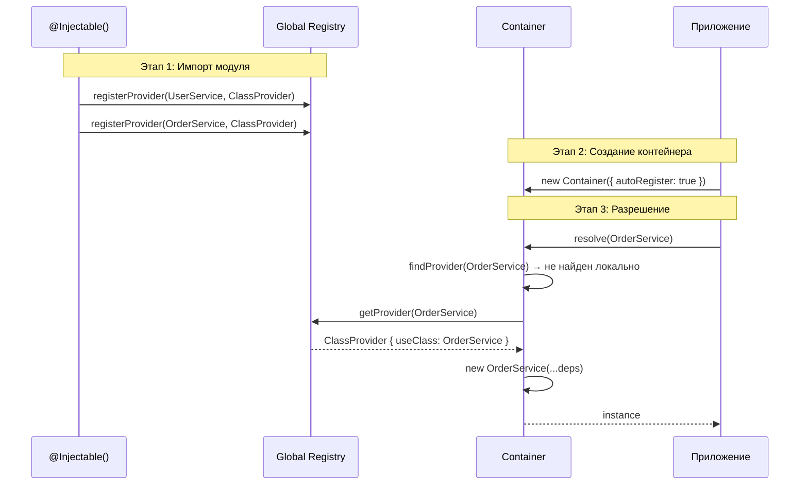

import { Callout } from 'fumadocs-ui/components/callout';
import { Tab, Tabs } from 'fumadocs-ui/components/tabs';

# Автоматическая регистрация

Автоматическая регистрация позволяет контейнеру подхватывать классы с `@Injectable()` без ручного вызова `register()`.

## Как это работает



1. `@Injectable()` регистрирует класс в глобальном `Registry` при импорте модуля
2. Контейнер с `autoRegister: true` проверяет Registry при `resolve()`
3. Если провайдер найден — используется, как если бы был зарегистрирован вручную

```typescript
import { Injectable, Container } from "@ambrosia/core";

@Injectable()
class UserService {
  getUsers() { return []; }
}

@Injectable()
class OrderService {
  constructor(private users: UserService) {}

  getOrdersForUser(id: string) {
    return this.users.getUsers().filter(u => u.id === id);
  }
}

// Никакой ручной регистрации!
const container = new Container(); // autoRegister: true по умолчанию
const orderService = container.resolve(OrderService); // Работает
```

<Callout type="info">
Автоматическая регистрация включена по умолчанию (`autoRegister: true`). Классы регистрируются в момент их импорта (когда TypeScript/JavaScript engine выполняет декоратор).
</Callout>

## Включение и отключение

```typescript
// Включена по умолчанию
const container = new Container();
const container = new Container({ autoRegister: true });

// Отключение — только ручная регистрация
const container = new Container({ autoRegister: false });
```

При `autoRegister: false` нужно регистрировать каждый провайдер вручную:

```typescript
const container = new Container({ autoRegister: false });

container.registerClass(UserService, UserService);
container.registerClass(OrderService, OrderService);

const service = container.resolve(OrderService); // OK
```

---

## Глобальный Registry

`Registry` — singleton-хранилище провайдеров, заполняемое декоратором `@Injectable()`.

```typescript
import { getRegistry } from "@ambrosia/core";

const registry = getRegistry();

// Проверить, что класс зарегистрирован
console.log(registry.hasProvider(UserService)); // true

// Получить все зарегистрированные токены
console.log(registry.getAllTokens());

// Количество провайдеров
console.log(registry.size);
```

### Как контейнер использует Registry

При `resolve()` контейнер проверяет провайдеры в следующем порядке:

```
1. Локальные провайдеры контейнера (register/registerClass/etc)
2. Провайдеры родительского контейнера (createChild)
3. Global Registry (autoRegister: true)
```

Локальная регистрация **всегда** имеет приоритет над Registry.

---

## Scope при автоматической регистрации

По умолчанию `@Injectable()` регистрирует класс как `SINGLETON`. Переопределите через параметр:

```typescript
import { Injectable, Scope } from "@ambrosia/core";

// Singleton (по умолчанию)
@Injectable()
class ConfigService {}

// Transient — новый экземпляр при каждом resolve
@Injectable({ scope: Scope.TRANSIENT })
class RequestLogger {}

// Request — один экземпляр на request context
@Injectable({ scope: Scope.REQUEST })
class RequestContext {}
```

---

## Автоматическая vs ручная регистрация

<Tabs items={['Автоматическая', 'Ручная']}>
<Tab value="Автоматическая">
```typescript
// Просто добавьте @Injectable()
@Injectable()
class UserService {
  constructor(private db: DatabaseService) {}
}

@Injectable()
class DatabaseService {
  connect() { /* ... */ }
}

// Всё работает автоматически
const container = new Container();
const service = container.resolve(UserService);
```

**Преимущества:**
- Минимум boilerplate
- Зависимости определяются из TypeScript metadata
- Добавление нового сервиса — только `@Injectable()`

**Ограничения:**
- Только `ClassProvider` (не поддерживает Value, Factory, Existing)
- Требует импорта файла с классом (декоратор должен выполниться)
</Tab>
<Tab value="Ручная">
```typescript
class UserService {
  constructor(private db: DatabaseService) {}
}

const container = new Container({ autoRegister: false });

// Явная регистрация каждого провайдера
container.registerClass(DatabaseService, DatabaseService);
container.registerClass(UserService, UserService);

// Можно использовать все типы провайдеров
container.registerValue(API_URL, "https://api.example.com");
container.registerFactory(Logger, (c) => new Logger(c.resolve(CONFIG)));
container.registerExisting(ILogger, ConsoleLogger);
```

**Преимущества:**
- Полный контроль над регистрацией
- Поддержка всех типов провайдеров
- Явная конфигурация — нет «магии»

**Ограничения:**
- Больше кода
- Нужно помнить о регистрации каждого класса
</Tab>
</Tabs>

---

## Комбинирование подходов

На практике используют **оба** подхода вместе:

```typescript
import { Injectable, Container, InjectionToken, Scope } from "@ambrosia/core";

// Авто-регистрация для обычных сервисов
@Injectable()
class UserRepository {
  findAll() { return []; }
}

@Injectable()
class UserService {
  constructor(private repo: UserRepository) {}
}

// Ручная регистрация для значений, фабрик, конфигурации
const DB_URL = new InjectionToken<string>("DB_URL");

const container = new Container(); // autoRegister: true

// InjectionToken нельзя авто-регистрировать — только вручную
container.registerValue(DB_URL, process.env.DATABASE_URL!);

// Фабрика с зависимостями
container.registerFactory(
  DatabasePool,
  (c) => createPool(c.resolve(DB_URL)),
  Scope.SINGLETON,
);

const service = container.resolve(UserService); // UserService + UserRepository — авто
```

<Callout type="success">
**Рекомендация:** Используйте `@Injectable()` для классов и ручную регистрацию для `InjectionToken`, фабрик и значений. Это даёт минимум boilerplate с полным контролем.
</Callout>

---

## Использование с паками

В паковой архитектуре авторегистрация часто **отключена**, потому что паки явно объявляют свои провайдеры:

```typescript
import { definePack } from "@ambrosia/core";

const UserPack = definePack({
  meta: { name: "users" },
  providers: [
    UserService,          // Shorthand для { token: UserService, useClass: UserService }
    UserRepository,
    {
      token: DB_URL,
      useValue: "postgres://localhost/users",
    },
  ],
  exports: [UserService], // Только UserService доступен извне
});
```

При обработке паков через `PackProcessor` провайдеры регистрируются в контейнер автоматически. `@Injectable()` по-прежнему нужен для metadata (определения зависимостей конструктора), но Registry не используется напрямую.

---

## Важные нюансы

### Порядок импортов

`@Injectable()` выполняется при импорте файла. Если файл не импортирован — класс не попадёт в Registry:

```typescript
// ❌ UserService не импортирован — не в Registry
const container = new Container();
container.resolve(UserService); // ProviderNotFoundError!

// ✅ Импортируйте файл (прямо или транзитивно)
import "./services/user.service";
const container = new Container();
container.resolve(UserService); // OK
```

### Несколько контейнеров

Registry — глобальный singleton. Все контейнеры с `autoRegister: true` видят одни и те же провайдеры:

```typescript
@Injectable()
class SharedService {}

const containerA = new Container();
const containerB = new Container();

// Оба контейнера резолвят SharedService из Registry
containerA.resolve(SharedService); // OK
containerB.resolve(SharedService); // OK (свой экземпляр)
```

### Переопределение авто-регистрации

Локальная регистрация всегда побеждает:

```typescript
@Injectable()
class Logger {
  level = "info";
}

const container = new Container();

// Переопределяем авто-зарегистрированный провайдер
container.registerValue(Logger, new Logger());

// Или подменяем класс
container.registerClass(Logger, VerboseLogger);
```

---

## Registry API

```typescript
import { getRegistry, Registry } from "@ambrosia/core";

const registry = getRegistry();

// Основные методы
registry.hasProvider(token: Token): boolean
registry.getProvider(token: Token): Provider | undefined
registry.getAllProviders(): Provider[]
registry.getAllTokens(): Token[]
registry.size: number

// Управление
registry.removeProvider(token: Token): boolean
registry.clear(): void

// @Implements маппинги
registry.registerImplementation(abstractToken, implementation): void
registry.getImplementation(abstractToken): Constructor | undefined

// Для тестов
Registry.reset(): void  // Сброс singleton
```

## Следующие шаги

- [Базовое использование](/docs/core/guides/basic-usage) — паттерны регистрации и резолва
- [Области видимости](/docs/core/guides/scopes) — SINGLETON, TRANSIENT, REQUEST
- [Паки](/docs/core/guides/packs) — модульная организация провайдеров
