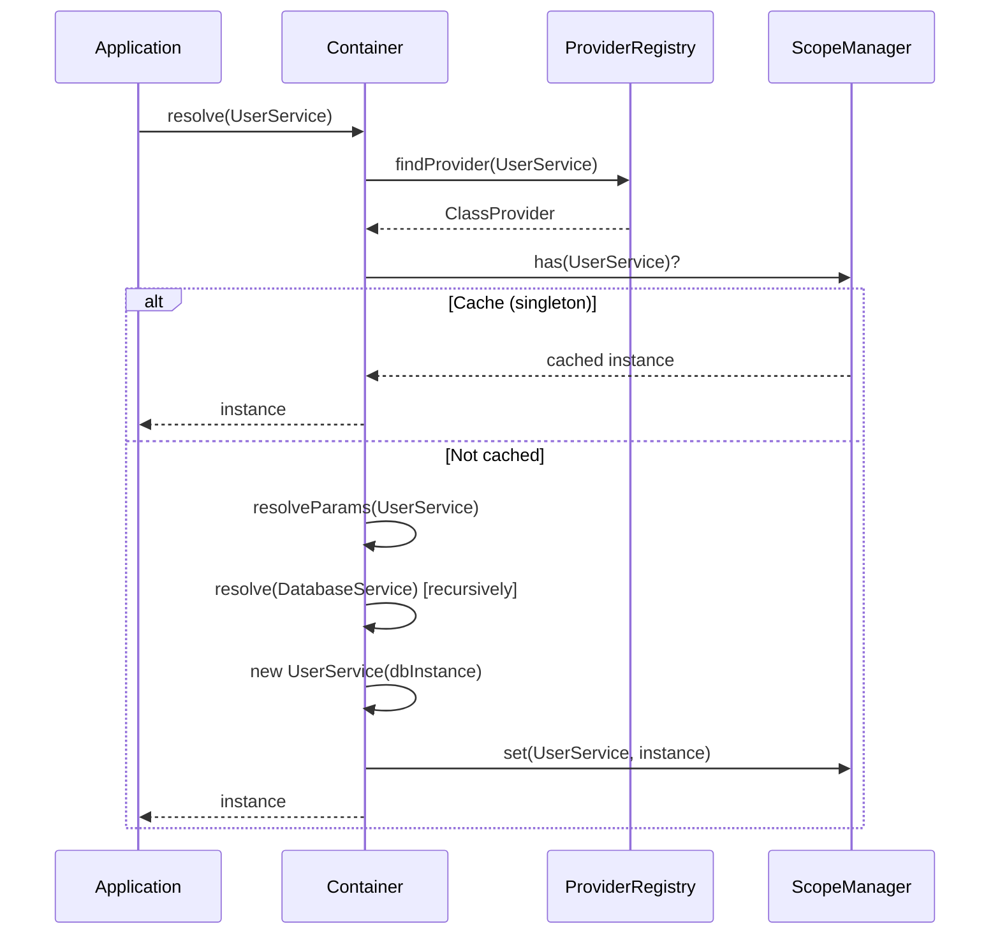

import { Callout } from 'fumadocs-ui/components/callout';
import { Tab, Tabs } from 'fumadocs-ui/components/tabs';

# Basic Usage

Master the fundamental patterns for using @ambrosia-unce/core in your applications.

## How Dependency Resolution Works



## Creating a Container

### Simple Container

The most basic setup:

```typescript
import { Container } from '@ambrosia-unce/core';

const container = new Container();
```

### Production Container

Optimized for production with improved performance:

```typescript
const container = new Container({
  mode: 'production',
  autoRegister: true,
});
```

<Callout type="success">
  **Production mode** provides 25% better performance by disabling debug logging and optimizing cycle checks.
</Callout>

### Development Container

Full debugging and validation:

```typescript
const container = new Container({
  mode: 'development',
  strict: true,
  enableCycleDetection: true,
});
```

## Registering Services

### Auto-Registration

Use `@Injectable()` for automatic registration:

```typescript
import { Injectable } from '@ambrosia-unce/core';

@Injectable()
class UserService {
  getUser(id: string) {
    return { id, name: 'John Doe' };
  }
}

// Automatically registered, just resolve
const service = container.resolve(UserService);
```

<Callout type="info">
  Auto-registration requires `autoRegister: true` (the default) in container options.
</Callout>

### Manual Registration

Register services manually for more control:

<Tabs items={['Class', 'Factory', 'Value']}>
  <Tab value="Class">
    ```typescript
    import { Scope } from '@ambrosia-unce/core';

    class UserService {
      getUser(id: string) {
        return { id, name: 'John' };
      }
    }

    container.register({
      token: UserService,
      useClass: UserService,
      scope: Scope.SINGLETON,
    });
    ```
  </Tab>
  <Tab value="Factory">
    ```typescript
    container.register({
      token: 'DatabaseConnection',
      useFactory: () => {
        return createConnection({
          host: process.env.DB_HOST,
          port: process.env.DB_PORT,
        });
      },
      scope: Scope.SINGLETON,
    });
    ```
  </Tab>
  <Tab value="Value">
    ```typescript
    container.register({
      token: 'AppConfig',
      useValue: {
        apiUrl: 'https://api.example.com',
        timeout: 5000,
      },
    });
    ```
  </Tab>
</Tabs>

### Registering Multiple Services

Register multiple services at once:

```typescript
container.registerMultiple([
  { token: UserService, useClass: UserService },
  { token: ProductService, useClass: ProductService },
  { token: OrderService, useClass: OrderService },
]);
```

## Resolving Dependencies

### Basic Resolution

Resolve a service from the container:

```typescript
@Injectable()
class UserService {
  getUsers() {
    return ['Alice', 'Bob'];
  }
}

const service = container.resolve(UserService);
const users = service.getUsers();
```

### Resolution with Dependencies

The container automatically resolves dependencies:

```typescript
@Injectable()
class DatabaseService {
  query(sql: string) {
    return [];
  }
}

@Injectable()
class UserRepository {
  constructor(private db: DatabaseService) {}

  findAll() {
    return this.db.query('SELECT * FROM users');
  }
}

// Container resolves both UserRepository AND DatabaseService
const repo = container.resolve(UserRepository);
```

### Resolution by String Token

```typescript
container.register({
  token: 'API_URL',
  useValue: 'https://api.example.com',
});

const apiUrl = container.resolve<string>('API_URL');
```

### Resolution by Symbol Token

```typescript
const CONFIG_TOKEN = Symbol('Config');

container.register({
  token: CONFIG_TOKEN,
  useValue: { timeout: 5000 },
});

const config = container.resolve<{ timeout: number }>(CONFIG_TOKEN);
```

## Constructor Injection

### Basic Constructor Injection

Dependencies are injected through the constructor:

```typescript
@Injectable()
class EmailService {
  send(to: string, message: string) {
    console.log(`Sending email to ${to}: ${message}`);
  }
}

@Injectable()
class NotificationService {
  // EmailService is automatically injected
  constructor(private email: EmailService) {}

  notify(userId: string, message: string) {
    this.email.send(`user-${userId}@example.com`, message);
  }
}
```

### Multiple Dependencies

Inject multiple dependencies:

```typescript
@Injectable()
class OrderService {
  constructor(
    private userRepo: UserRepository,
    private productRepo: ProductRepository,
    private paymentService: PaymentService
  ) {}

  createOrder(userId: string, productId: string) {
    const user = this.userRepo.findById(userId);
    const product = this.productRepo.findById(productId);
    return this.paymentService.charge(user, product);
  }
}
```

### Explicit Injection Tokens

Use `@Inject()` for abstract classes or interfaces:

```typescript
abstract class Logger {
  abstract log(message: string): void;
}

@Injectable()
class ConsoleLogger extends Logger {
  log(message: string) {
    console.log(message);
  }
}

@Injectable()
class UserService {
  constructor(
    @Inject('Logger') private logger: Logger
  ) {}
}

// Register the implementation
container.register({
  token: 'Logger',
  useClass: ConsoleLogger,
});
```

## Property Injection

### Using @Autowired()

Inject dependencies through properties:

```typescript
import { Injectable, Autowired } from '@ambrosia-unce/core';

@Injectable()
class UserService {
  @Autowired()
  private logger!: LoggerService;

  @Autowired()
  private cache!: CacheService;

  getUser(id: string) {
    this.logger.log(`Getting user ${id}`);
    return this.cache.get(`user:${id}`);
  }
}
```

<Callout type="warn">
  **Constructor injection is preferred** for better testability and explicit dependencies. Use property injection only when constructor injection is not possible.
</Callout>

## Optional Dependencies

### Optional Constructor Dependencies

Use `@Optional()` for optional constructor parameters:

```typescript
import { Injectable, Optional, Inject } from '@ambrosia-unce/core';

@Injectable()
class UserService {
  constructor(
    private db: DatabaseService,
    @Optional() @Inject('Cache') private cache?: CacheService
  ) {}

  getUser(id: string) {
    // Try cache first
    const cached = this.cache?.get(`user:${id}`);
    if (cached) return cached;

    // Fall back to database
    return this.db.query(`SELECT * FROM users WHERE id = '${id}'`);
  }
}
```

## Factory Providers

### Simple Factory

Create instances with custom logic:

```typescript
container.register({
  token: 'DatabaseConnection',
  useFactory: () => {
    return new DatabaseConnection({
      host: process.env.DB_HOST || 'localhost',
      port: parseInt(process.env.DB_PORT || '5432'),
      user: process.env.DB_USER,
      password: process.env.DB_PASS,
    });
  },
});
```

### Factory with Dependencies

Factory functions can depend on other services:

```typescript
container.register({
  token: 'UserRepository',
  useFactory: (container) => {
    const db = container.resolve(DatabaseService);
    const logger = container.resolve(LoggerService);

    return new UserRepository(db, logger);
  },
});
```

### Async Factory

Create instances asynchronously:

```typescript
container.register({
  token: 'DatabaseConnection',
  useFactory: async () => {
    const connection = new DatabaseConnection();
    await connection.connect();
    return connection;
  },
});

// Resolve asynchronously
const db = await container.resolveAsync('DatabaseConnection');
```

## Checking Registration

### Check if a Token is Registered

```typescript
if (container.has(UserService)) {
  console.log('UserService is registered');
}
```

### Get Provider Information

```typescript
const provider = container.getProvider(UserService);
if (provider) {
  console.log(`Scope: ${provider.scope}`);
}
```

## Cleanup and Reset

### Clear a Specific Scope

Clear all cached instances in a scope:

```typescript
import { Scope } from '@ambrosia-unce/core';

// Clear singleton cache
container.clearScope(Scope.SINGLETON);

// Clear request scope
container.clearScope(Scope.REQUEST);
```

<Callout type="warn">
  Clearing the SINGLETON scope will destroy all singleton instances. They will be recreated on the next resolution.
</Callout>

### Reset the Container

Clear all registrations and cached instances:

```typescript
container.reset();
```

## Best Practices

### 1. Use Constructor Injection

Good:
```typescript
@Injectable()
class UserService {
  constructor(private db: DatabaseService) {}
}
```

Avoid:
```typescript
@Injectable()
class UserService {
  @Autowired()
  private db!: DatabaseService;
}
```

### 2. Prefer Class Tokens

Good:
```typescript
@Injectable()
class UserService {}

const service = container.resolve(UserService);
```

Avoid:
```typescript
container.register({
  token: 'UserService',
  useClass: UserService,
});

const service = container.resolve('UserService');
```

### 3. Keep Services with Single Responsibility

Good:
```typescript
@Injectable()
class UserRepository {
  findById(id: string) { /* ... */ }
  findAll() { /* ... */ }
  create(data: any) { /* ... */ }
}

@Injectable()
class UserValidator {
  validateEmail(email: string) { /* ... */ }
  validatePassword(password: string) { /* ... */ }
}

@Injectable()
class UserService {
  constructor(
    private repo: UserRepository,
    private validator: UserValidator
  ) {}
}
```

## Next Steps

- [Scopes Guide](/docs/core/guides/scopes) - Learn SINGLETON, TRANSIENT, and REQUEST scopes
- [Circular Dependencies](/docs/core/guides/circular-dependencies) - Handling circular references
- [API Reference](/docs/core/api-reference/container) - Complete API documentation
