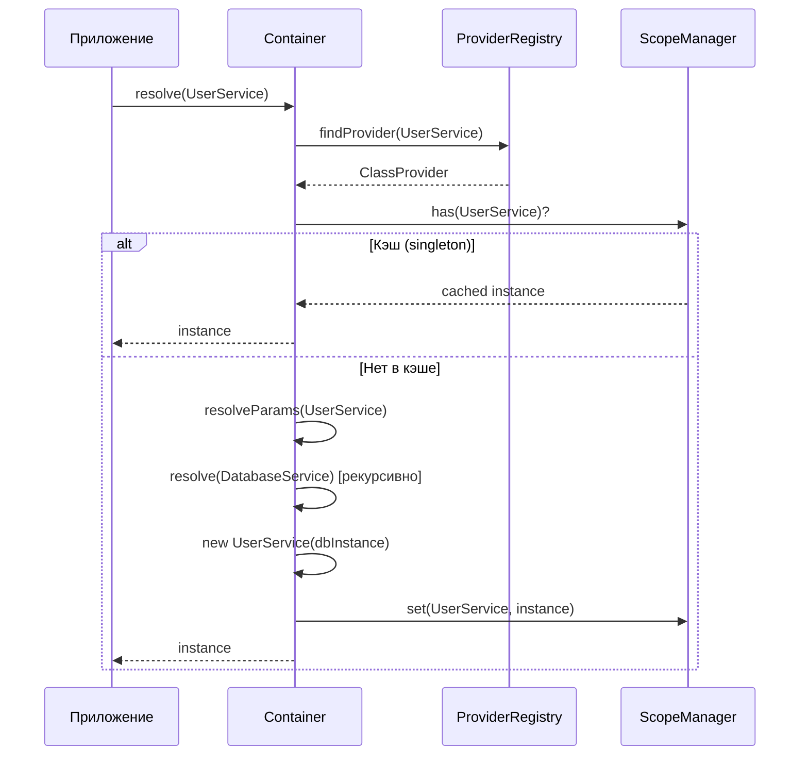

import { Callout } from 'fumadocs-ui/components/callout';
import { Tab, Tabs } from 'fumadocs-ui/components/tabs';

# Базовое использование

Освойте фундаментальные паттерны использования @ambrosia/core в ваших приложениях.

## Как работает разрешение зависимостей



## Создание контейнера

### Простой контейнер

Самая базовая настройка:

```typescript
import { Container } from '@ambrosia/core';

const container = new Container();
```

### Production контейнер

Оптимизирован для production с улучшенной производительностью:

```typescript
const container = new Container({
  mode: 'production',
  autoRegister: true,
});
```

<Callout type="success">
  **Production режим** обеспечивает на 25% лучшую производительность за счёт отключения debug логирования и оптимизации проверки циклов.
</Callout>

### Development контейнер

Полная отладка и валидация:

```typescript
const container = new Container({
  mode: 'development',
  strict: true,
  enableCycleDetection: true,
});
```

## Регистрация сервисов

### Автоматическая регистрация

Используйте `@Injectable()` для автоматической регистрации:

```typescript
import { Injectable } from '@ambrosia/core';

@Injectable()
class UserService {
  getUser(id: string) {
    return { id, name: 'Иван Иванов' };
  }
}

// Автоматически зарегистрирован, просто разрешаем
const service = container.resolve(UserService);
```

<Callout type="info">
  Автоматическая регистрация требует `autoRegister: true` (по умолчанию) в опциях контейнера.
</Callout>

### Ручная регистрация

Регистрируйте сервисы вручную для большего контроля:

<Tabs items={['Класс', 'Фабрика', 'Значение']}>
  <Tab value="Класс">
    ```typescript
    import { Scope } from '@ambrosia/core';

    class UserService {
      getUser(id: string) {
        return { id, name: 'Иван' };
      }
    }

    container.register({
      token: UserService,
      useClass: UserService,
      scope: Scope.SINGLETON,
    });
    ```
  </Tab>
  <Tab value="Фабрика">
    ```typescript
    container.register({
      token: 'DatabaseConnection',
      useFactory: () => {
        return createConnection({
          host: process.env.DB_HOST,
          port: process.env.DB_PORT,
        });
      },
      scope: Scope.SINGLETON,
    });
    ```
  </Tab>
  <Tab value="Значение">
    ```typescript
    container.register({
      token: 'AppConfig',
      useValue: {
        apiUrl: 'https://api.example.com',
        timeout: 5000,
      },
    });
    ```
  </Tab>
</Tabs>

### Регистрация нескольких сервисов

Зарегистрируйте несколько сервисов одновременно:

```typescript
container.registerMultiple([
  { token: UserService, useClass: UserService },
  { token: ProductService, useClass: ProductService },
  { token: OrderService, useClass: OrderService },
]);
```

## Разрешение зависимостей

### Базовое разрешение

Разрешите сервис из контейнера:

```typescript
@Injectable()
class UserService {
  getUsers() {
    return ['Алиса', 'Боб'];
  }
}

const service = container.resolve(UserService);
const users = service.getUsers();
```

### Разрешение с зависимостями

Контейнер автоматически разрешает зависимости:

```typescript
@Injectable()
class DatabaseService {
  query(sql: string) {
    return [];
  }
}

@Injectable()
class UserRepository {
  constructor(private db: DatabaseService) {}
  
  findAll() {
    return this.db.query('SELECT * FROM users');
  }
}

// Контейнер разрешает UserRepository И DatabaseService
const repo = container.resolve(UserRepository);
```

### Разрешение по строковому токену

```typescript
container.register({
  token: 'API_URL',
  useValue: 'https://api.example.com',
});

const apiUrl = container.resolve<string>('API_URL');
```

### Разрешение по Symbol токену

```typescript
const CONFIG_TOKEN = Symbol('Config');

container.register({
  token: CONFIG_TOKEN,
  useValue: { timeout: 5000 },
});

const config = container.resolve<{ timeout: number }>(CONFIG_TOKEN);
```

## Инъекция через конструктор

### Базовая инъекция через конструктор

Зависимости инъектируются через конструктор:

```typescript
@Injectable()
class EmailService {
  send(to: string, message: string) {
    console.log(`Отправка email на ${to}: ${message}`);
  }
}

@Injectable()
class NotificationService {
  // EmailService автоматически инъектируется
  constructor(private email: EmailService) {}
  
  notify(userId: string, message: string) {
    this.email.send(`user-${userId}@example.com`, message);
  }
}
```

### Несколько зависимостей

Инъектируйте несколько зависимостей:

```typescript
@Injectable()
class OrderService {
  constructor(
    private userRepo: UserRepository,
    private productRepo: ProductRepository,
    private paymentService: PaymentService
  ) {}
  
  createOrder(userId: string, productId: string) {
    const user = this.userRepo.findById(userId);
    const product = this.productRepo.findById(productId);
    return this.paymentService.charge(user, product);
  }
}
```

### Явные токены инъекции

Используйте `@Inject()` для абстрактных классов или интерфейсов:

```typescript
abstract class Logger {
  abstract log(message: string): void;
}

@Injectable()
class ConsoleLogger extends Logger {
  log(message: string) {
    console.log(message);
  }
}

@Injectable()
class UserService {
  constructor(
    @Inject('Logger') private logger: Logger
  ) {}
}

// Регистрируем реализацию
container.register({
  token: 'Logger',
  useClass: ConsoleLogger,
});
```

## Инъекция через свойства

### Использование @Autowired()

Инъектируйте зависимости через свойства:

```typescript
import { Injectable, Autowired } from '@ambrosia/core';

@Injectable()
class UserService {
  @Autowired()
  private logger!: LoggerService;
  
  @Autowired()
  private cache!: CacheService;
  
  getUser(id: string) {
    this.logger.log(`Получение пользователя ${id}`);
    return this.cache.get(`user:${id}`);
  }
}
```

<Callout type="warn">
  **Инъекция через конструктор предпочтительнее** для лучшей тестируемости и явных зависимостей. Используйте инъекцию через свойства только когда инъекция через конструктор невозможна.
</Callout>

## Опциональные зависимости

### Опциональные зависимости в конструкторе

Используйте `@Optional()` для опциональных параметров конструктора:

```typescript
import { Injectable, Optional, Inject } from '@ambrosia/core';

@Injectable()
class UserService {
  constructor(
    private db: DatabaseService,
    @Optional() @Inject('Cache') private cache?: CacheService
  ) {}
  
  getUser(id: string) {
    // Сначала пробуем кэш
    const cached = this.cache?.get(`user:${id}`);
    if (cached) return cached;
    
    // Откат к базе данных
    return this.db.query(`SELECT * FROM users WHERE id = '${id}'`);
  }
}
```

## Провайдеры фабрики

### Простая фабрика

Создавайте экземпляры с пользовательской логикой:

```typescript
container.register({
  token: 'DatabaseConnection',
  useFactory: () => {
    return new DatabaseConnection({
      host: process.env.DB_HOST || 'localhost',
      port: parseInt(process.env.DB_PORT || '5432'),
      user: process.env.DB_USER,
      password: process.env.DB_PASS,
    });
  },
});
```

### Фабрика с зависимостями

Функции фабрики могут зависеть от других сервисов:

```typescript
container.register({
  token: 'UserRepository',
  useFactory: (container) => {
    const db = container.resolve(DatabaseService);
    const logger = container.resolve(LoggerService);
    
    return new UserRepository(db, logger);
  },
});
```

### Асинхронная фабрика

Создавайте экземпляры асинхронно:

```typescript
container.register({
  token: 'DatabaseConnection',
  useFactory: async () => {
    const connection = new DatabaseConnection();
    await connection.connect();
    return connection;
  },
});

// Разрешайте асинхронно
const db = await container.resolveAsync('DatabaseConnection');
```

## Проверка регистрации

### Проверить, зарегистрирован ли токен

```typescript
if (container.has(UserService)) {
  console.log('UserService зарегистрирован');
}
```

### Получить информацию о провайдере

```typescript
const provider = container.getProvider(UserService);
if (provider) {
  console.log(`Область видимости: ${provider.scope}`);
}
```

## Очистка и сброс

### Очистить конкретную область видимости

Очистите все кэшированные экземпляры в области видимости:

```typescript
import { Scope } from '@ambrosia/core';

// Очистить кэш singleton
container.clearScope(Scope.SINGLETON);

// Очистить область видимости request
container.clearScope(Scope.REQUEST);
```

<Callout type="warn">
  Очистка области видимости SINGLETON уничтожит все singleton экземпляры. Они будут пересозданы при следующем разрешении.
</Callout>

### Сбросить контейнер

Очистить все регистрации и кэшированные экземпляры:

```typescript
container.reset();
```

## Лучшие практики

### 1. Используйте инъекцию через конструктор

✅ **Хорошо:**
```typescript
@Injectable()
class UserService {
  constructor(private db: DatabaseService) {}
}
```

❌ **Избегайте:**
```typescript
@Injectable()
class UserService {
  @Autowired()
  private db!: DatabaseService;
}
```

### 2. Предпочитайте токены классов

✅ **Хорошо:**
```typescript
@Injectable()
class UserService {}

const service = container.resolve(UserService);
```

❌ **Избегайте:**
```typescript
container.register({
  token: 'UserService',
  useClass: UserService,
});

const service = container.resolve('UserService');
```

### 3. Держите сервисы с единой ответственностью

✅ **Хорошо:**
```typescript
@Injectable()
class UserRepository {
  findById(id: string) { /* ... */ }
  findAll() { /* ... */ }
  create(data: any) { /* ... */ }
}

@Injectable()
class UserValidator {
  validateEmail(email: string) { /* ... */ }
  validatePassword(password: string) { /* ... */ }
}

@Injectable()
class UserService {
  constructor(
    private repo: UserRepository,
    private validator: UserValidator
  ) {}
}
```

## Следующие шаги

- [Руководство по областям видимости](/docs/core/guides/scopes) - Изучите SINGLETON, TRANSIENT и REQUEST области видимости
- [Циклические зависимости](/docs/core/guides/circular-dependencies) - Обработка циклических ссылок
- [API Справочник](/docs/core/api-reference/container) - Полная документация API
