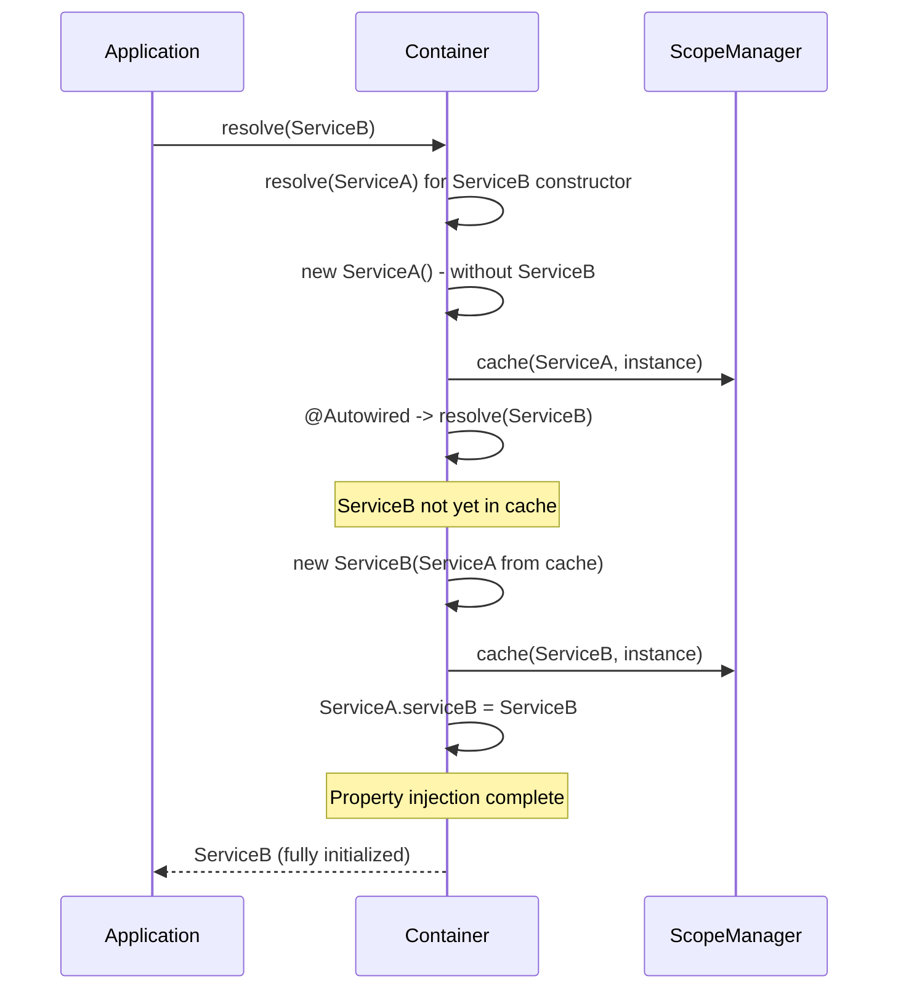

import { Callout } from 'fumadocs-ui/components/callout';
import { Tab, Tabs } from 'fumadocs-ui/components/tabs';

# Circular Dependencies

A circular dependency occurs when two or more services directly or indirectly depend on each other, forming a closed loop in the dependency graph.

## Types of Cycles

### Simple Cycle (A ↔ B)

```typescript
@Injectable()
class ServiceA {
  constructor(private b: ServiceB) {}
}

@Injectable()
class ServiceB {
  constructor(private a: ServiceA) {} // Cycle!
}
```

```
ServiceA -> ServiceB -> ServiceA <- infinite recursion
```

### Transitive Cycle (A -> B -> C -> A)

```typescript
@Injectable()
class AuthService {
  constructor(private users: UserService) {}
}

@Injectable()
class UserService {
  constructor(private notifications: NotificationService) {}
}

@Injectable()
class NotificationService {
  constructor(private auth: AuthService) {} // Cycle through 3 services!
}
```

```
AuthService -> UserService -> NotificationService -> AuthService
```

---

## Cycle Detection

Ambrosia automatically detects circular dependencies and throws a `CircularDependencyError` with the full cycle path.

```typescript
import { CircularDependencyError } from "@ambrosia-unce/core";

try {
  container.resolve(ServiceA);
} catch (error) {
  if (error instanceof CircularDependencyError) {
    console.error(error.message);
    // Circular dependency detected:
    //   ServiceA -> ServiceB -> ServiceA
  }
}
```

### Detection Configuration

| Mode | Behavior |
|---|---|
| `mode: "development"` (default) | Detection always enabled |
| `mode: "production"` | Detection disabled for cached instances (optimization) |
| `enableCycleDetection: false` | Completely disabled (not recommended) |

```typescript
// Production: less overhead, detection only for new instances
const container = new Container({ mode: "production" });

// Explicit disable (use with caution!)
const container = new Container({ enableCycleDetection: false });
```

<Callout type="warn">
Disabling cycle detection in development mode can lead to infinite recursion and stack overflow.
</Callout>

---

## Resolution Strategies

### 1. @Autowired - Property Injection (Recommended)

Move one of the dependencies from the constructor to a property via `@Autowired`. This breaks the cycle because property injection is performed **after** the instance is cached.

```typescript
@Injectable()
class ServiceA {
  // Property injection instead of constructor
  @Autowired()
  private serviceB!: ServiceB;

  doWork() {
    return this.serviceB.help(); // Available after initialization
  }
}

@Injectable()
class ServiceB {
  constructor(private serviceA: ServiceA) {}

  help() { return "done"; }
}
```

**How it works step by step:**



<Callout type="info">
`@Autowired` is the **standard** way to break cycles. Property injection is specifically designed for this: the instance is cached before properties are injected.
</Callout>

### 2. autoResolveCircular - Lazy Proxy (Automatic)

Enable automatic resolution via lazy proxy. The container creates a proxy object that resolves the real instance on first property access.

```typescript
const container = new Container({ autoResolveCircular: true });

@Injectable()
class ServiceA {
  constructor(private b: ServiceB) {}

  doWork() {
    return this.b.help(); // Proxy resolves ServiceB on call
  }
}

@Injectable()
class ServiceB {
  constructor(private a: ServiceA) {}

  help() { return "done"; }
}

// Works without errors!
const a = container.resolve(ServiceA);
a.doWork(); // "done"
```

**Lazy proxy features:**
- Transparent to calling code - behaves like the original object
- Supports `instanceof`, property access, method calls
- Resolves the real instance on first property/method access

<Callout type="warn">
Do not access the lazy proxy **in the constructor**. The constructor is called before the real instance is created. Use the proxy only in methods called after initialization.
</Callout>

```typescript
@Injectable()
class ServiceA {
  constructor(private b: ServiceB) {
    // Proxy not yet resolved!
    // this.b.help(); // Error!
  }

  doWork() {
    // Proxy will resolve on method call
    return this.b.help();
  }
}
```

### 3. Refactoring - Eliminating the Cycle (Best Practice)

Often a cycle is a sign of poor architecture. Extract shared logic into a separate service.

**Before refactoring:**

```typescript
@Injectable()
class OrderService {
  constructor(private payments: PaymentService) {}

  createOrder() {
    this.payments.processPayment(/*...*/);
  }
}

@Injectable()
class PaymentService {
  constructor(private orders: OrderService) {} // Cycle!

  refund(orderId: string) {
    const order = this.orders.getOrder(orderId);
    // ...
  }
}
```

**After refactoring:**

```typescript
// Extract shared dependency
@Injectable()
class OrderRepository {
  getOrder(id: string) { /* ... */ }
  saveOrder(order: Order) { /* ... */ }
}

@Injectable()
class OrderService {
  constructor(
    private repo: OrderRepository,
    private payments: PaymentService,
  ) {}

  createOrder() {
    const order = this.repo.saveOrder(/*...*/);
    this.payments.processPayment(order);
  }
}

@Injectable()
class PaymentService {
  constructor(private repo: OrderRepository) {} // No cycle!

  refund(orderId: string) {
    const order = this.repo.getOrder(orderId);
    // ...
  }
}
```

```
Before: OrderService ↔ PaymentService (cycle)
After:  OrderService -> OrderRepository <- PaymentService (acyclic)
```

### 4. Event Bus - Decoupling via Messaging

Replace direct dependencies with event-based communication.

```typescript
@Injectable()
class EventBus {
  private handlers = new Map<string, Function[]>();

  on(event: string, handler: Function) {
    const list = this.handlers.get(event) ?? [];
    list.push(handler);
    this.handlers.set(event, list);
  }

  emit(event: string, data: unknown) {
    for (const handler of this.handlers.get(event) ?? []) {
      handler(data);
    }
  }
}

@Injectable()
class OrderService {
  constructor(private events: EventBus) {}

  createOrder(data: OrderData) {
    const order = { id: crypto.randomUUID(), ...data };
    this.events.emit("order.created", order);
    return order;
  }
}

@Injectable()
class NotificationService implements OnInit {
  constructor(private events: EventBus) {}

  onInit() {
    this.events.on("order.created", (order: Order) => {
      this.sendEmail(order);
    });
  }

  private sendEmail(order: Order) { /* ... */ }
}
```

### 5. Abstract Classes + @Implements

Depend on an abstraction instead of a concrete implementation.

```typescript
abstract class INotifier {
  abstract notify(msg: string): void;
}

@Injectable()
@Implements(INotifier)
class EmailNotifier extends INotifier {
  notify(msg: string) { /* send email */ }
}

@Injectable()
class UserService {
  constructor(@Inject(INotifier) private notifier: INotifier) {}
}
```

---

## Diagnostics

### Reading CircularDependencyError

The error message contains the full cycle path:

```
Circular dependency detected:
  AuthService -> UserService -> NotificationService -> AuthService
```

Read from right to left - the **last -> first** element is the edge that closes the cycle. That's the dependency you need to break (e.g., with `@Autowired`).

### Dependency Graph

For debugging complex cycles use `getDependencyGraph()`:

```typescript
const resolver = container.resolve(/* internal - for advanced debugging */);
```

---

## Strategy Comparison

| Strategy | Complexity | When to Use |
|---|---|---|
| `@Autowired` | Minimal | Simple cycles, quick fix |
| `autoResolveCircular` | Minimal | Enable globally when cycles are unavoidable |
| Refactoring | Medium | Better architecture long-term |
| Event bus | High | Module decoupling, microservice architecture |
| Abstract classes | Medium | Dependency inversion, DIP |

<Callout type="success">
**Best practice:** Design an acyclic architecture from the start. Use layered architecture: Controllers -> Services -> Repositories -> Infrastructure. Each layer depends only on layers below it.
</Callout>

## Performance

| Scenario | Overhead |
|---|---|
| Development mode (detection enabled) | ~5-10% on uncached resolve |
| Production mode (detection disabled) | < 1% |
| Lazy proxy (autoResolveCircular) | ~2-5% on first access |

## Next Steps

- [Decorators - @Autowired](/docs/core/api-reference/decorators) - Property injection reference
- [Basic Usage](/docs/core/guides/basic-usage) - DI patterns
- [Plugins](/docs/core/guides/plugins) - Extending the container
