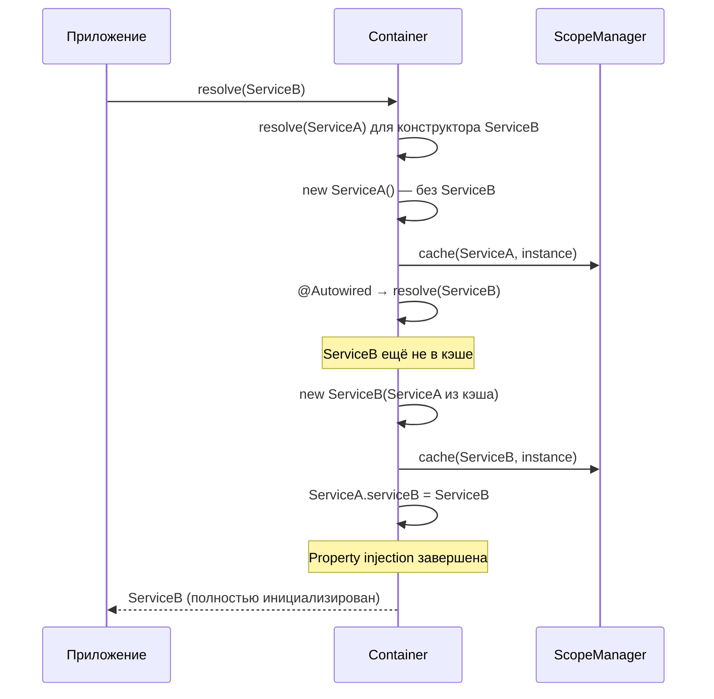

import { Callout } from 'fumadocs-ui/components/callout';
import { Tab, Tabs } from 'fumadocs-ui/components/tabs';

# Циклические зависимости

Циклическая зависимость возникает, когда два или более сервиса прямо или косвенно зависят друг от друга, образуя замкнутый цикл в графе зависимостей.

## Типы циклов

### Простой цикл (A ↔ B)

```typescript
@Injectable()
class ServiceA {
  constructor(private b: ServiceB) {}
}

@Injectable()
class ServiceB {
  constructor(private a: ServiceA) {} // Цикл!
}
```

```
ServiceA → ServiceB → ServiceA ← бесконечная рекурсия
```

### Транзитивный цикл (A → B → C → A)

```typescript
@Injectable()
class AuthService {
  constructor(private users: UserService) {}
}

@Injectable()
class UserService {
  constructor(private notifications: NotificationService) {}
}

@Injectable()
class NotificationService {
  constructor(private auth: AuthService) {} // Цикл через 3 сервиса!
}
```

```
AuthService → UserService → NotificationService → AuthService
```

---

## Обнаружение циклов

Ambrosia автоматически обнаруживает циклические зависимости и выбрасывает `CircularDependencyError` с полным путём цикла.

```typescript
import { CircularDependencyError } from "@ambrosia/core";

try {
  container.resolve(ServiceA);
} catch (error) {
  if (error instanceof CircularDependencyError) {
    console.error(error.message);
    // Circular dependency detected:
    //   ServiceA → ServiceB → ServiceA
  }
}
```

### Настройка обнаружения

| Режим | Поведение |
|---|---|
| `mode: "development"` (по умолчанию) | Обнаружение всегда включено |
| `mode: "production"` | Обнаружение отключено для кэшированных экземпляров (оптимизация) |
| `enableCycleDetection: false` | Полностью отключить (не рекомендуется) |

```typescript
// Production: меньше overhead, обнаружение только для новых экземпляров
const container = new Container({ mode: "production" });

// Явное отключение (осторожно!)
const container = new Container({ enableCycleDetection: false });
```

<Callout type="warn">
Отключение обнаружения циклов в development-режиме может привести к бесконечной рекурсии и stack overflow.
</Callout>

---

## Стратегии разрешения

### 1. @Autowired — property injection (рекомендуется)

Перенесите одну из зависимостей из конструктора в свойство через `@Autowired`. Это разрывает цикл, потому что property injection выполняется **после** кэширования экземпляра.

```typescript
@Injectable()
class ServiceA {
  // Property injection вместо конструктора
  @Autowired()
  private serviceB!: ServiceB;

  doWork() {
    return this.serviceB.help(); // Доступен после инициализации
  }
}

@Injectable()
class ServiceB {
  constructor(private serviceA: ServiceA) {}

  help() { return "done"; }
}
```

**Как это работает пошагово:**



<Callout type="info">
`@Autowired` — это **штатный** способ разрыва циклов. Property injection специально спроектирована для этого: экземпляр кэшируется до инъекции свойств.
</Callout>

### 2. autoResolveCircular — lazy proxy (автоматически)

Включите автоматическое разрешение через lazy proxy. Контейнер создаёт прокси-объект, который разрешает реальный экземпляр при первом обращении к свойству.

```typescript
const container = new Container({ autoResolveCircular: true });

@Injectable()
class ServiceA {
  constructor(private b: ServiceB) {}

  doWork() {
    return this.b.help(); // Proxy разрешит ServiceB при вызове
  }
}

@Injectable()
class ServiceB {
  constructor(private a: ServiceA) {}

  help() { return "done"; }
}

// Работает без ошибок!
const a = container.resolve(ServiceA);
a.doWork(); // "done"
```

**Особенности lazy proxy:**
- Прозрачен для вызывающего кода — ведёт себя как оригинальный объект
- Поддерживает `instanceof`, доступ к свойствам, вызов методов
- Разрешает реальный экземпляр при первом доступе к свойству/методу

<Callout type="warn">
Не обращайтесь к lazy proxy **в конструкторе**. Конструктор вызывается до того, как реальный экземпляр создан. Используйте proxy только в методах, вызываемых после инициализации.
</Callout>

```typescript
@Injectable()
class ServiceA {
  constructor(private b: ServiceB) {
    // ❌ Proxy ещё не разрешён!
    // this.b.help(); // Ошибка!
  }

  doWork() {
    // ✅ Proxy разрешится при вызове метода
    return this.b.help();
  }
}
```

### 3. Рефакторинг — устранение цикла (лучшая практика)

Часто цикл — признак неправильной архитектуры. Извлеките общую логику в отдельный сервис.

**До рефакторинга:**

```typescript
@Injectable()
class OrderService {
  constructor(private payments: PaymentService) {}

  createOrder() {
    this.payments.processPayment(/*...*/);
  }
}

@Injectable()
class PaymentService {
  constructor(private orders: OrderService) {} // Цикл!

  refund(orderId: string) {
    const order = this.orders.getOrder(orderId);
    // ...
  }
}
```

**После рефакторинга:**

```typescript
// Извлекаем общую зависимость
@Injectable()
class OrderRepository {
  getOrder(id: string) { /* ... */ }
  saveOrder(order: Order) { /* ... */ }
}

@Injectable()
class OrderService {
  constructor(
    private repo: OrderRepository,
    private payments: PaymentService,
  ) {}

  createOrder() {
    const order = this.repo.saveOrder(/*...*/);
    this.payments.processPayment(order);
  }
}

@Injectable()
class PaymentService {
  constructor(private repo: OrderRepository) {} // Нет цикла!

  refund(orderId: string) {
    const order = this.repo.getOrder(orderId);
    // ...
  }
}
```

```
До:   OrderService ↔ PaymentService (цикл)
После: OrderService → OrderRepository ← PaymentService (ацикличный)
```

### 4. Шина событий — развязка через messaging

Замените прямую зависимость на событийную коммуникацию.

```typescript
@Injectable()
class EventBus {
  private handlers = new Map<string, Function[]>();

  on(event: string, handler: Function) {
    const list = this.handlers.get(event) ?? [];
    list.push(handler);
    this.handlers.set(event, list);
  }

  emit(event: string, data: unknown) {
    for (const handler of this.handlers.get(event) ?? []) {
      handler(data);
    }
  }
}

@Injectable()
class OrderService {
  constructor(private events: EventBus) {}

  createOrder(data: OrderData) {
    const order = { id: crypto.randomUUID(), ...data };
    this.events.emit("order.created", order);
    return order;
  }
}

@Injectable()
class NotificationService implements OnInit {
  constructor(private events: EventBus) {}

  onInit() {
    this.events.on("order.created", (order: Order) => {
      this.sendEmail(order);
    });
  }

  private sendEmail(order: Order) { /* ... */ }
}
```

### 5. Абстрактные классы + @Implements

Зависьте от абстракции вместо конкретной реализации.

```typescript
abstract class INotifier {
  abstract notify(msg: string): void;
}

@Injectable()
@Implements(INotifier)
class EmailNotifier extends INotifier {
  notify(msg: string) { /* отправка email */ }
}

@Injectable()
class UserService {
  constructor(@Inject(INotifier) private notifier: INotifier) {}
}
```

---

## Диагностика

### Чтение CircularDependencyError

Сообщение об ошибке содержит полный путь цикла:

```
Circular dependency detected:
  AuthService → UserService → NotificationService → AuthService
```

Читайте справа налево — **последний → первый** элемент — это ребро, которое замыкает цикл. Именно эту зависимость нужно разорвать (например, через `@Autowired`).

### Граф зависимостей

Для отладки сложных циклов используйте `getDependencyGraph()`:

```typescript
const resolver = container.resolve(/* internal — для продвинутой отладки */);
```

---

## Сравнение стратегий

| Стратегия | Сложность | Когда использовать |
|---|---|---|
| `@Autowired` | Минимальная | Простые циклы, быстрое исправление |
| `autoResolveCircular` | Минимальная | Включить глобально, когда циклы неизбежны |
| Рефакторинг | Средняя | Лучшая архитектура в долгосрочной перспективе |
| Event bus | Высокая | Развязка модулей, микросервисная архитектура |
| Абстрактные классы | Средняя | Инверсия зависимостей, DIP |

<Callout type="success">
**Лучшая практика:** Проектируйте ацикличную архитектуру с самого начала. Используйте слоистую архитектуру: Controllers → Services → Repositories → Infrastructure. Каждый слой зависит только от нижележащих.
</Callout>

## Производительность

| Сценарий | Overhead |
|---|---|
| Development mode (обнаружение включено) | ~5-10% на некэшированных resolve |
| Production mode (обнаружение отключено) | < 1% |
| Lazy proxy (autoResolveCircular) | ~2-5% на первый доступ |

## Следующие шаги

- [Декораторы — @Autowired](/docs/core/api-reference/decorators) — справочник по property injection
- [Базовое использование](/docs/core/guides/basic-usage) — паттерны DI
- [Плагины](/docs/core/guides/plugins) — расширение контейнера
