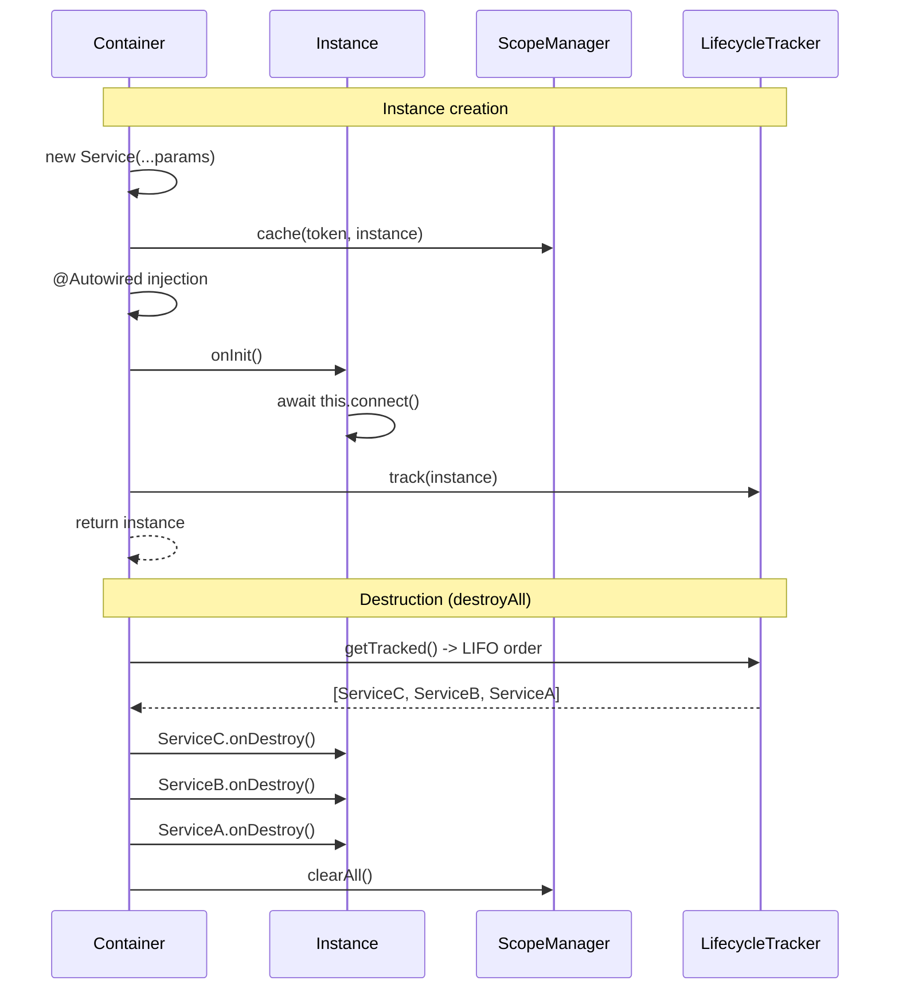

import { Callout } from 'fumadocs-ui/components/callout';
import { Tab, Tabs } from 'fumadocs-ui/components/tabs';

# Injectable Lifecycle

The `OnInit` and `OnDestroy` interfaces let you hook into the lifecycle of instances managed by the DI container.

## Overview



```typescript
import { Injectable, type OnInit, type OnDestroy } from "@ambrosia-unce/core";

@Injectable()
class DatabaseService implements OnInit, OnDestroy {
  private connection: any;

  async onInit(): Promise<void> {
    this.connection = await connect();
    console.log("DB connected");
  }

  async onDestroy(): Promise<void> {
    await this.connection.close();
    console.log("DB disconnected");
  }
}
```

## OnInit

Called **after** instance creation and injection of all dependencies (constructor + `@Autowired`).

```typescript
import { Injectable, Inject, type OnInit } from "@ambrosia-unce/core";

@Injectable()
class CacheService implements OnInit {
  constructor(@Inject(CACHE_CONFIG) private config: CacheConfig) {}

  onInit(): void {
    this.pool = createPool(this.config.maxConnections);
    console.log(`Cache pool created: ${this.config.maxConnections} connections`);
  }
}
```

### Synchronous vs Asynchronous onInit

`onInit()` can be synchronous or asynchronous. However, the choice affects how you resolve the dependency:

<Tabs items={['Synchronous', 'Asynchronous']}>
<Tab value="Synchronous">
```typescript
@Injectable()
class ConfigService implements OnInit {
  onInit(): void {
    // Synchronous initialization
    this.loaded = true;
  }
}

// Works with both methods
const config = container.resolve(ConfigService);
const config2 = await container.resolveAsync(ConfigService);
```
</Tab>
<Tab value="Asynchronous">
```typescript
@Injectable()
class DatabaseService implements OnInit {
  async onInit(): Promise<void> {
    // Asynchronous initialization
    await this.connect();
  }
}

// Only via resolveAsync!
const db = await container.resolveAsync(DatabaseService);

// resolve() will throw an error:
// "DatabaseService.onInit() returned a Promise.
//  Use container.resolveAsync() for async lifecycle hooks."
```
</Tab>
</Tabs>

<Callout type="warn">
If `onInit()` returns a `Promise`, calling `container.resolve()` (synchronous) will throw an error. Use `container.resolveAsync()`.
</Callout>

### Execution Order

```
1. new Service(...params)       <- constructor
2. @Autowired injection         <- property injection
3. caching in scope             <- singleton/transient
4. onInit()                     <- lifecycle hook
5. return instance
```

All dependencies are already injected by the time `onInit()` is called, so you can safely access them.

## OnDestroy

Called when the container is destroyed - `container.destroyAll()` or `app.close()`.

```typescript
import { Injectable, type OnDestroy } from "@ambrosia-unce/core";

@Injectable()
class MetricsCollector implements OnDestroy {
  private interval: Timer;

  constructor() {
    this.interval = setInterval(() => this.flush(), 10_000);
  }

  async onDestroy(): Promise<void> {
    clearInterval(this.interval);
    await this.flush(); // Final metrics flush
    console.log("Metrics flushed");
  }
}
```

### Destruction Order (LIFO)

Instances are destroyed in **reverse** creation order - last created is destroyed first:

```typescript
@Injectable()
class A implements OnDestroy {
  async onDestroy() { console.log("A destroyed"); }
}

@Injectable()
class B implements OnDestroy {
  constructor(private a: A) {}
  async onDestroy() { console.log("B destroyed"); }
}

container.resolve(B); // Creates A, then B

await container.destroyAll();
// B destroyed   (created last - destroyed first)
// A destroyed
```

This ensures dependencies remain available while dependent services complete their cleanup.

### Error Handling

Errors in `onDestroy()` are **logged** but do not interrupt the destruction process. All instances will be destroyed even if one throws an error:

```typescript
@Injectable()
class FlakyService implements OnDestroy {
  async onDestroy() {
    throw new Error("Cleanup failed!");
    // Error will be logged, but other onDestroy calls will continue
  }
}
```

## Full Example

```typescript
import { Injectable, Inject, type OnInit, type OnDestroy } from "@ambrosia-unce/core";

const DB_CONFIG = Symbol("DB_CONFIG");

interface DbConfig {
  host: string;
  port: number;
}

@Injectable()
class DatabaseService implements OnInit, OnDestroy {
  private pool: ConnectionPool | null = null;

  constructor(@Inject(DB_CONFIG) private config: DbConfig) {}

  async onInit(): Promise<void> {
    this.pool = await ConnectionPool.create({
      host: this.config.host,
      port: this.config.port,
      max: 10,
    });
    console.log(`Connected to ${this.config.host}:${this.config.port}`);
  }

  async onDestroy(): Promise<void> {
    if (this.pool) {
      await this.pool.drain();
      await this.pool.clear();
      console.log("Connection pool closed");
    }
  }

  query(sql: string) {
    return this.pool!.query(sql);
  }
}
```

### Usage with Packs

```typescript
import { definePack, createAsyncProvider } from "@ambrosia-unce/core";

export const DatabasePack = definePack({
  meta: { name: "database" },
  providers: [
    createAsyncProvider(DB_CONFIG, {
      useFactory: (env: EnvService) => ({
        host: env.get("DB_HOST"),
        port: Number(env.get("DB_PORT")),
      }),
      inject: [EnvService],
    }),
    DatabaseService,
  ],
  exports: [DatabaseService],
});
```

When used with `HttpApplication`:

```typescript
const app = await HttpApplication.create({
  provider: ElysiaProvider,
  packs: [DatabasePack],
});

// DatabaseService.onInit() called automatically

// On shutdown:
await app.close();
// DatabaseService.onDestroy() called automatically
```

## Lifecycle vs Pack Hooks

Don't confuse lifecycle hooks of **Injectable classes** with lifecycle hooks of **packs**:

| | `OnInit` / `OnDestroy` (Injectable) | `onInit` / `onDestroy` (Pack) |
|---|---|---|
| **Level** | Class instance | Pack (module) |
| **When** | On instance creation/destruction | On pack load/unload |
| **Interface** | `implements OnInit` | `onInit` field in `PackDefinition` |
| **Context** | Access to `this` (injected dependencies) | Receives `container` as argument |
| **Example** | Database connection | Running migrations |

Both mechanisms complement each other:

```typescript
// Pack onInit - module-level configuration
const DatabasePack = definePack({
  providers: [DatabaseService, MigrationRunner],
  async onInit(container) {
    const runner = container.resolve(MigrationRunner);
    await runner.run(); // Migrations after all services are initialized
  },
});

// Injectable onInit - instance initialization
@Injectable()
class DatabaseService implements OnInit {
  async onInit() {
    await this.connect(); // Connect on creation
  }
}
```

## API Reference

### OnInit

```typescript
interface OnInit {
  onInit(): void | Promise<void>;
}
```

### OnDestroy

```typescript
interface OnDestroy {
  onDestroy(): void | Promise<void>;
}
```

### Type Guards

```typescript
import { hasOnInit, hasOnDestroy } from "@ambrosia-unce/core";

if (hasOnInit(instance)) {
  await instance.onInit();
}

if (hasOnDestroy(instance)) {
  await instance.onDestroy();
}
```

### Container.destroyAll()

```typescript
// Calls onDestroy() on all tracked instances (LIFO order)
// Then clears all caches
await container.destroyAll();
```
