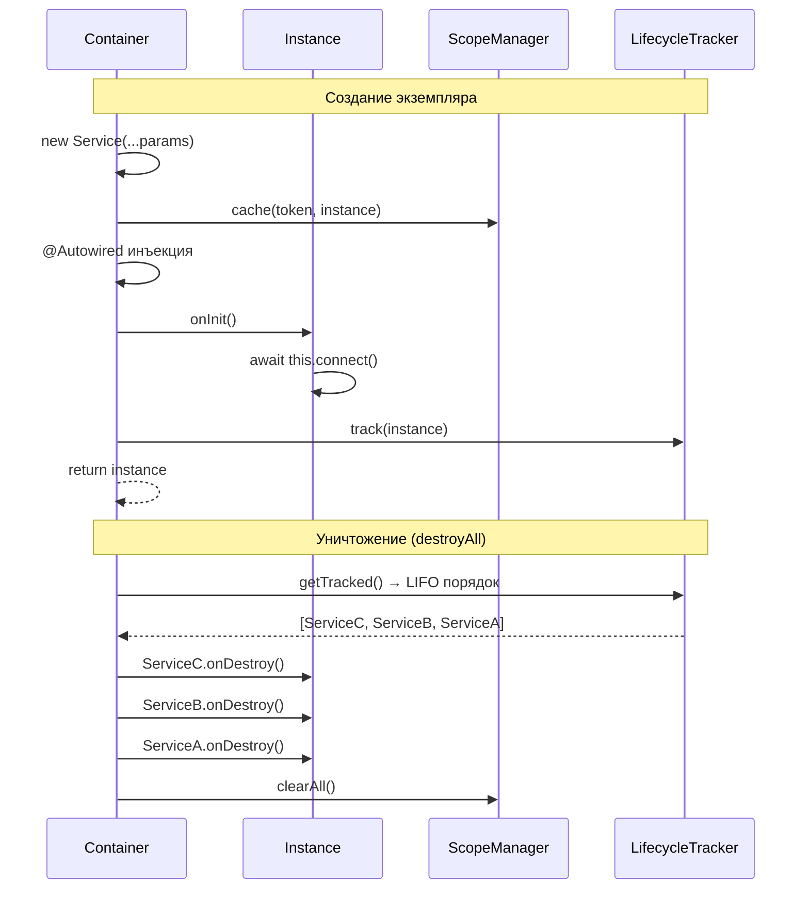

import { Callout } from 'fumadocs-ui/components/callout';
import { Tab, Tabs } from 'fumadocs-ui/components/tabs';

# Жизненный цикл Injectable

Интерфейсы `OnInit` и `OnDestroy` позволяют подключаться к жизненному циклу экземпляров, управляемых DI-контейнером.

## Обзор



```typescript
import { Injectable, type OnInit, type OnDestroy } from "@ambrosia/core";

@Injectable()
class DatabaseService implements OnInit, OnDestroy {
  private connection: any;

  async onInit(): Promise<void> {
    this.connection = await connect();
    console.log("DB connected");
  }

  async onDestroy(): Promise<void> {
    await this.connection.close();
    console.log("DB disconnected");
  }
}
```

## OnInit

Вызывается **после** создания экземпляра и инъекции всех зависимостей (конструктор + `@Autowired`).

```typescript
import { Injectable, Inject, type OnInit } from "@ambrosia/core";

@Injectable()
class CacheService implements OnInit {
  constructor(@Inject(CACHE_CONFIG) private config: CacheConfig) {}

  onInit(): void {
    this.pool = createPool(this.config.maxConnections);
    console.log(`Cache pool created: ${this.config.maxConnections} connections`);
  }
}
```

### Синхронный vs асинхронный onInit

`onInit()` может быть синхронным или асинхронным. Однако выбор влияет на то, как вы резолвите зависимость:

<Tabs items={['Синхронный', 'Асинхронный']}>
<Tab value="Синхронный">
```typescript
@Injectable()
class ConfigService implements OnInit {
  onInit(): void {
    // Синхронная инициализация
    this.loaded = true;
  }
}

// Работает с обоими методами
const config = container.resolve(ConfigService);
const config2 = await container.resolveAsync(ConfigService);
```
</Tab>
<Tab value="Асинхронный">
```typescript
@Injectable()
class DatabaseService implements OnInit {
  async onInit(): Promise<void> {
    // Асинхронная инициализация
    await this.connect();
  }
}

// Только через resolveAsync!
const db = await container.resolveAsync(DatabaseService);

// resolve() выбросит ошибку:
// "DatabaseService.onInit() returned a Promise.
//  Use container.resolveAsync() for async lifecycle hooks."
```
</Tab>
</Tabs>

<Callout type="warn">
Если `onInit()` возвращает `Promise`, вызов `container.resolve()` (синхронный) выбросит ошибку. Используйте `container.resolveAsync()`.
</Callout>

### Порядок выполнения

```
1. new Service(...params)       ← конструктор
2. @Autowired инъекция          ← property injection
3. кеширование в scope          ← singleton/transient
4. onInit()                     ← lifecycle hook
5. return instance
```

Все зависимости уже инъецированы к моменту вызова `onInit()`, поэтому можно безопасно обращаться к ним.

## OnDestroy

Вызывается при уничтожении контейнера — `container.destroyAll()` или `app.close()`.

```typescript
import { Injectable, type OnDestroy } from "@ambrosia/core";

@Injectable()
class MetricsCollector implements OnDestroy {
  private interval: Timer;

  constructor() {
    this.interval = setInterval(() => this.flush(), 10_000);
  }

  async onDestroy(): Promise<void> {
    clearInterval(this.interval);
    await this.flush(); // Финальный сброс метрик
    console.log("Metrics flushed");
  }
}
```

### Порядок уничтожения (LIFO)

Экземпляры уничтожаются в **обратном** порядке создания — последний созданный уничтожается первым:

```typescript
@Injectable()
class A implements OnDestroy {
  async onDestroy() { console.log("A destroyed"); }
}

@Injectable()
class B implements OnDestroy {
  constructor(private a: A) {}
  async onDestroy() { console.log("B destroyed"); }
}

container.resolve(B); // Создаёт A, затем B

await container.destroyAll();
// B destroyed   (создан последним — уничтожен первым)
// A destroyed
```

Это гарантирует, что зависимости остаются доступными, пока зависимый сервис не завершит cleanup.

### Обработка ошибок

Ошибки в `onDestroy()` **логируются**, но не прерывают процесс уничтожения. Все экземпляры будут уничтожены, даже если один из них выбросит ошибку:

```typescript
@Injectable()
class FlakyService implements OnDestroy {
  async onDestroy() {
    throw new Error("Cleanup failed!");
    // Ошибка будет залогирована, но остальные onDestroy продолжат выполняться
  }
}
```

## Полный пример

```typescript
import { Injectable, Inject, type OnInit, type OnDestroy } from "@ambrosia/core";

const DB_CONFIG = Symbol("DB_CONFIG");

interface DbConfig {
  host: string;
  port: number;
}

@Injectable()
class DatabaseService implements OnInit, OnDestroy {
  private pool: ConnectionPool | null = null;

  constructor(@Inject(DB_CONFIG) private config: DbConfig) {}

  async onInit(): Promise<void> {
    this.pool = await ConnectionPool.create({
      host: this.config.host,
      port: this.config.port,
      max: 10,
    });
    console.log(`Connected to ${this.config.host}:${this.config.port}`);
  }

  async onDestroy(): Promise<void> {
    if (this.pool) {
      await this.pool.drain();
      await this.pool.clear();
      console.log("Connection pool closed");
    }
  }

  query(sql: string) {
    return this.pool!.query(sql);
  }
}
```

### Использование с паками

```typescript
import { definePack, createAsyncProvider } from "@ambrosia/core";

export const DatabasePack = definePack({
  meta: { name: "database" },
  providers: [
    createAsyncProvider(DB_CONFIG, {
      useFactory: (env: EnvService) => ({
        host: env.get("DB_HOST"),
        port: Number(env.get("DB_PORT")),
      }),
      inject: [EnvService],
    }),
    DatabaseService,
  ],
  exports: [DatabaseService],
});
```

При использовании с `HttpApplication`:

```typescript
const app = await HttpApplication.create({
  provider: ElysiaProvider,
  packs: [DatabasePack],
});

// DatabaseService.onInit() вызван автоматически

// При shutdown:
await app.close();
// DatabaseService.onDestroy() вызван автоматически
```

## Lifecycle vs Pack hooks

Не путайте lifecycle хуки **Injectable-классов** с lifecycle хуками **паков**:

| | `OnInit` / `OnDestroy` (Injectable) | `onInit` / `onDestroy` (Pack) |
|---|---|---|
| **Уровень** | Экземпляр класса | Пак (модуль) |
| **Когда** | При создании/уничтожении экземпляра | При загрузке/выгрузке пака |
| **Интерфейс** | `implements OnInit` | Поле `onInit` в `PackDefinition` |
| **Контекст** | Доступ к `this` (инъецированным зависимостям) | Получает `container` как аргумент |
| **Пример** | Подключение к БД | Запуск миграций |

Оба механизма дополняют друг друга:

```typescript
// Pack onInit — конфигурация уровня модуля
const DatabasePack = definePack({
  providers: [DatabaseService, MigrationRunner],
  async onInit(container) {
    const runner = container.resolve(MigrationRunner);
    await runner.run(); // Миграции после инициализации всех сервисов
  },
});

// Injectable onInit — инициализация экземпляра
@Injectable()
class DatabaseService implements OnInit {
  async onInit() {
    await this.connect(); // Подключение при создании
  }
}
```

## API Reference

### OnInit

```typescript
interface OnInit {
  onInit(): void | Promise<void>;
}
```

### OnDestroy

```typescript
interface OnDestroy {
  onDestroy(): void | Promise<void>;
}
```

### Type Guards

```typescript
import { hasOnInit, hasOnDestroy } from "@ambrosia/core";

if (hasOnInit(instance)) {
  await instance.onInit();
}

if (hasOnDestroy(instance)) {
  await instance.onDestroy();
}
```

### Container.destroyAll()

```typescript
// Вызывает onDestroy() на всех tracked экземплярах (LIFO порядок)
// Затем очищает все кеши
await container.destroyAll();
```
