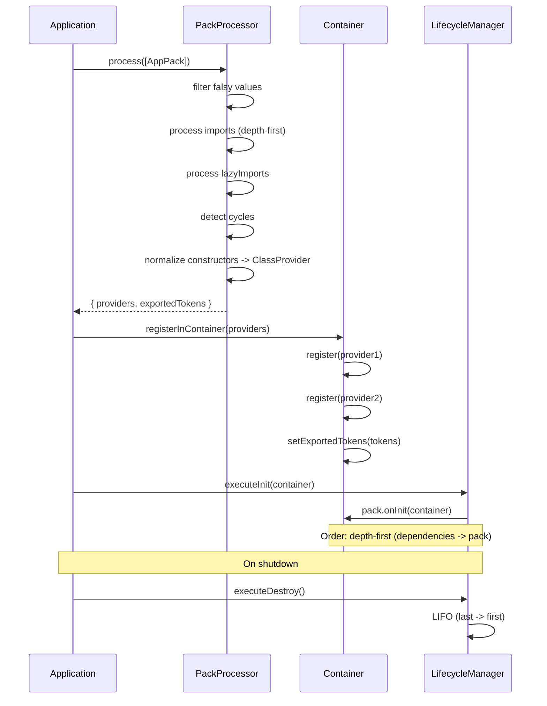

import { Callout } from 'fumadocs-ui/components/callout';
import { Tab, Tabs } from 'fumadocs-ui/components/tabs';

# Pack System

A Pack is a reusable module that bundles providers, configuration, and initialization logic. It's analogous to a `Module` in NestJS, but simpler - it's a plain object, not a class with a decorator.

## Overview



```typescript
import type { PackDefinition } from "@ambrosia/core";

export const LoggingPack: PackDefinition = {
  meta: { name: "logging", version: "1.0.0" },
  providers: [LoggingService],
  exports: [LoggingService],
};
```

## PackDefinition

| Field | Type | Description |
|-------|------|-------------|
| `meta` | `PackMetadata` | Metadata for introspection (name, version, tags) |
| `providers` | `(Provider \| Constructor)[]` | Providers to register in the container |
| `exports` | `Token[]` | Tokens visible to other packs. If not specified, everything is exported |
| `imports` | `Packable[]` | Dependencies - other packs (processed depth-first) |
| `lazyImports` | `() => Packable[]` | Lazy imports for breaking cycles |
| `onInit` | `(container) => void \| Promise<void>` | Hook after provider registration |
| `onDestroy` | `() => void \| Promise<void>` | Hook on shutdown (LIFO order) |

## Simple Pack

A static object - for organizing code within a project:

```typescript
import type { PackDefinition } from "@ambrosia/core";

export const CachePack: PackDefinition = {
  meta: { name: "cache" },
  providers: [
    CacheService,
    { token: CACHE_CONFIG, useValue: { ttl: 3600 } },
  ],
  exports: [CacheService], // CACHE_CONFIG is internal, not exported
};
```

## Configurable Pack (forRoot / forRootAsync)

A class with static methods - for reusable libraries:

```typescript
import type { PackDefinition, AsyncPackOptions } from "@ambrosia/core";
import { createAsyncProvider } from "@ambrosia/core";

export class DatabasePack {
  static forRoot(config: DatabaseConfig): PackDefinition {
    return {
      meta: { name: "database", version: "1.0.0" },
      providers: [
        { token: DB_CONFIG, useValue: config },
        DatabaseService,
        ConnectionPool,
      ],
      exports: [DatabaseService],
      async onInit(container) {
        const db = container.resolve(DatabaseService);
        await db.connect();
      },
      async onDestroy() {
        // Close connections on shutdown
      },
    };
  }

  static forRootAsync(options: AsyncPackOptions<DatabaseConfig>): PackDefinition {
    return {
      meta: { name: "database-async" },
      providers: [
        createAsyncProvider(DB_CONFIG, options),
        DatabaseService,
        ConnectionPool,
      ],
      exports: [DatabaseService],
    };
  }
}
```

### Usage

```typescript
// Synchronous configuration
packs: [
  DatabasePack.forRoot({ host: "localhost", port: 5432 }),
]

// Asynchronous configuration
packs: [
  DatabasePack.forRootAsync({
    useFactory: async (env: EnvService) => ({
      host: env.get("DB_HOST"),
      port: Number(env.get("DB_PORT")),
    }),
    inject: [EnvService],
  }),
]
```

## createAsyncProvider

A helper for creating an async provider from `AsyncPackOptions`. Automatically resolves dependencies from `inject`:

```typescript
import { createAsyncProvider } from "@ambrosia/core";

const provider = createAsyncProvider(DB_CONFIG, {
  useFactory: async (env: EnvService, logger: Logger) => ({
    host: env.get("DB_HOST"),
    debug: logger.level === "debug",
  }),
  inject: [EnvService, Logger],
});
```

## Imports

A pack can import other packs. Imports are processed depth-first - dependencies first, then the pack itself:

```typescript
export const AppPack: PackDefinition = {
  imports: [
    DatabasePack.forRoot(dbConfig),
    CachePack,
    LoggingPack,
  ],
  providers: [AppService],
};
```

## Dynamic Packs

The `imports` and `packs` arrays support falsy values for conditional loading:

```typescript
packs: [
  CorePack.forRoot(),
  process.env.CACHE_ENABLED === "true" && CachePack.forRoot(cacheConfig),
  isDev ? DevToolsPack.forRoot() : null,
  undefined, // Ignored
]
```

<Callout type="info">
The `Packable` type = `PackDefinition | null | undefined | false`. All falsy values are automatically filtered out.
</Callout>

## Exports (Encapsulation)

The `exports` field controls which providers are visible outside the pack:

```typescript
const InternalPack: PackDefinition = {
  providers: [
    PublicService,      // Will be accessible
    InternalHelper,     // Will remain internal
    ConfigProvider,     // Will remain internal
  ],
  exports: [PublicService], // Only PublicService is exported
};
```

<Callout type="warn">
If `exports` is not specified, **all** providers are exported. This ensures backward compatibility.
</Callout>

## Pack Lifecycle Hooks

### onInit

Called after the pack's providers are registered in the container. Can be async:

```typescript
{
  providers: [DatabaseService],
  async onInit(container) {
    const db = container.resolve(DatabaseService);
    await db.runMigrations();
    console.log("Migrations complete");
  },
}
```

### onDestroy

Called on shutdown (`app.close()` or `container.destroyAll()`). Order is LIFO (last registered is destroyed first):

```typescript
{
  providers: [RedisClient],
  async onDestroy() {
    // Graceful cleanup
    console.log("Redis disconnected");
  },
}
```

## Metadata and Introspection

Each pack can contain metadata for discovery and debugging:

```typescript
{
  meta: {
    name: "auth",
    version: "2.1.0",
    description: "Authentication & authorization",
    author: "Team",
    tags: ["auth", "security"],
  },
  providers: [AuthService],
}
```

### PackRegistry

All loaded packs are automatically registered in `PackRegistry`:

```typescript
import { packRegistry } from "@ambrosia/core";

// All loaded packs
const allPacks = packRegistry.getAll();

// Search by name
const authPack = packRegistry.get("auth");

// Search by tag
const securityPacks = packRegistry.findByTag("security");

// Via container
const loaded = container.getLoadedPacks();
const pack = container.getPack("database");
```

## Circular Import Detection

If pack A imports B and B imports A, PackProcessor detects the cycle and outputs a warning:

```
[WARN] Circular pack import detected: pack-a -> pack-b -> pack-a
```

Processing is not interrupted (deduplication prevents infinite recursion), but the warning helps identify the architectural issue.

### lazyImports for Breaking Cycles

```typescript
const PackA: PackDefinition = {
  meta: { name: "pack-a" },
  providers: [ServiceA],
  lazyImports: () => [PackB], // Lazy import
};

const PackB: PackDefinition = {
  meta: { name: "pack-b" },
  providers: [ServiceB],
  imports: [PackA],
};
```

## forFeature Pattern

A pattern for packs that need global configuration (`forRoot`) and feature-specific registration (`forFeature`):

```typescript
export class DatabasePack {
  // Called once - global configuration
  static forRoot(config: DbConfig): PackDefinition {
    return {
      meta: { name: "database-root" },
      providers: [
        { token: DB_CONFIG, useValue: config },
        DatabaseConnection,
        EntityRegistry,
      ],
      exports: [DatabaseConnection, EntityRegistry],
    };
  }

  // Called in each feature pack
  static forFeature(entities: Constructor[]): PackDefinition {
    return {
      meta: { name: "database-feature" },
      providers: entities.map(entity => ({
        token: entity,
        useClass: entity,
      })),
    };
  }
}

// Usage
const UserPack: PackDefinition = {
  imports: [
    DatabasePack.forFeature([UserEntity, ProfileEntity]),
  ],
  providers: [UserService],
};
```

## Generating a Pack via CLI

```bash
ambrosia g pack auth
```

Creates a ready publish-ready project with a `forRoot` / `forRootAsync` structure, types, service, and build script.

## Pack Processing (PackProcessor)

`PackProcessor` is the core of the pack system. It processes an array of `PackDefinition`:

1. Filters falsy values
2. Recursively processes imports (depth-first)
3. Processes lazyImports
4. Detects cycles
5. Normalizes constructors to ClassProvider
6. Tracks exports
7. Registers lifecycle hooks
8. Registers in PackRegistry

```typescript
const processor = new PackProcessor();
const result = processor.process(packs);

// result.providers - flat array of all providers
// result.exportedTokens - Set of all exported tokens

PackProcessor.registerInContainer(container, result.providers);

// Lifecycle
const lifecycle = processor.getLifecycleManager();
await lifecycle.executeInit(container);
// ... on shutdown:
await lifecycle.executeDestroy();
```
