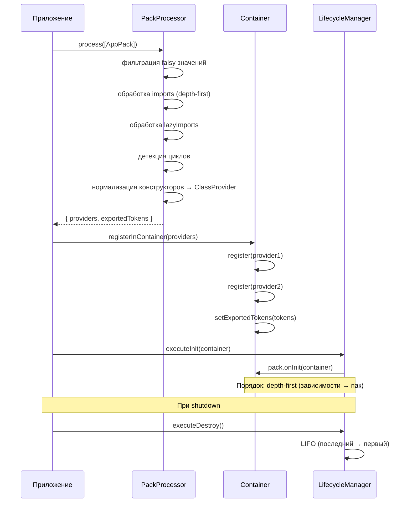

import { Callout } from 'fumadocs-ui/components/callout';
import { Tab, Tabs } from 'fumadocs-ui/components/tabs';

# Система паков

Пак (Pack) — переиспользуемый модуль, объединяющий провайдеры, конфигурацию и логику инициализации. Аналог `Module` в NestJS, но проще — это обычный объект, а не класс с декоратором.

## Обзор



```typescript
import type { PackDefinition } from "@ambrosia-unce/core";

export const LoggingPack: PackDefinition = {
  meta: { name: "logging", version: "1.0.0" },
  providers: [LoggingService],
  exports: [LoggingService],
};
```

## PackDefinition

| Поле | Тип | Описание |
|------|-----|----------|
| `meta` | `PackMetadata` | Метаданные для интроспекции (имя, версия, теги) |
| `providers` | `(Provider \| Constructor)[]` | Провайдеры для регистрации в контейнере |
| `exports` | `Token[]` | Токены, видимые другим пакам. Если не указано — экспортируется всё |
| `imports` | `Packable[]` | Зависимости — другие паки (обрабатываются depth-first) |
| `lazyImports` | `() => Packable[]` | Ленивые импорты для разрыва циклов |
| `onInit` | `(container) => void \| Promise<void>` | Хук после регистрации провайдеров |
| `onDestroy` | `() => void \| Promise<void>` | Хук при shutdown (LIFO порядок) |

## Простой пак

Статический объект — для организации кода внутри проекта:

```typescript
import type { PackDefinition } from "@ambrosia-unce/core";

export const CachePack: PackDefinition = {
  meta: { name: "cache" },
  providers: [
    CacheService,
    { token: CACHE_CONFIG, useValue: { ttl: 3600 } },
  ],
  exports: [CacheService], // CACHE_CONFIG — внутренний, не экспортируется
};
```

## Конфигурируемый пак (forRoot / forRootAsync)

Класс со статическими методами — для переиспользуемых библиотек:

```typescript
import type { PackDefinition, AsyncPackOptions } from "@ambrosia-unce/core";
import { createAsyncProvider } from "@ambrosia-unce/core";

export class DatabasePack {
  static forRoot(config: DatabaseConfig): PackDefinition {
    return {
      meta: { name: "database", version: "1.0.0" },
      providers: [
        { token: DB_CONFIG, useValue: config },
        DatabaseService,
        ConnectionPool,
      ],
      exports: [DatabaseService],
      async onInit(container) {
        const db = container.resolve(DatabaseService);
        await db.connect();
      },
      async onDestroy() {
        // Закрытие соединений при shutdown
      },
    };
  }

  static forRootAsync(options: AsyncPackOptions<DatabaseConfig>): PackDefinition {
    return {
      meta: { name: "database-async" },
      providers: [
        createAsyncProvider(DB_CONFIG, options),
        DatabaseService,
        ConnectionPool,
      ],
      exports: [DatabaseService],
    };
  }
}
```

### Использование

```typescript
// Синхронная конфигурация
packs: [
  DatabasePack.forRoot({ host: "localhost", port: 5432 }),
]

// Асинхронная конфигурация
packs: [
  DatabasePack.forRootAsync({
    useFactory: async (env: EnvService) => ({
      host: env.get("DB_HOST"),
      port: Number(env.get("DB_PORT")),
    }),
    inject: [EnvService],
  }),
]
```

## createAsyncProvider

Хелпер для создания асинхронного провайдера из `AsyncPackOptions`. Автоматически резолвит зависимости из `inject`:

```typescript
import { createAsyncProvider } from "@ambrosia-unce/core";

const provider = createAsyncProvider(DB_CONFIG, {
  useFactory: async (env: EnvService, logger: Logger) => ({
    host: env.get("DB_HOST"),
    debug: logger.level === "debug",
  }),
  inject: [EnvService, Logger],
});
```

## Импорты

Пак может импортировать другие паки. Импорты обрабатываются depth-first — сначала зависимости, потом сам пак:

```typescript
export const AppPack: PackDefinition = {
  imports: [
    DatabasePack.forRoot(dbConfig),
    CachePack,
    LoggingPack,
  ],
  providers: [AppService],
};
```

## Динамические паки

Массив `imports` и `packs` поддерживает falsy-значения для условной загрузки:

```typescript
packs: [
  CorePack.forRoot(),
  process.env.CACHE_ENABLED === "true" && CachePack.forRoot(cacheConfig),
  isDev ? DevToolsPack.forRoot() : null,
  undefined, // Игнорируется
]
```

<Callout type="info">
Тип `Packable` = `PackDefinition | null | undefined | false`. Все falsy-значения автоматически фильтруются.
</Callout>

## Экспорты (Encapsulation)

Поле `exports` контролирует, какие провайдеры видны снаружи пака:

```typescript
const InternalPack: PackDefinition = {
  providers: [
    PublicService,      // Будет доступен
    InternalHelper,     // Останется внутренним
    ConfigProvider,     // Останется внутренним
  ],
  exports: [PublicService], // Только PublicService экспортируется
};
```

<Callout type="warn">
Если `exports` не указан — **все** провайдеры экспортируются. Это обеспечивает обратную совместимость.
</Callout>

## Lifecycle Hooks пака

### onInit

Вызывается после регистрации провайдеров пака в контейнере. Может быть async:

```typescript
{
  providers: [DatabaseService],
  async onInit(container) {
    const db = container.resolve(DatabaseService);
    await db.runMigrations();
    console.log("Migrations complete");
  },
}
```

### onDestroy

Вызывается при shutdown (`app.close()` или `container.destroyAll()`). Порядок — LIFO (последний зарегистрированный — первый уничтоженный):

```typescript
{
  providers: [RedisClient],
  async onDestroy() {
    // Graceful cleanup
    console.log("Redis disconnected");
  },
}
```

## Метаданные и интроспекция

Каждый пак может содержать метаданные для обнаружения и отладки:

```typescript
{
  meta: {
    name: "auth",
    version: "2.1.0",
    description: "Authentication & authorization",
    author: "Team",
    tags: ["auth", "security"],
  },
  providers: [AuthService],
}
```

### PackRegistry

Все загруженные паки автоматически регистрируются в `PackRegistry`:

```typescript
import { packRegistry } from "@ambrosia-unce/core";

// Все загруженные паки
const allPacks = packRegistry.getAll();

// Поиск по имени
const authPack = packRegistry.get("auth");

// Поиск по тегу
const securityPacks = packRegistry.findByTag("security");

// Через контейнер
const loaded = container.getLoadedPacks();
const pack = container.getPack("database");
```

## Обнаружение циклических импортов

Если пак A импортирует B, а B импортирует A — PackProcessor детектирует цикл и выводит предупреждение:

```
[WARN] Circular pack import detected: pack-a → pack-b → pack-a
```

Обработка не прерывается (дедупликация предотвращает бесконечную рекурсию), но предупреждение помогает найти архитектурную проблему.

### lazyImports для разрыва циклов

```typescript
const PackA: PackDefinition = {
  meta: { name: "pack-a" },
  providers: [ServiceA],
  lazyImports: () => [PackB], // Ленивый импорт
};

const PackB: PackDefinition = {
  meta: { name: "pack-b" },
  providers: [ServiceB],
  imports: [PackA],
};
```

## forFeature паттерн

Паттерн для паков, которым нужна глобальная конфигурация (`forRoot`) и feature-специфичная регистрация (`forFeature`):

```typescript
export class DatabasePack {
  // Вызывается один раз — глобальная конфигурация
  static forRoot(config: DbConfig): PackDefinition {
    return {
      meta: { name: "database-root" },
      providers: [
        { token: DB_CONFIG, useValue: config },
        DatabaseConnection,
        EntityRegistry,
      ],
      exports: [DatabaseConnection, EntityRegistry],
    };
  }

  // Вызывается в каждом feature-паке
  static forFeature(entities: Constructor[]): PackDefinition {
    return {
      meta: { name: "database-feature" },
      providers: entities.map(entity => ({
        token: entity,
        useClass: entity,
      })),
    };
  }
}

// Использование
const UserPack: PackDefinition = {
  imports: [
    DatabasePack.forFeature([UserEntity, ProfileEntity]),
  ],
  providers: [UserService],
};
```

## Генерация пака через CLI

```bash
ambrosia g pack auth
```

Создаёт готовый publish-ready проект со структурой `forRoot` / `forRootAsync`, типами, сервисом и build-скриптом.

## Обработка паков (PackProcessor)

`PackProcessor` — ядро системы паков. Обрабатывает массив `PackDefinition`:

1. Фильтрует falsy-значения
2. Рекурсивно обрабатывает imports (depth-first)
3. Обрабатывает lazyImports
4. Детектирует циклы
5. Нормализует конструкторы в ClassProvider
6. Отслеживает экспорты
7. Регистрирует lifecycle hooks
8. Регистрирует в PackRegistry

```typescript
const processor = new PackProcessor();
const result = processor.process(packs);

// result.providers — плоский массив всех провайдеров
// result.exportedTokens — Set всех экспортированных токенов

PackProcessor.registerInContainer(container, result.providers);

// Lifecycle
const lifecycle = processor.getLifecycleManager();
await lifecycle.executeInit(container);
// ... при shutdown:
await lifecycle.executeDestroy();
```
