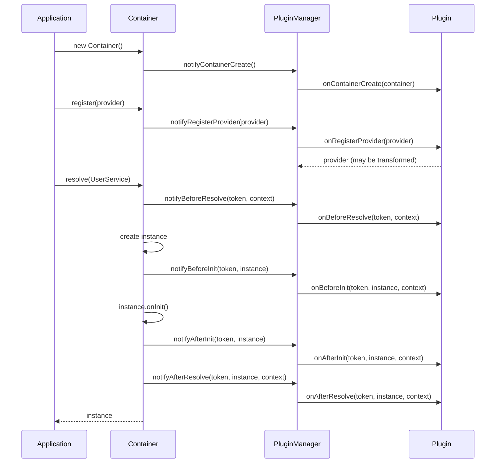
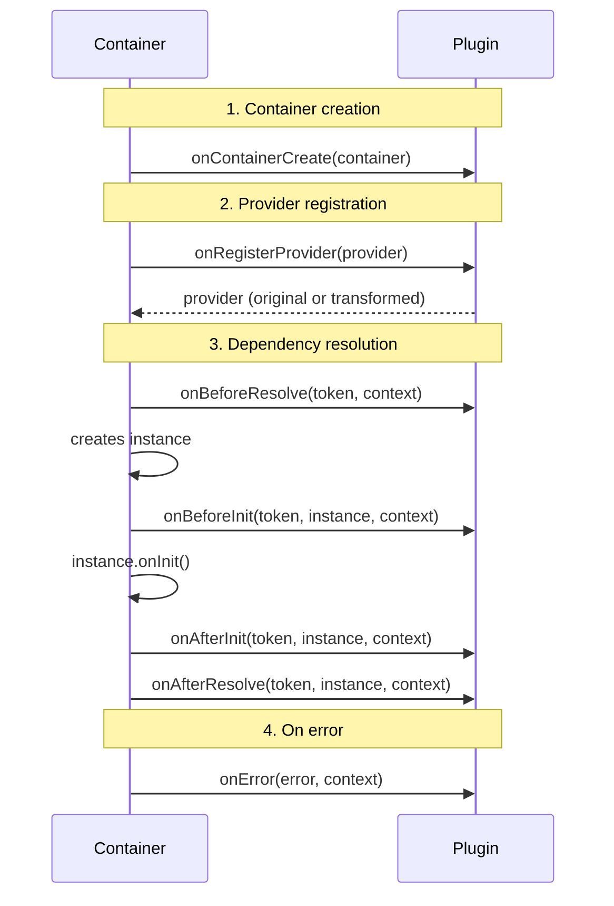

import { Callout } from 'fumadocs-ui/components/callout';
import { Tab, Tabs } from 'fumadocs-ui/components/tabs';

# Plugin System

Plugins let you extend the container's functionality without modifying core code. Use them for logging, telemetry, validation, caching, and other cross-cutting concerns.

## How Plugins Work



## Plugin Interface

A plugin is an object implementing the `Plugin` interface with lifecycle hooks:

```typescript
import type { Plugin, Token, ResolutionContext, Provider } from "@ambrosia/core";

interface Plugin {
  name: string;
  version?: string;

  onContainerCreate?(container: IContainer): void;
  onRegisterProvider?(provider: Provider): Provider;
  onBeforeResolve?(token: Token, context: ResolutionContext): void;
  onAfterResolve?(token: Token, instance: unknown, context: ResolutionContext): void;
  onBeforeInit?(token: Token, instance: unknown, context: ResolutionContext): void;
  onAfterInit?(token: Token, instance: unknown, context: ResolutionContext): void;
  onError?(error: Error, context: ResolutionContext): void;
}
```

## Lifecycle Hooks



| Hook | When Called | Returns |
|------|-----------|---------|
| `onContainerCreate` | On `new Container()` | `void` |
| `onRegisterProvider` | On `register()` / `registerClass()` etc. | `Provider` (can transform) |
| `onBeforeResolve` | Before each `resolve()` | `void` |
| `onAfterResolve` | After successful `resolve()` | `void` |
| `onBeforeInit` | Before instance's `onInit()` | `void` |
| `onAfterInit` | After instance's `onInit()` | `void` |
| `onError` | On resolution error | `void` |

<Callout type="info">
`onBeforeInit` / `onAfterInit` are called **only** for `ClassProvider` instances implementing the `OnInit` interface. Value, Factory, and Existing providers do not trigger these hooks.
</Callout>

## Registering Plugins

```typescript
import { Container, LoggingPlugin, PluginPriority } from "@ambrosia/core";

const container = new Container();

// Simple registration
container.use(new LoggingPlugin());

// With priority
container.use(mySecurityPlugin, PluginPriority.HIGHEST);

// Chaining
container
  .use(new LoggingPlugin({ logResolutionTiming: true }))
  .use(telemetryPlugin, PluginPriority.LOW);
```

### Priorities

Higher value = earlier execution:

```typescript
import { PluginPriority } from "@ambrosia/core";

enum PluginPriority {
  HIGHEST = 100,   // Executes first
  HIGH    = 75,
  NORMAL  = 50,    // Default
  LOW     = 25,
  LOWEST  = 0,     // Executes last
}
```

```typescript
container
  .use(securityPlugin, PluginPriority.HIGHEST)  // Security first
  .use(loggingPlugin, PluginPriority.NORMAL)     // Logging standard
  .use(metricsPlugin, PluginPriority.LOW);       // Metrics after everything
```

## Built-in Plugins

### LoggingPlugin

Debug and monitor dependency resolution:

```typescript
import { Container, LoggingPlugin } from "@ambrosia/core";

const container = new Container();

container.use(new LoggingPlugin({
  logger: customLogger,              // Default: ConsoleLogger
  logResolutionTiming: true,         // Log resolve timing
  logProviderRegistration: true,     // Log registration
}));

// Now every resolve is logged:
container.resolve(UserService);
// [DEBUG] Resolving: UserService
// [DEBUG] Resolved: UserService in 0.12ms
```

### AsyncPluginManager

Batching and deferred processing of plugin events for better performance:

```typescript
import { AsyncPluginManager } from "@ambrosia/core";

const asyncManager = new AsyncPluginManager({
  batchSize: 50,       // Max events per batch
  flushInterval: 100,  // Flush interval in ms
});

container.use(asyncManager);

// Non-critical hooks (onBeforeResolve, onAfterResolve, onError)
// are processed asynchronously via queueMicrotask()

// Critical hooks (onContainerCreate, onRegisterProvider)
// are processed synchronously

// Manual flush when needed (e.g., before shutdown)
await asyncManager.flush();
```

<Callout type="info">
`AsyncPluginManager` uses `queueMicrotask()` for non-blocking processing, providing up to 10% better throughput in high-load scenarios.
</Callout>

## Creating Custom Plugins

### Minimal Plugin

```typescript
import type { Plugin, Token, ResolutionContext } from "@ambrosia/core";
import { tokenToString } from "@ambrosia/core";

const countPlugin: Plugin = {
  name: "resolution-counter",

  onAfterResolve(token: Token) {
    console.log(`Resolved: ${tokenToString(token)}`);
  },
};

container.use(countPlugin);
```

### Profiling Plugin

```typescript
import type { Plugin, Token, ResolutionContext } from "@ambrosia/core";
import { tokenToString } from "@ambrosia/core";

class ProfilingPlugin implements Plugin {
  name = "profiling";
  version = "1.0.0";

  private durations = new Map<string, number[]>();

  onAfterResolve(token: Token, _instance: unknown, context: ResolutionContext) {
    const elapsed = performance.now() - context.startTime;
    const name = tokenToString(token);

    const list = this.durations.get(name) ?? [];
    list.push(elapsed);
    this.durations.set(name, list);

    if (elapsed > 50) {
      console.warn(`[Profiling] Slow: ${name} took ${elapsed.toFixed(1)}ms`);
    }
  }

  getReport() {
    const report: Record<string, { avg: number; max: number; count: number }> = {};
    for (const [name, durations] of this.durations) {
      const avg = durations.reduce((a, b) => a + b, 0) / durations.length;
      const max = Math.max(...durations);
      report[name] = { avg, max, count: durations.length };
    }
    return report;
  }
}

// Usage
const profiler = new ProfilingPlugin();
container.use(profiler);

// ... resolve various services ...

console.table(profiler.getReport());
```

### Validation Plugin

```typescript
import type { Plugin, Token, Provider } from "@ambrosia/core";
import { tokenToString, Scope } from "@ambrosia/core";

class ValidationPlugin implements Plugin {
  name = "validation";

  onRegisterProvider(provider: Provider): Provider {
    // Warn about TRANSIENT in production
    if (provider.scope === Scope.TRANSIENT) {
      console.warn(
        `[Validation] TRANSIENT scope for ${tokenToString(provider.token)} — ` +
        `consider SINGLETON for better performance`
      );
    }
    return provider; // Must return the provider
  }

  onAfterResolve(token: Token, instance: unknown) {
    // Check that instance is not null
    if (instance == null) {
      throw new Error(`[Validation] Resolved null for ${tokenToString(token)}`);
    }
  }
}
```

### Telemetry Plugin

```typescript
import type { Plugin, Token, ResolutionContext, Provider } from "@ambrosia/core";
import { tokenToString } from "@ambrosia/core";

class TelemetryPlugin implements Plugin {
  name = "telemetry";
  version = "1.0.0";

  private resolutions = new Map<string, number>();
  private errors: Array<{ token: string; error: string; time: number }> = [];

  onContainerCreate() {
    console.log("[Telemetry] Container created at", new Date().toISOString());
  }

  onBeforeResolve(token: Token) {
    const name = tokenToString(token);
    this.resolutions.set(name, (this.resolutions.get(name) ?? 0) + 1);
  }

  onAfterResolve(token: Token, _instance: unknown, context: ResolutionContext) {
    const elapsed = performance.now() - context.startTime;
    if (elapsed > 100) {
      console.warn(`[Telemetry] Slow resolution: ${tokenToString(token)} ${elapsed.toFixed(1)}ms`);
    }
  }

  onError(error: Error, context: ResolutionContext) {
    this.errors.push({
      token: tokenToString(context.token),
      error: error.message,
      time: Date.now(),
    });
  }

  onRegisterProvider(provider: Provider) {
    console.log(`[Telemetry] Registered: ${tokenToString(provider.token)}`);
    return provider;
  }

  getStats() {
    return {
      resolutions: Object.fromEntries(this.resolutions),
      errors: this.errors,
      totalResolutions: [...this.resolutions.values()].reduce((a, b) => a + b, 0),
    };
  }
}
```

## Conditional Plugins

Enable plugins based on environment:

```typescript
const container = new Container({ mode: "production" });

// Development-only plugins
if (process.env.NODE_ENV === "development") {
  container.use(new LoggingPlugin({ logResolutionTiming: true }));
  container.use(new ProfilingPlugin());
}

// Production-only plugins
if (process.env.NODE_ENV === "production") {
  container.use(new TelemetryPlugin());
}

// Always
container.use(errorReporterPlugin);
```

## Provider Transformation

The `onRegisterProvider` hook is the only one that can transform data. It receives a provider and must return a provider (original or modified):

```typescript
const scopeEnforcer: Plugin = {
  name: "scope-enforcer",

  onRegisterProvider(provider: Provider): Provider {
    // Automatically set SINGLETON for all services in production
    if (process.env.NODE_ENV === "production" && provider.scope === Scope.TRANSIENT) {
      return { ...provider, scope: Scope.SINGLETON };
    }
    return provider;
  },
};
```

## Plugin Management

```typescript
// Check for a plugin
if (container.hasPlugin("telemetry")) {
  console.log("Telemetry active");
}

// Get all plugins
const plugins = container.getPlugins();
console.log(`Active plugins: ${plugins.map(p => p.name).join(", ")}`);
```

## Best Practices

1. **Keep plugins lightweight** - minimize work in `onBeforeResolve` (called on every resolve)
2. **Don't crash on errors** - log and continue; a plugin crash should not break the application
3. **Use `AsyncPluginManager`** for I/O operations (sending metrics, writing logs)
4. **Give unique names** - name conflicts can lead to confusion
5. **Return the provider** in `onRegisterProvider` - a forgotten `return` will remove the provider

<Callout type="success">
**Recommendation:** For production, use `AsyncPluginManager` + `TelemetryPlugin` for monitoring. For development - `LoggingPlugin` with `logResolutionTiming: true` for debugging.
</Callout>

## Next Steps

- [Async Operations](/docs/core/guides/async-operations) - AsyncPluginManager and AsyncLogger
- [API: Plugins](/docs/core/api-reference/plugins) - Full Plugin API reference
- [Advanced: Plugin Development](/docs/core/advanced/plugin-development) - Step-by-step guide
