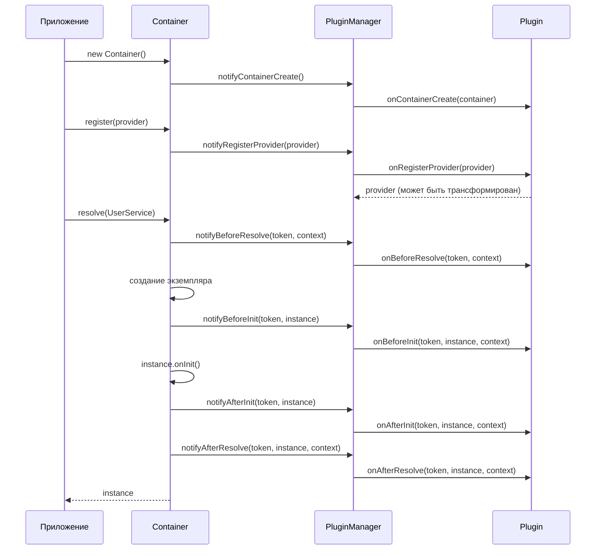
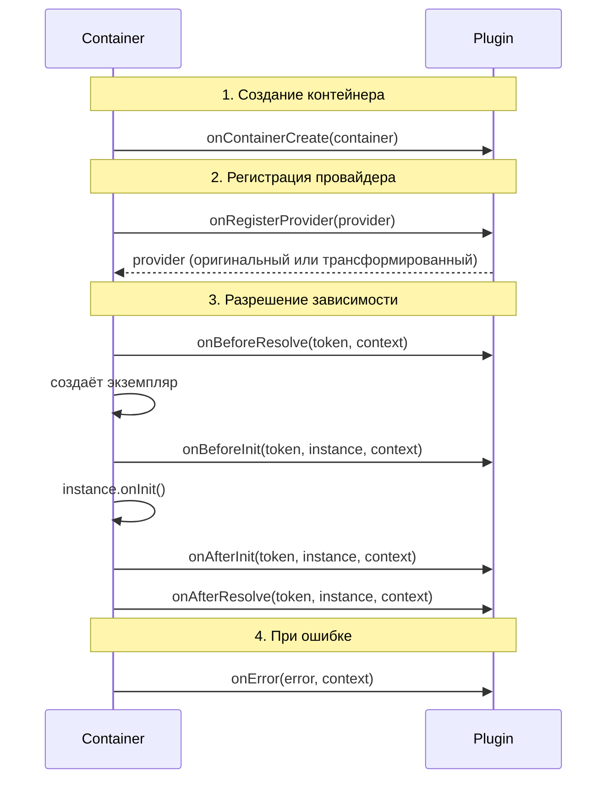

import { Callout } from 'fumadocs-ui/components/callout';
import { Tab, Tabs } from 'fumadocs-ui/components/tabs';

# Система плагинов

Плагины позволяют расширять функциональность контейнера без изменения основного кода. Используйте их для логирования, телеметрии, валидации, кэширования и других cross-cutting concerns.

## Как работают плагины



## Интерфейс Plugin

Плагин — объект, реализующий интерфейс `Plugin` с lifecycle hooks:

```typescript
import type { Plugin, Token, ResolutionContext, Provider } from "@ambrosia-unce/core";

interface Plugin {
  name: string;
  version?: string;

  onContainerCreate?(container: IContainer): void;
  onRegisterProvider?(provider: Provider): Provider;
  onBeforeResolve?(token: Token, context: ResolutionContext): void;
  onAfterResolve?(token: Token, instance: unknown, context: ResolutionContext): void;
  onBeforeInit?(token: Token, instance: unknown, context: ResolutionContext): void;
  onAfterInit?(token: Token, instance: unknown, context: ResolutionContext): void;
  onError?(error: Error, context: ResolutionContext): void;
}
```

## Lifecycle hooks



| Hook | Когда вызывается | Возвращает |
|------|-----------------|------------|
| `onContainerCreate` | При `new Container()` | `void` |
| `onRegisterProvider` | При `register()` / `registerClass()` и т.д. | `Provider` (может трансформировать) |
| `onBeforeResolve` | Перед каждым `resolve()` | `void` |
| `onAfterResolve` | После успешного `resolve()` | `void` |
| `onBeforeInit` | Перед `onInit()` экземпляра | `void` |
| `onAfterInit` | После `onInit()` экземпляра | `void` |
| `onError` | При ошибке разрешения | `void` |

<Callout type="info">
`onBeforeInit` / `onAfterInit` вызываются **только** для `ClassProvider`-экземпляров, реализующих интерфейс `OnInit`. Value, Factory и Existing провайдеры не триггерят эти хуки.
</Callout>

## Регистрация плагинов

```typescript
import { Container, LoggingPlugin, PluginPriority } from "@ambrosia-unce/core";

const container = new Container();

// Простая регистрация
container.use(new LoggingPlugin());

// С приоритетом
container.use(mySecurityPlugin, PluginPriority.HIGHEST);

// Chaining
container
  .use(new LoggingPlugin({ logResolutionTiming: true }))
  .use(telemetryPlugin, PluginPriority.LOW);
```

### Приоритеты

Больше значение = раньше выполнение:

```typescript
import { PluginPriority } from "@ambrosia-unce/core";

enum PluginPriority {
  HIGHEST = 100,   // Выполняется первым
  HIGH    = 75,
  NORMAL  = 50,    // По умолчанию
  LOW     = 25,
  LOWEST  = 0,     // Выполняется последним
}
```

```typescript
container
  .use(securityPlugin, PluginPriority.HIGHEST)  // Безопасность — первой
  .use(loggingPlugin, PluginPriority.NORMAL)     // Логирование — стандартно
  .use(metricsPlugin, PluginPriority.LOW);       // Метрики — после всего
```

## Встроенные плагины

### LoggingPlugin

Отладка и мониторинг разрешения зависимостей:

```typescript
import { Container, LoggingPlugin } from "@ambrosia-unce/core";

const container = new Container();

container.use(new LoggingPlugin({
  logger: customLogger,              // По умолчанию: ConsoleLogger
  logResolutionTiming: true,         // Логировать время resolve
  logProviderRegistration: true,     // Логировать регистрацию
}));

// Теперь каждый resolve логируется:
container.resolve(UserService);
// [DEBUG] Resolving: UserService
// [DEBUG] Resolved: UserService in 0.12ms
```

### AsyncPluginManager

Батчинг и отложенная обработка событий плагинов для лучшей производительности:

```typescript
import { AsyncPluginManager } from "@ambrosia-unce/core";

const asyncManager = new AsyncPluginManager({
  batchSize: 50,       // Макс. событий в батче
  flushInterval: 100,  // Интервал flush в мс
});

container.use(asyncManager);

// Некритические хуки (onBeforeResolve, onAfterResolve, onError)
// обрабатываются асинхронно через queueMicrotask()

// Критические хуки (onContainerCreate, onRegisterProvider)
// обрабатываются синхронно

// Ручной flush при необходимости (например, перед shutdown)
await asyncManager.flush();
```

<Callout type="info">
`AsyncPluginManager` использует `queueMicrotask()` для неблокирующей обработки, что обеспечивает до 10% лучшую пропускную способность в нагруженных сценариях.
</Callout>

## Создание собственного плагина

### Минимальный плагин

```typescript
import type { Plugin, Token, ResolutionContext } from "@ambrosia-unce/core";
import { tokenToString } from "@ambrosia-unce/core";

const countPlugin: Plugin = {
  name: "resolution-counter",

  onAfterResolve(token: Token) {
    console.log(`Resolved: ${tokenToString(token)}`);
  },
};

container.use(countPlugin);
```

### Плагин профилирования

```typescript
import type { Plugin, Token, ResolutionContext } from "@ambrosia-unce/core";
import { tokenToString } from "@ambrosia-unce/core";

class ProfilingPlugin implements Plugin {
  name = "profiling";
  version = "1.0.0";

  private durations = new Map<string, number[]>();

  onAfterResolve(token: Token, _instance: unknown, context: ResolutionContext) {
    const elapsed = performance.now() - context.startTime;
    const name = tokenToString(token);

    const list = this.durations.get(name) ?? [];
    list.push(elapsed);
    this.durations.set(name, list);

    if (elapsed > 50) {
      console.warn(`[Profiling] Slow: ${name} took ${elapsed.toFixed(1)}ms`);
    }
  }

  getReport() {
    const report: Record<string, { avg: number; max: number; count: number }> = {};
    for (const [name, durations] of this.durations) {
      const avg = durations.reduce((a, b) => a + b, 0) / durations.length;
      const max = Math.max(...durations);
      report[name] = { avg, max, count: durations.length };
    }
    return report;
  }
}

// Использование
const profiler = new ProfilingPlugin();
container.use(profiler);

// ... resolve различных сервисов ...

console.table(profiler.getReport());
```

### Плагин валидации

```typescript
import type { Plugin, Token, Provider } from "@ambrosia-unce/core";
import { tokenToString, Scope } from "@ambrosia-unce/core";

class ValidationPlugin implements Plugin {
  name = "validation";

  onRegisterProvider(provider: Provider): Provider {
    // Запретить TRANSIENT в production
    if (provider.scope === Scope.TRANSIENT) {
      console.warn(
        `[Validation] TRANSIENT scope for ${tokenToString(provider.token)} — ` +
        `consider SINGLETON for better performance`
      );
    }
    return provider; // Обязательно вернуть провайдер
  }

  onAfterResolve(token: Token, instance: unknown) {
    // Проверить, что экземпляр не null
    if (instance == null) {
      throw new Error(`[Validation] Resolved null for ${tokenToString(token)}`);
    }
  }
}
```

### Плагин телеметрии

```typescript
import type { Plugin, Token, ResolutionContext, Provider } from "@ambrosia-unce/core";
import { tokenToString } from "@ambrosia-unce/core";

class TelemetryPlugin implements Plugin {
  name = "telemetry";
  version = "1.0.0";

  private resolutions = new Map<string, number>();
  private errors: Array<{ token: string; error: string; time: number }> = [];

  onContainerCreate() {
    console.log("[Telemetry] Container created at", new Date().toISOString());
  }

  onBeforeResolve(token: Token) {
    const name = tokenToString(token);
    this.resolutions.set(name, (this.resolutions.get(name) ?? 0) + 1);
  }

  onAfterResolve(token: Token, _instance: unknown, context: ResolutionContext) {
    const elapsed = performance.now() - context.startTime;
    if (elapsed > 100) {
      console.warn(`[Telemetry] Slow resolution: ${tokenToString(token)} ${elapsed.toFixed(1)}ms`);
    }
  }

  onError(error: Error, context: ResolutionContext) {
    this.errors.push({
      token: tokenToString(context.token),
      error: error.message,
      time: Date.now(),
    });
  }

  onRegisterProvider(provider: Provider) {
    console.log(`[Telemetry] Registered: ${tokenToString(provider.token)}`);
    return provider;
  }

  getStats() {
    return {
      resolutions: Object.fromEntries(this.resolutions),
      errors: this.errors,
      totalResolutions: [...this.resolutions.values()].reduce((a, b) => a + b, 0),
    };
  }
}
```

## Условные плагины

Включайте плагины на основе окружения:

```typescript
const container = new Container({ mode: "production" });

// Development-only плагины
if (process.env.NODE_ENV === "development") {
  container.use(new LoggingPlugin({ logResolutionTiming: true }));
  container.use(new ProfilingPlugin());
}

// Production-only плагины
if (process.env.NODE_ENV === "production") {
  container.use(new TelemetryPlugin());
}

// Всегда
container.use(errorReporterPlugin);
```

## Трансформация провайдеров

Hook `onRegisterProvider` — единственный, который может трансформировать данные. Он получает провайдер и должен вернуть провайдер (оригинальный или модифицированный):

```typescript
const scopeEnforcer: Plugin = {
  name: "scope-enforcer",

  onRegisterProvider(provider: Provider): Provider {
    // Автоматически установить SINGLETON для всех сервисов в production
    if (process.env.NODE_ENV === "production" && provider.scope === Scope.TRANSIENT) {
      return { ...provider, scope: Scope.SINGLETON };
    }
    return provider;
  },
};
```

## Управление плагинами

```typescript
// Проверить наличие плагина
if (container.hasPlugin("telemetry")) {
  console.log("Telemetry active");
}

// Получить все плагины
const plugins = container.getPlugins();
console.log(`Active plugins: ${plugins.map(p => p.name).join(", ")}`);
```

## Best Practices

1. **Держите плагины легковесными** — минимизируйте работу в `onBeforeResolve` (вызывается при каждом resolve)
2. **Не падайте при ошибках** — логируйте и продолжайте; падение плагина не должно ломать приложение
3. **Используйте `AsyncPluginManager`** для I/O операций (отправка метрик, запись логов)
4. **Давайте уникальные имена** — конфликты имен могут привести к путанице
5. **Возвращайте провайдер** в `onRegisterProvider` — забытый `return` удалит провайдер

<Callout type="success">
**Рекомендация:** Для production используйте `AsyncPluginManager` + `TelemetryPlugin` для мониторинга. Для development — `LoggingPlugin` с `logResolutionTiming: true` для отладки.
</Callout>

## Следующие шаги

- [Асинхронные операции](/docs/core/guides/async-operations) — AsyncPluginManager и AsyncLogger
- [API: Плагины](/docs/core/api-reference/plugins) — полный справочник Plugin API
- [Продвинутое: Разработка плагинов](/docs/core/advanced/plugin-development) — пошаговое руководство
