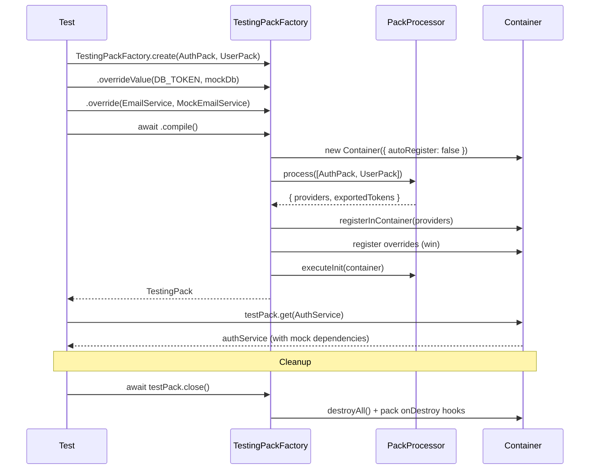

import { Callout } from 'fumadocs-ui/components/callout';
import { Tab, Tabs } from 'fumadocs-ui/components/tabs';

# Testing

`TestingPackFactory` is a builder for creating test environments from packs with the ability to override dependencies.

## How TestingPackFactory Works



## Quick Start

```typescript
import { TestingPackFactory } from "@ambrosia/core";

const testPack = await TestingPackFactory
  .create(AuthPack.forRoot({ secret: "test-secret" }))
  .overrideValue(DATABASE_TOKEN, mockDatabase)
  .compile();

const authService = testPack.get(AuthService);
expect(authService).toBeDefined();

await testPack.close();
```

## API

### TestingPackFactory.create(...packs)

Creates a factory from one or more packs:

```typescript
// Single pack
const factory = TestingPackFactory.create(UserPack);

// Multiple packs
const factory = TestingPackFactory.create(
  DatabasePack.forRoot(testConfig),
  CachePack,
  UserPack,
);
```

Supports `Packable` - falsy values are filtered automatically:

```typescript
const factory = TestingPackFactory.create(
  CorePack,
  process.env.CACHE ? CachePack : null,
);
```

### .override(token, useClass)

Replaces a class provider:

```typescript
TestingPackFactory
  .create(NotificationPack)
  .override(EmailService, MockEmailService)
  .compile();
```

### .overrideValue(token, value)

Replaces a value (for value providers, configs, mocks):

```typescript
const mockDb = {
  query: async (sql: string) => [],
  close: async () => {},
};

TestingPackFactory
  .create(UserPack)
  .overrideValue(DATABASE_TOKEN, mockDb)
  .overrideValue(CACHE_CONFIG, { ttl: 0 })
  .compile();
```

### .overrideFactory(token, factory)

Replaces a factory provider:

```typescript
TestingPackFactory
  .create(AppPack)
  .overrideFactory(CONNECTION_POOL, () => createTestPool())
  .compile();
```

### .compile()

Builds the test container. Returns `Promise<TestingPack>`:

```typescript
const testPack = await factory.compile();
```

`compile()` performs:
1. Creates a container (`autoRegister: false`)
2. Processes packs via `PackProcessor`
3. Applies overrides (overrides win)
4. Executes pack `onInit` hooks

### TestingPack

The object returned from `compile()`:

```typescript
interface TestingPack {
  // Get a dependency (throws if not found)
  get<T>(token: Token<T>): T;

  // Get a dependency (undefined if not found)
  getOptional<T>(token: Token<T>): T | undefined;

  // Direct access to the container
  getContainer(): Container;

  // Cleanup - calls onDestroy hooks and clears the container
  close(): Promise<void>;
}
```

## Examples

### Testing a Service with Mocks

```typescript
import { describe, it, expect, beforeEach, afterEach } from "bun:test";
import { TestingPackFactory, type TestingPack } from "@ambrosia/core";

describe("UserService", () => {
  let testPack: TestingPack;

  beforeEach(async () => {
    testPack = await TestingPackFactory
      .create(UserPack)
      .overrideValue(DATABASE_TOKEN, {
        query: async () => [{ id: 1, name: "Test User" }],
      })
      .compile();
  });

  afterEach(async () => {
    await testPack.close();
  });

  it("should find user by id", () => {
    const userService = testPack.get(UserService);
    const user = await userService.findById(1);
    expect(user.name).toBe("Test User");
  });
});
```

### Testing a Pack with Dependencies

```typescript
describe("AuthPack", () => {
  it("should resolve AuthService with all dependencies", async () => {
    const testPack = await TestingPackFactory
      .create(
        DatabasePack.forRoot({ host: "localhost", port: 5432 }),
        AuthPack.forRoot({ secret: "test", expiresIn: "1h" }),
      )
      .overrideValue(DATABASE_TOKEN, mockDb)
      .compile();

    const authService = testPack.get(AuthService);
    expect(authService).toBeDefined();

    const token = await authService.createToken({ userId: 1 });
    expect(token).toBeString();

    await testPack.close();
  });
});
```

### Replacing an Entire Class

```typescript
@Injectable()
class MockEmailService {
  sent: Array<{ to: string; body: string }> = [];

  async send(to: string, body: string) {
    this.sent.push({ to, body });
  }
}

const testPack = await TestingPackFactory
  .create(NotificationPack)
  .override(EmailService, MockEmailService)
  .compile();

const notifications = testPack.get(NotificationService);
await notifications.notifyUser(1, "Hello!");

const emailMock = testPack.get(MockEmailService);
expect(emailMock.sent).toHaveLength(1);
```

### Testing Lifecycle Hooks

```typescript
let initCalled = false;
let destroyCalled = false;

@Injectable()
class TrackedService implements OnInit, OnDestroy {
  onInit() { initCalled = true; }
  onDestroy() { destroyCalled = true; }
}

const pack = definePack({
  providers: [TrackedService],
});

const testPack = await TestingPackFactory
  .create(pack)
  .compile();

testPack.get(TrackedService);
expect(initCalled).toBe(true);

await testPack.close();
expect(destroyCalled).toBe(true);
```

## Priority Order

Overrides are applied **after** provider registration from packs, so they always win:

```
1. PackProcessor processes packs -> registers providers
2. Overrides registered on top -> overwrite providers
3. Lifecycle onInit executes
```

<Callout type="info">
An override does not remove the original provider - it overwrites it in the container. This means dependencies of the original provider won't be resolved if they aren't needed by the mock version.
</Callout>

## Best Practices

1. **Always call `close()`** - this ensures `onDestroy` hooks are called and resources are cleaned up
2. **Use `overrideValue` for external dependencies** - databases, HTTP clients, file systems
3. **Create helper functions** for repeated test configurations:

```typescript
function createTestApp(...extraPacks: Packable[]) {
  return TestingPackFactory
    .create(CorePack.forRoot(testConfig), ...extraPacks)
    .overrideValue(DATABASE_TOKEN, mockDb)
    .overrideValue(CACHE_TOKEN, mockCache)
    .compile();
}

// In tests:
const testPack = await createTestApp(UserPack);
```
