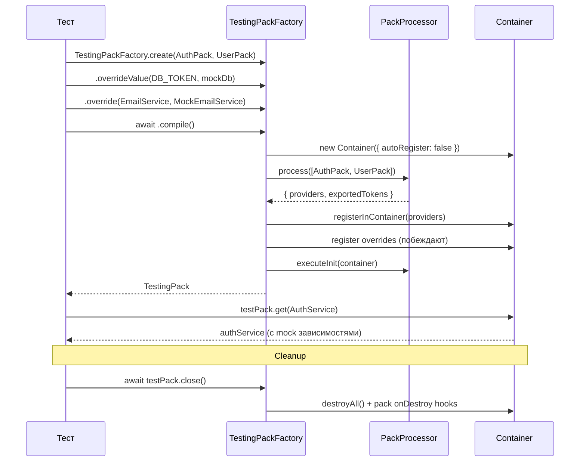

import { Callout } from 'fumadocs-ui/components/callout';
import { Tab, Tabs } from 'fumadocs-ui/components/tabs';

# Тестирование

`TestingPackFactory` — builder для создания тестового окружения из паков с возможностью подмены зависимостей.

## Как работает TestingPackFactory



## Быстрый старт

```typescript
import { TestingPackFactory } from "@ambrosia/core";

const testPack = await TestingPackFactory
  .create(AuthPack.forRoot({ secret: "test-secret" }))
  .overrideValue(DATABASE_TOKEN, mockDatabase)
  .compile();

const authService = testPack.get(AuthService);
expect(authService).toBeDefined();

await testPack.close();
```

## API

### TestingPackFactory.create(...packs)

Создаёт фабрику из одного или нескольких паков:

```typescript
// Один пак
const factory = TestingPackFactory.create(UserPack);

// Несколько паков
const factory = TestingPackFactory.create(
  DatabasePack.forRoot(testConfig),
  CachePack,
  UserPack,
);
```

Поддерживает `Packable` — falsy-значения фильтруются автоматически:

```typescript
const factory = TestingPackFactory.create(
  CorePack,
  process.env.CACHE ? CachePack : null,
);
```

### .override(token, useClass)

Подменяет класс-провайдер:

```typescript
TestingPackFactory
  .create(NotificationPack)
  .override(EmailService, MockEmailService)
  .compile();
```

### .overrideValue(token, value)

Подменяет значение (для value-провайдеров, конфигов, моков):

```typescript
const mockDb = {
  query: async (sql: string) => [],
  close: async () => {},
};

TestingPackFactory
  .create(UserPack)
  .overrideValue(DATABASE_TOKEN, mockDb)
  .overrideValue(CACHE_CONFIG, { ttl: 0 })
  .compile();
```

### .overrideFactory(token, factory)

Подменяет factory-провайдер:

```typescript
TestingPackFactory
  .create(AppPack)
  .overrideFactory(CONNECTION_POOL, () => createTestPool())
  .compile();
```

### .compile()

Собирает тестовый контейнер. Возвращает `Promise<TestingPack>`:

```typescript
const testPack = await factory.compile();
```

`compile()` выполняет:
1. Создаёт контейнер (`autoRegister: false`)
2. Обрабатывает паки через `PackProcessor`
3. Применяет overrides (overrides побеждают)
4. Выполняет `onInit` хуки паков

### TestingPack

Объект, возвращаемый из `compile()`:

```typescript
interface TestingPack {
  // Получить зависимость (throws если не найдена)
  get<T>(token: Token<T>): T;

  // Получить зависимость (undefined если не найдена)
  getOptional<T>(token: Token<T>): T | undefined;

  // Доступ к контейнеру напрямую
  getContainer(): Container;

  // Cleanup — вызывает onDestroy хуки и очищает контейнер
  close(): Promise<void>;
}
```

## Примеры

### Тестирование сервиса с моками

```typescript
import { describe, it, expect, beforeEach, afterEach } from "bun:test";
import { TestingPackFactory, type TestingPack } from "@ambrosia/core";

describe("UserService", () => {
  let testPack: TestingPack;

  beforeEach(async () => {
    testPack = await TestingPackFactory
      .create(UserPack)
      .overrideValue(DATABASE_TOKEN, {
        query: async () => [{ id: 1, name: "Test User" }],
      })
      .compile();
  });

  afterEach(async () => {
    await testPack.close();
  });

  it("should find user by id", () => {
    const userService = testPack.get(UserService);
    const user = await userService.findById(1);
    expect(user.name).toBe("Test User");
  });
});
```

### Тестирование пака с зависимостями

```typescript
describe("AuthPack", () => {
  it("should resolve AuthService with all dependencies", async () => {
    const testPack = await TestingPackFactory
      .create(
        DatabasePack.forRoot({ host: "localhost", port: 5432 }),
        AuthPack.forRoot({ secret: "test", expiresIn: "1h" }),
      )
      .overrideValue(DATABASE_TOKEN, mockDb)
      .compile();

    const authService = testPack.get(AuthService);
    expect(authService).toBeDefined();

    const token = await authService.createToken({ userId: 1 });
    expect(token).toBeString();

    await testPack.close();
  });
});
```

### Подмена класса целиком

```typescript
@Injectable()
class MockEmailService {
  sent: Array<{ to: string; body: string }> = [];

  async send(to: string, body: string) {
    this.sent.push({ to, body });
  }
}

const testPack = await TestingPackFactory
  .create(NotificationPack)
  .override(EmailService, MockEmailService)
  .compile();

const notifications = testPack.get(NotificationService);
await notifications.notifyUser(1, "Hello!");

const emailMock = testPack.get(MockEmailService);
expect(emailMock.sent).toHaveLength(1);
```

### Тестирование lifecycle hooks

```typescript
let initCalled = false;
let destroyCalled = false;

@Injectable()
class TrackedService implements OnInit, OnDestroy {
  onInit() { initCalled = true; }
  onDestroy() { destroyCalled = true; }
}

const pack = definePack({
  providers: [TrackedService],
});

const testPack = await TestingPackFactory
  .create(pack)
  .compile();

testPack.get(TrackedService);
expect(initCalled).toBe(true);

await testPack.close();
expect(destroyCalled).toBe(true);
```

## Порядок приоритетов

Overrides применяются **после** регистрации провайдеров из паков, поэтому всегда побеждают:

```
1. PackProcessor обрабатывает паки → регистрирует провайдеры
2. Overrides регистрируются поверх → перезаписывают провайдеры
3. Lifecycle onInit выполняется
```

<Callout type="info">
Override не удаляет оригинальный провайдер — он перезаписывает его в контейнере. Это значит, что зависимости оригинального провайдера не будут резолвиться, если они не нужны mock-версии.
</Callout>

## Best Practices

1. **Всегда вызывайте `close()`** — это гарантирует вызов `onDestroy` хуков и очистку ресурсов
2. **Используйте `overrideValue` для внешних зависимостей** — базы данных, HTTP-клиенты, файловые системы
3. **Создавайте helper-функции** для повторяющихся тестовых конфигураций:

```typescript
function createTestApp(...extraPacks: Packable[]) {
  return TestingPackFactory
    .create(CorePack.forRoot(testConfig), ...extraPacks)
    .overrideValue(DATABASE_TOKEN, mockDb)
    .overrideValue(CACHE_TOKEN, mockCache)
    .compile();
}

// В тестах:
const testPack = await createTestApp(UserPack);
```
