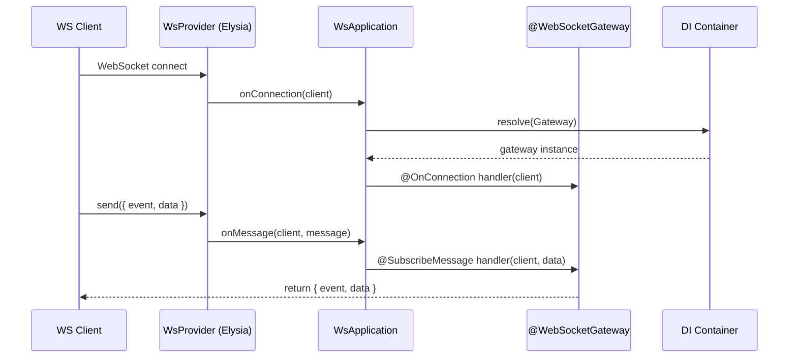

# @ambrosia-unce/websocket

A provider-agnostic WebSocket layer with decorators for implementing real-time functionality in Ambrosia applications.

## Features

- **Decorator-based approach** — `@WebSocketGateway`, `@SubscribeMessage`, `@OnConnection`, `@OnDisconnection`
- **Full DI integration** — Gateways participate in dependency injection just like any other service
- **Provider-agnostic** — Swap the transport (Elysia, Bun.serve) without changing business logic
- **Pack system** — WebSocket modules are composed via `WsPackDefinition`
- **Testing** — `TestingWsFactory` and `MockWsClient` for unit/integration tests without a real server

## Quick Start

```typescript title="chat.gateway.ts"
import { Injectable } from "@ambrosia-unce/core";
import {
  WebSocketGateway,
  SubscribeMessage,
  OnConnection,
  OnDisconnection,
} from "@ambrosia-unce/websocket";
import type { WsClient } from "@ambrosia-unce/websocket";

@WebSocketGateway("/chat")
class ChatGateway {
  constructor(private chatService: ChatService) {}

  @OnConnection()
  handleConnection(client: WsClient) {
    console.log(`Client ${client.id} connected`);
  }

  @OnDisconnection()
  handleDisconnection(client: WsClient) {
    console.log(`Client ${client.id} disconnected`);
  }

  @SubscribeMessage("message")
  handleMessage(client: WsClient, data: { text: string }) {
    this.chatService.save(data.text);
    return { event: "newMessage", data: { from: client.id, text: data.text } };
  }
}
```

## Architecture



## Next Steps

- [Installation and Setup](/docs/websocket/getting-started/installation)
- [Gateway Guide](/docs/websocket/guides/gateways)
- [Testing](/docs/websocket/guides/testing)
- [API Reference](/docs/websocket/api/decorators)
