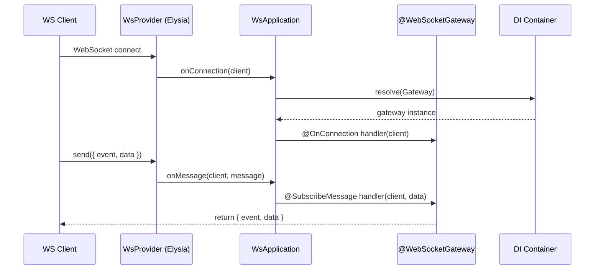

# @ambrosia-unce/websocket

Provider-agnostic WebSocket слой с декораторами для реализации real-time функциональности в Ambrosia приложениях.

## Возможности

- **Декоратор-подход** — `@WebSocketGateway`, `@SubscribeMessage`, `@OnConnection`, `@OnDisconnection`
- **Полная DI интеграция** — Гейтвеи участвуют в dependency injection как любые другие сервисы
- **Provider-agnostic** — Меняйте транспорт (Elysia, Bun.serve) без изменения бизнес-логики
- **Pack система** — WebSocket модули компонуются через `WsPackDefinition`
- **Тестирование** — `TestingWsFactory` и `MockWsClient` для unit/integration тестов без реального сервера

## Быстрый старт

```typescript title="chat.gateway.ts"
import { Injectable } from "@ambrosia-unce/core";
import {
  WebSocketGateway,
  SubscribeMessage,
  OnConnection,
  OnDisconnection,
} from "@ambrosia-unce/websocket";
import type { WsClient } from "@ambrosia-unce/websocket";

@WebSocketGateway("/chat")
class ChatGateway {
  constructor(private chatService: ChatService) {}

  @OnConnection()
  handleConnection(client: WsClient) {
    console.log(`Client ${client.id} connected`);
  }

  @OnDisconnection()
  handleDisconnection(client: WsClient) {
    console.log(`Client ${client.id} disconnected`);
  }

  @SubscribeMessage("message")
  handleMessage(client: WsClient, data: { text: string }) {
    this.chatService.save(data.text);
    return { event: "newMessage", data: { from: client.id, text: data.text } };
  }
}
```

## Архитектура



## Следующие шаги

- [Установка и настройка](/docs/websocket/getting-started/installation)
- [Гайд по гейтвеям](/docs/websocket/guides/gateways)
- [Тестирование](/docs/websocket/guides/testing)
- [API Reference](/docs/websocket/api/decorators)
